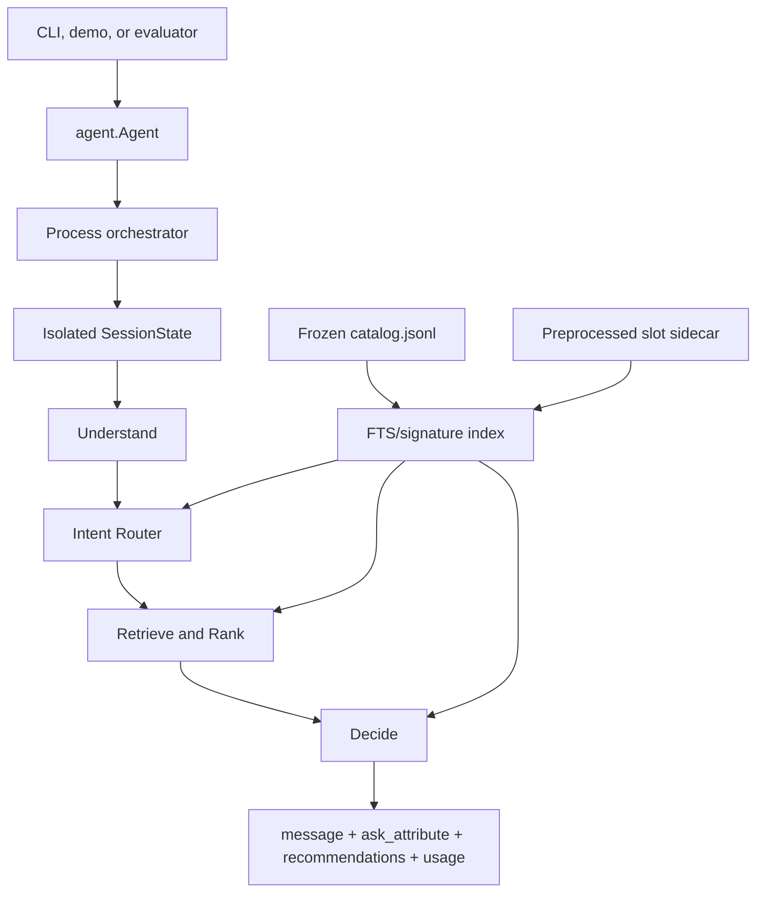

# WOW-WILDLOTUS Shopping Copilot

Source repository: [Maxxtucker/WOW-WILDLOTUS-Shopping-Copilot](https://github.com/Maxxtucker/WOW-WILDLOTUS-Shopping-Copilot).

A multi-turn shopping agent over a frozen 50,000-product Amazon catalog.
Each turn searches the catalog, returns a ranked list of `parent_asin` values,
and may ask one structured attribute before the next message.


The live path is `understand → intent router → retrieve/rank → decide`. Observe
and routing use local Ollama (`qwen3.5:4b`). Retrieve and Decide use stdlib
SQLite plus a CPU planner. An optional Chainlit UI is included for inspection.

## Contents

- [Quick start](#quick-start)
- [Layout](#layout)
- [Agent](#agent)
- [Catalog and sidecar](#catalog-and-sidecar)
- [Demo](#demo)
- [Architecture](#architecture)
- [Example session](#example-session)
- [Evaluation](#evaluation)
- [Latency, tokens, and cost](#latency-tokens-and-cost)
- [Runtime configuration](#runtime-configuration)

## Quick start

Python **3.10+** with SQLite FTS5. The Agent itself has no third-party pip
packages (`requirements.txt` is empty). First run needs network for the
catalog download and, if Ollama is missing, the installer plus `qwen3.5:4b`.
After that, the Agent talks only to localhost.

Windows:

```powershell
powershell -ExecutionPolicy Bypass -File setup.ps1
```

macOS / Linux:

```bash
bash setup.sh
```

Already-activated venv, any platform:

```bash
python bootstrap.py --check
python bootstrap.py --extras demo --run demo
```

Later launches: `.\run_demo.ps1` or `bash run_demo.sh`.

### What the first run does

1. Creates `.venv` and installs `requirements.txt` plus demo extras
   (`chainlit==2.12.0`). Optional PyTorch reranker and alias-rebuild pandas:
   `-Extras all` / `EXTRAS=all`.
2. Downloads and SHA-256-checks `data/catalog.jsonl`.
3. Builds `.cache/catalog_preprocess/product_slots.sqlite3`.
4. If `ollama` is missing: Windows `winget` then official installer; macOS
   Homebrew; Linux `https://ollama.com/install.sh`.
5. Starts `ollama serve` if needed and `ollama pull qwen3.5:4b`.
6. Warms the FTS/signature index.
7. Starts Chainlit on port 8006 (`cwd=demo`, `CHAINLIT_APP_ROOT=demo`).

Skip NLU install with `-SkipOllama` / `SKIP_OLLAMA=1`. If Ollama install fails,
Understand falls back to regex. `reset` / `respond` never download models or
rebuild the sidecar.

After setup:

```bash
python bootstrap.py --check
python nlu_console.py
python bootstrap.py --run eval
```

## Layout

```text
.
  agent.py                 # from agent import Agent
  src/                     # Understand, Intent Router, Retrieve, Decide
  src/assets/              # nlu.env, reranker.env, alias JSON
  preprocess/              # sidecar extract (not imported by src/)
  extract_slots.py
  download_catalog.py
  bootstrap.py
  setup.ps1 / setup.sh
  run_demo.ps1 / run_demo.sh
  nlu_console.py
  requirements.txt         # empty: stdlib + SQLite FTS5
  requirements-demo.txt    # optional Chainlit
  demo/                    # Chainlit UI
  docs/images/             # demo and public-set screenshots
```

| Path | Role |
|---|---|
| `src/` | Understand, Intent Router, Retrieve, Decide |
| `src/assets/aliases/*.json` | color/material maps and three-level category tree |
| `src/assets/nlu.env` | local Ollama host/model/timeout (no secrets) |
| `download_catalog.py` | fetch and verify the frozen catalog |
| `extract_slots.py` / `preprocess/` | one-pass slot sidecar; not imported by `src/` |
| `bootstrap.py` / `setup.ps1` | extras, sidecar, Ollama, Chainlit |
| `demo/` | optional UI |

## Agent

```python
from agent import Agent

agent = Agent("data/catalog.jsonl")
agent.reset(session_id, user_profile)
response = agent.respond(session_id, user_message, turn, top_k)
# message, ask_attribute, recommendations [{parent_asin}], usage
```

Default observe/router NLU is local Ollama (`src/assets/nlu.env`, model
`qwen3.5:4b` at `http://127.0.0.1:11434`). After three failed NLU attempts,
Understand uses regex. Pin regex with `AGENT_UNDERSTAND_MODE=regex` or
`Agent(..., understand_mode="regex")`.

## Catalog and sidecar

`python download_catalog.py` fetches `data/catalog.jsonl`.
`python extract_slots.py` writes `.cache/catalog_preprocess/product_slots.sqlite3`.

A missing sidecar is fine: Retrieve falls back to the FTS/signature index.
Set `AGENT_SLOTS_PATH=:none:` to disable the sidecar explicitly.

Rebuild alias JSON and the category tree only when their sources or the
catalog change:

```bash
python build_aliases_color.py
python build_aliases_material.py
python build_category_tree.py
python extract_slots.py
```

Color-alias rebuild needs `requirements-preprocess.txt`. The FTS/signature
index is built on first Agent startup and reused by a catalog fingerprint.
`AGENT_INDEX_PATH=:memory:` keeps it process-local.

## Demo

After `setup.ps1` / `setup.sh`, or:

```bash
pip install -r requirements-demo.txt
cd demo
# Windows:  set CHAINLIT_APP_ROOT=%CD%
# Unix:     export CHAINLIT_APP_ROOT="$PWD"
python -m chainlit run chainlit_app.py --port 8006
```

Open [http://localhost:8006](http://localhost:8006). Close leftover tabs on
port 8005; that origin can cache an older Chainlit shell.

The demo imports `from src import Agent` and uses the same process Agent as
headless turns. Shopping chat does not need `data/public_set.jsonl`. The Eval
dock does: it runs public samples through the same UI path and shows score
cards. CLI without UI: `python nlu_console.py`.

## Architecture

Each `respond()` is `understand → intent router → retrieve/rank → decide`.
Understand writes a grounded `turn_delta` only. Router commits constraints,
builds exact pools, and labels Buying/Browsing. Retrieve is exact-first or
hybrid BM25/structured fusion (optional local head rerank). Decide plans
`ask_attribute` and slate size with expected utility. Hits are exact
`parent_asin` matches; the LLM never scores a recommendation.

| Use | Model | Where |
|---|---|---|
| Observe + Router (default) | `qwen3.5:4b` via Ollama | localhost; three NLU attempts then regex |
| Observe (no local LLM) | none | `understand_mode="regex"` |
| Retrieve / Decide | none | SQLite + CPU planner |
| Optional rerank | `Qwen/Qwen3-Reranker-0.6B` | local weights; `auto` falls back if missing |

Buying/Browsing has no numeric cutoff. Exact pools can be `None` for unseen
phrasing (hybrid recall still runs). Clarification uses catalog-signature
approximations, not a full counterfactual rerun. `usage` counts Router tokens
only.



Stage docs:

- [`src/README.md`](src/README.md) — orchestrator, session state, turn pipeline
- [`src/understand/README.md`](src/understand/README.md) — NLU, typed constraints, grounding
- [`src/intent_router/README.md`](src/intent_router/README.md) — L1/L2 overrides, exact pools, Buying/Browsing
- [`src/retrieve/README.md`](src/retrieve/README.md) — hybrid recall, scoring, RRF, optional rerank
- [`src/decide/README.md`](src/decide/README.md) — clarification, dynamic slate, writeback
- [`preprocess/README.md`](preprocess/README.md) — sidecar extract and SQLite schema

## Example session

```text
reset(session_id, user_profile)

Turn 1  user: I'd prefer something green and easy to wear.
        agent.message: a short shopper reply that may ask one attribute
        agent.ask_attribute: e.g. "category" or "material" (or null)
        agent.recommendations: up to 10 catalog parent_asin values, best first
        agent.usage: Router token counts (zeros if regex)

Turn 2  user: cotton, not too dressy.
        agent: commits the new constraints, re-ranks, may ask another
        attribute or return a fuller slate.
```

Try the same first sentence in the Chainlit demo after setup. The screenshot
at the top of this README is that UI on a public-set turn.

## Evaluation

Public set (`data/public_set.jsonl`, 200 sessions), live NLU `qwen3.5:4b`:

```bash
python bootstrap.py --run eval
```

| | Sessions | Hit@10 | MRR | MTTC | Efficiency | Technical |
|---|---|---|---|---|---|---|
| **Overall** | 200 | 93.0% | 0.584 | 3.88 | 71.2% | **0.783** |
| buying | 80 | 93.8% | 0.649 | | | |
| browsing | 80 | 96.3% | 0.529 | | | |
| intent_override | 30 | 80.0% | 0.654 | | | |
| boundary | 10 | 100.0% | 0.295 | | | |


A regex-observe ablation on the same 200 sessions scored Technical **0.9788**
(Hit@10 1.0, MRR 1.0, MTTC 2.06, 0 tokens). That path is a baseline and the
automatic fallback when Ollama is unavailable, not the default shopper NLU.

## Latency, tokens, and cost

| Item | Live NLU (`qwen3.5:4b`, local) | Regex observe |
|---|---|---|
| Per-turn latency (warm Agent) | **15–20 s** (sequential Ollama chats) | SQLite + planner only |
| Process startup | minutes on first index build + model load | index build only |
| `respond()["usage"]` | Router only (~200–1,500 prompt, ~10–80 completion typical) | `{0, 0}` |
| Understand tokens | ~2.5k–6k prompt, ~150–500 completion per successful turn; **not** in `usage` | 0 |
| API cost | **$0** (local weights + electricity; public-set NLU ≪ $1 power) | **$0** |
| Network | localhost only after model pull | none |

A live-NLU replay of ~400 turns is on the order of 1–3M prompt + 0.1–0.3M
completion tokens including Understand. Optional reranker is local and is not
included in `usage`. No paid API key is required.

| Phase | Network |
|---|---|
| First `setup.ps1` / `bootstrap.py` | Catalog release; Ollama installer + `qwen3.5:4b` pull |
| `reset` / `respond` (default NLU) | Localhost Ollama only |
| `reset` / `respond` (regex, or after three NLU failures) | None |
| Optional reranker at score time | None if weights are already local |

## Runtime configuration

| Variable | Meaning |
|---|---|
| `AGENT_NLU_MODEL` | Ollama NLU/router model; default `qwen3.5:4b` |
| `AGENT_NLU_HOST` | Ollama base URL; default `http://127.0.0.1:11434` |
| `AGENT_NLU_TIMEOUT` | per-request NLU timeout in seconds |
| `AGENT_UNDERSTAND_MODE` | `nlu` (default) or `regex` |
| `AGENT_INDEX_PATH` | explicit primary index path; `:memory:` disables persistence |
| `AGENT_CACHE_DIR` | parent directory for fingerprinted primary indexes |
| `AGENT_SLOTS_PATH` | explicit slot-sidecar path; `:none:` disables it |
| `AGENT_RERANKER_MODE` | `off`, `auto`, or `required` |
| `AGENT_RERANKER_MODEL` | optional CrossEncoder model; default `Qwen/Qwen3-Reranker-0.6B` |
| `AGENT_RERANKER_LOCAL_FILES_ONLY` | offline-safe model loading; default true |

Defaults also live in `src/assets/nlu.env`. Load into a shell with
`. .\load_nlu_env.ps1` or `source ./load_nlu_env.sh`.
