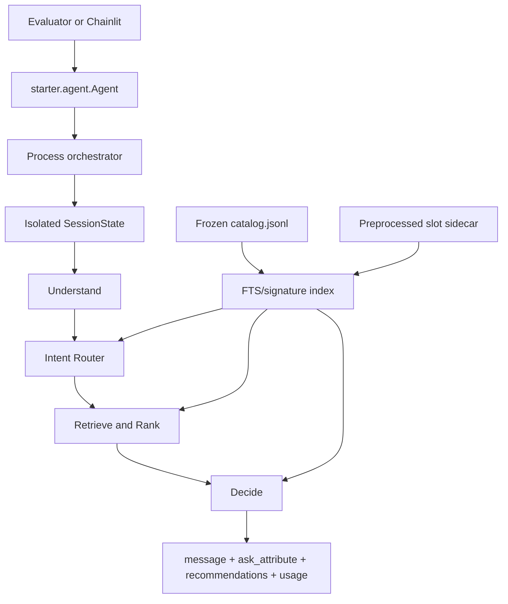

# Converge Shopping Copilot

Converge is a multi-turn shopping agent for the TechJam Conversational E-Commerce Search Challenge. It searches a frozen 50,000-product Amazon catalog for a hidden target product, returns up to ten ranked `parent_asin` values per turn, and decides which structured attribute to ask about next. A session ends at the first target hit or after ten turns.

This README describes the production Agent, the official and scenario evaluators, and the Chainlit demo. Detailed implementation notes live in:

- [`agent/README.md`](agent/README.md) — orchestrator, session state, and the end-to-end turn pipeline.
- [`agent/understand/README.md`](agent/understand/README.md) — NLU, typed constraints, grounding, and turn deltas.
- [`agent/intent_router/README.md`](agent/intent_router/README.md) — L1/L2 override handling, exact pools, and Buying/Browsing routing.
- [`agent/retrieve/README.md`](agent/retrieve/README.md) — exact/lenient pools, hybrid recall, scoring, weighted RRF, and semantic reranking.
- [`agent/decide/README.md`](agent/decide/README.md) — clarification selection, dynamic slate sizing, response construction, and writeback.
- [`scripts/catalog_preprocess/README.md`](scripts/catalog_preprocess/README.md) — catalog normalization, all attribute extractors, and the sidecar SQLite schema.

## Competition objective

The evaluator holds a target `parent_asin`, but the Agent receives only a safe
aggregate `user_profile`, ordinary natural-language shopper messages, a turn
number, and `top_k`. Agent logic does not depend on generated customer
templates, public labels, session IDs, or known targets. Correctness is always
an exact catalog-ID match; an LLM never decides whether a recommendation is
correct.

The official score is:

\[
\begin{aligned}
\text{HitRate@10} &= \frac{\text{successful sessions}}{N} \\
\text{MRR} &= \frac{1}{N}\sum_i \frac{1}{\text{target rank}_i} \\
\text{MTTC} &= \frac{1}{N}\sum_i \text{first-hit turn}_i \\
\text{Efficiency} &= \operatorname{clip}\left(\frac{11-\text{MTTC}}{10},0,1\right) \\
\text{TechnicalScore} &= 0.50\,\text{HitRate@10}+0.30\,\text{MRR}+0.20\,\text{Efficiency}.
\end{aligned}
\]

A miss contributes reciprocal rank `0` and turn `11` to MTTC. Metrics are also reported for Buying, Browsing, Intent Override, and Boundary sessions.

## System architecture



The production flow is `understand → intent router → retrieve/rank → decide`. The process-wide orchestrator owns one shared catalog retriever and a map of per-session states. Each `reset()` creates a clean session; each `respond()` validates the 1–10 turn contract and runs one pipeline turn.

### Agent

`starter/agent.py` exports the required `Agent` class from `agent/orchestrator.py`:

```python
class Agent:
    def reset(self, session_id: str, user_profile: dict) -> None:
        ...

    def respond(
        self,
        session_id: str,
        user_message: str,
        turn: int,
        top_k: int,
    ) -> dict:
        return {
            "message": "Do you have a material preference?",
            "ask_attribute": "material",
            "recommendations": [{"parent_asin": "B000..."}],
            "usage": {"prompt_tokens": 120, "completion_tokens": 30},
        }
```

The four stages have distinct responsibilities:

| Stage | Input | Responsibility | Output |
|---|---|---|---|
| Understand | current message and prior session context | Normalize aliases, classify category layers, extract grounded typed slots, mark hard/soft requirements, and create a non-committed delta | `turn_delta` and `disclosure_empty` |
| Intent Router | prior committed state and `turn_delta` | Detect L1/L2 overrides, update committed constraints, build strict/lenient exact pools, and label Buying/Browsing | updated `SessionState`, exact pools, intention |
| Retrieve | committed constraints and pools | Exact-first or hybrid recall, structured/lexical scoring, three-route weighted RRF, optional semantic reranking, and probability normalization | ranked candidate posterior |
| Decide | ranked posterior and session memory | Jointly select `ask_attribute` and recommendation count with two-step expected-utility planning; persist the action | official response dictionary |

Important runtime behavior:

- `SessionState` is isolated by `session_id`; the catalog index is shared.
- Turns outside `1..10` and non-positive `top_k` values are rejected.
- Understand makes at most three complete NLU attempts, then uses regex.
  Grounding repairs are field-local within an attempt, and Understand writes
  new evidence only to `turn_delta`.
- Router L1 requires category evidence in the delta. Only after L1/L2 finish at
  level 0 does the strong explicit fallback run, and it maps only to L2.
- Strict exact requires known matches; lenient exact allows match-or-unknown
  but never a known mismatch. Retrieve uses lenient only for a represented
  strict pool below 150 when lenient is non-empty.
- The base candidate score is
  `1.15*w_lex*lexical + 0.003*structured + catalog_prior + w_text*soft_text`.
  Profile fit is diagnostic and has zero final-score weight.
- Usable active-intent text enables weighted RRF over strict/base, relaxed, and
  raw routes with weights `1.40/0.90/1.25` and `k=60`.
- Ranking uses an optional Qwen head reranker; deterministic fallback uses
  fixed temperature `0.12` for ordinary scores and an adaptive clipped
  temperature for RRF scores.
- Decide runs production Dynamic Slate with two answer observations. Seeded
  epsilon exploration (`0.20`) chooses uniformly from the pre-viability
  informative, unasked attributes and never changes the planned slate.
  `eligible_questions()` does not directly filter an attribute merely because
  it is already present in `typed_constraints`.
- Turn 10 returns the full allowed prefix with no question. The current
  sequential gate is a no-op.
- Displayed slate IDs are immediately recorded as shown/excluded. At the start of turn `t > 1`, the gate-aware miss-feedback step conditionally unions the prior slate again when the prior gate was open; that union is idempotent with current writeback.
- A no-information response can page unshown products from the prior ranking
  without rerunning Router or Retrieve when `turn_delta` is absent and
  `disclosure_empty` is not false.
- The optional recommendation-preference slider changes only the runtime planner's HitRate/MRR trade-off before turn 1. It does not change the official evaluator formula.
- User-profile `preference_tags` are weak, reset-time context. The current retrieval score computes profile similarity for diagnostics, but its final score contribution is deliberately disabled in code.
- Response `usage` includes this turn's Intent Router prompt/completion tokens;
  Understand token counts are not currently reported.

### Catalog and preprocessing

`data/catalog.jsonl` is read-only. `scripts/extract_catalog_slots.py` scans it once and creates `.cache/catalog_preprocess/product_slots.sqlite3`. The sidecar contains three business tables—`product_slots`, `product_text`, and `slot_stats`—plus a `meta` control table used for version and catalog-fingerprint validation.

At runtime, the retriever attaches a current sidecar as SQLite schema `slots`. A missing or stale sidecar never triggers an automatic rebuild; the Agent falls back to its catalog signature index. Set `AGENT_SLOTS_PATH=:none:` to disable the sidecar explicitly.

### Evaluators

`evaluator/local_evaluator.py` is the deterministic public harness. For each sample it:

1. creates a random session ID and calls `Agent.reset()`;
2. materializes hidden intent/behavior fields only inside the evaluator when the public row omits them;
3. sends the scenario-dependent first customer message;
4. calls `Agent.respond(..., top_k=10)` for at most ten turns;
5. normalizes recommendations to the first ten unique, catalog-valid IDs;
6. records the first eligible target hit, its rank, and its turn; and
7. returns overall and per-scenario HitRate@10, MRR, MTTC, Efficiency, TechnicalScore, and reported token usage.

Invalid responses and exceptions are treated as empty misses. Intent Override sessions cannot convert until the evaluator has sent the replacement intent.

`evaluator/scenario_evaluator.py` supplies alternate Buyer-language modes while preserving the same scoring contract:

| Mode | Buyer behavior |
|---:|---|
| 1 | Original deterministic customer wording |
| 2 | Controlled paraphrase with protected keywords |
| 3 | Natural semantic paraphrase |
| 4 | Meaning-preserving imperfect English |

Modes 2–4 validate that the rewritten message preserves the intended meaning and fall back deterministically when a model response is missing or invalid. They can use a configured OpenAI-compatible endpoint or local Ollama; the scoring path remains exact code matching.

### Chainlit demo

`demo/chainlit_app.py` runs the same process Agent and full catalog as the evaluator-facing API. It is a diagnostic UI, not a second recommendation implementation.

On chat start it creates a UUID-backed Agent session, initializes ten-turn UI state, lazily builds the process-wide Agent once, warms NLU, and displays the recommendation-preference control. On every message it:

1. allocates the next turn and locks the preference slider after the first turn;
2. creates a per-turn `PipelineCircuit` and inspector state;
3. runs `agent.respond_traced()` in a worker thread;
4. listens to progress events and lights the exact pipeline nodes used by that turn;
5. renders product cards, a product shelf, the clarification prompt, and contextual quick-reply actions; and
6. stores completed circuit/trace data in the Chainlit user session for sidebar inspection.

The **Eval** composer command opens `EvalDock`. It can select one sample, a range, a random subset, or all public samples; run the Local or Scenario evaluator automatically; step through turns using the same `handle_user_text()` path; cancel a run; and render session/group score cards. The Agent package itself never reads public labels during a normal chat.

The frontend is split into small backend adapters and custom elements:

| Component | Responsibility |
|---|---|
| `demo/session.py` | maps one Chainlit conversation to a UUID Agent session and monotonically allocates turns 1–10 |
| `demo/progress_ui.py` | reduces Agent progress events and final traces into circuit/inspector props |
| `demo/render.py` | hydrates the official response with catalog metadata and constructs shelves/cards/actions |
| `demo/actions.py` | derives focused quick replies from `ask_attribute`, active dialog text, and product trade-offs |
| `demo/turn_monitor.py` | prints stage-completed trace snapshots to the terminal without reading evaluator labels |
| `PipelineCircuit.jsx` | shows the complete branch graph and highlights only nodes used this turn |
| `NodeInspector.jsx` | keeps per-turn stage inputs/outputs available in the sidebar |
| `ProductShelf.jsx` / `ProductCard.jsx` | renders ranked recommendations with catalog metadata |
| `RecommendationPreference.jsx` | sets planner HitRate/MRR preference before the first turn, then locks |
| `EvalDock.jsx` / `EvalScoreCard.jsx` | configures public evaluation and displays session/group metrics |

The turn executes off the async UI loop with `asyncio.to_thread()`. A thread-safe listener forwards progress events into an `asyncio.Queue`; an async pump updates the already-sent circuit element as nodes start, finish, skip, or fail. The assistant reply also updates a placeholder message and retries updates before creating a fallback message, which makes long local-NLU turns resilient to frontend reconnects.

Quick-reply callbacks send their stored natural-language text back through `handle_user_text()` rather than mutating Agent state. Inspector callbacks only switch selected nodes/graphs. Eval callbacks delegate to `eval_ui.py`, which keeps cancellation and step state in the Chainlit user session while reusing the process-wide Agent and official scoring helpers.

## Repository map

```text
agent/
  orchestrator.py              required API and process/session ownership
  pipeline.py                  one-turn stage orchestration
  understand/                  message → grounded turn delta
  intent_router/               override, state commit, exact pools, route label
  retrieve/                    catalog index, recall, scoring, and fusion
  decide/                      reranking, clarification, slate, and response
demo/
  chainlit_app.py              live application and callbacks
  eval_harness.py              public-set selection and evaluator wrappers
  eval_ui.py                   EvalDock actions and score cards
  public/elements/             Chainlit custom React elements
evaluator/
  local_evaluator.py           official deterministic local evaluator
  scenario_evaluator.py        Buyer-language robustness evaluator
scripts/
  extract_catalog_slots.py     one-pass preprocessing entry point
  catalog_preprocess/          normalization and attribute extractors
starter/
  agent.py                     competition import surface
docs/
  problem_requirements/        problem statement
  competition_specification.md protocol and scoring
  submission_rules.md          packaging and reproducibility rules
```

## Requirements

- Python 3.10 or newer.
- SQLite with FTS5 enabled.
- `data/catalog.jsonl`; `data/public_set.jsonl` for local evaluation.
- Ollama and the configured local model for the default NLU path. `scripts/nlu.env` defaults to `qwen3.5:4b`.
- Optional Qwen cross-encoder dependencies from `requirements-reranker.txt` for semantic reranking.
- Chainlit and its frontend dependencies for the demo UI; they are not required by the core Agent.

The core Python package has no third-party runtime dependency:

```bash
python -m pip install -r requirements.txt
```

Install the optional local reranker with:

```bash
python -m pip install -r requirements-reranker.txt
```

## Prepare the catalog

The alias JSON and three-level category tree are committed runtime assets. Rebuild them only when their source data or the frozen catalog changes:

```bash
python scripts/build_aliases_color.py
python scripts/build_aliases_material.py
python scripts/build_category_tree.py
python scripts/extract_catalog_slots.py
```

Only the two alias-builder commands require their documented source downloads. The category-tree builder and `extract_catalog_slots.py` read the local catalog; the latter writes the validated sidecar atomically through a temporary SQLite file.

The primary FTS/signature index is built automatically on first Agent startup and reused by a catalog size/mtime fingerprint. Configure its location with `AGENT_INDEX_PATH` or `AGENT_CACHE_DIR`; set `AGENT_INDEX_PATH=:memory:` for a process-local database.

## Run the evaluators

Run the deterministic public evaluator:

```bash
python -m evaluator.local_evaluator \
  --catalog data/catalog.jsonl \
  --dataset data/public_set.jsonl \
  --output results.json
```

Run a single readable session trace:

```bash
python scripts/demo_session.py
```

`scripts/check_parity.py` verifies that the Agent's catalog protocol copy remains aligned with the evaluator-visible deterministic helpers:

```bash
python scripts/check_parity.py
```

## Run the Chainlit demo

Load the NLU environment, then start Chainlit from `demo/` so custom elements resolve from `demo/public/elements`:

```bash
cd demo
python -m chainlit run chainlit_app.py -w --port 8005
```

The header in `demo/chainlit_app.py` also contains the PowerShell environment-loading example used by the project. The UI allows at most ten main-chat turns, mirroring the official session contract.

## Runtime configuration

| Variable | Meaning |
|---|---|
| `AGENT_NLU_MODEL` | Ollama NLU/router model; default `qwen3.5:4b` |
| `AGENT_NLU_HOST` | Ollama base URL; default `http://127.0.0.1:11434` |
| `AGENT_NLU_TIMEOUT` | per-request NLU timeout in seconds |
| `AGENT_INDEX_PATH` | explicit primary index path; `:memory:` disables persistence |
| `AGENT_CACHE_DIR` | parent directory for fingerprinted primary indexes |
| `AGENT_SLOTS_PATH` | explicit slot-sidecar path; `:none:` disables it |
| `AGENT_RERANKER_MODE` | `off`, `auto`, or `required` |
| `AGENT_RERANKER_MODEL` | optional CrossEncoder model; default `Qwen/Qwen3-Reranker-0.6B` |
| `AGENT_RERANKER_LOCAL_FILES_ONLY` | offline-safe model loading; default true |
| `CONVERGE_LLM_*` | optional Scenario Buyer OpenAI-compatible backend settings |

`Agent(..., understand_mode="regex")` skips Ollama entirely. In default NLU
mode, the complete extraction pipeline is attempted at most three times and
then falls back to regex. Optional semantic reranking also fails safely in
`auto` mode when the model is unavailable. These fallbacks matter because
official scoring may disable network access.

## Reproducibility and submission boundaries

- Do not modify `evaluator/` when preparing an official submission.
- Never commit model/API credentials; use environment variables.
- Keep the frozen catalog read-only and recommend only IDs present in it.
- The submitted `respond()` value must contain a string `message`, an allowed `ask_attribute` or `None`, ordered recommendations, and non-negative usage counters when available.
- Only the first ten valid unique recommendations are scored; optional numeric recommendation scores are ignored.
- Declare any required model assets, network needs, latency, token usage, approximate cost, and offline behavior in the submission report.

## Current limitations

- The Buying/Browsing route is an LLM judgment over accumulated constraints and pool contraction; there is intentionally no deterministic ratio cutoff.
- Exact pools depend on catalog-side normalization and may be unrepresentable (`None`) for unseen phrasing. Hybrid retrieval preserves recall in that case.
- The sidecar's `product_text` table improves soft text fit only when a current, attachable sidecar exists.
- Semantic reranking is bounded to the head and depends on a locally available model; deterministic belief ranking remains the fallback.
- Clarification transitions are catalog-signature approximations, not full counterfactual reruns of Understand and Retrieve.
- The Chainlit UI is a development and explanation surface; official judging calls the headless Agent interface.
