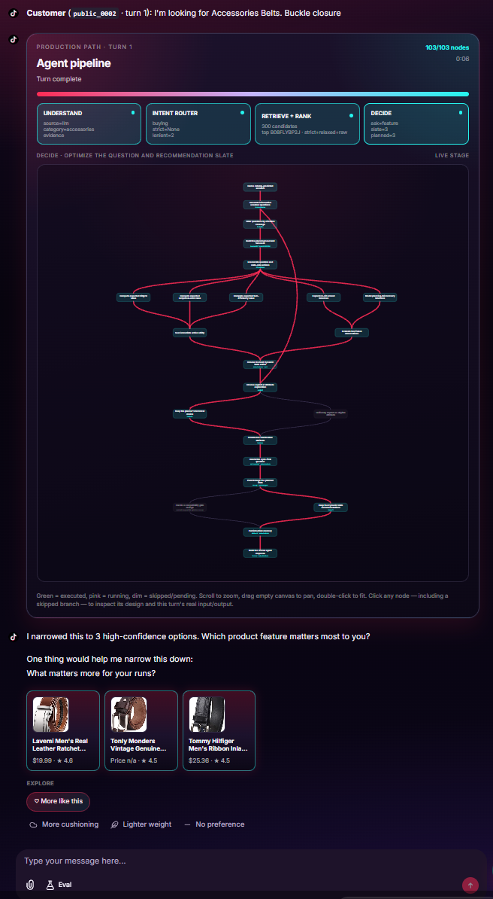
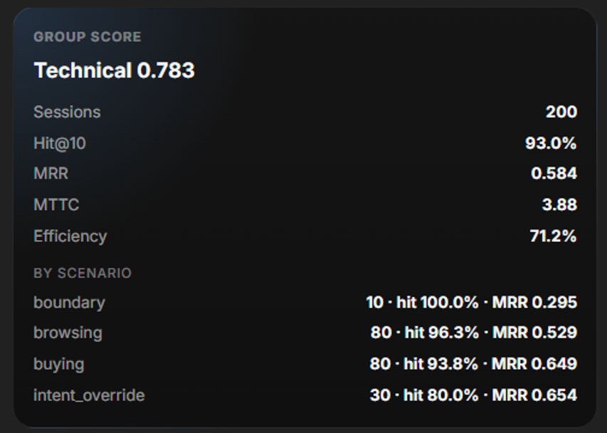
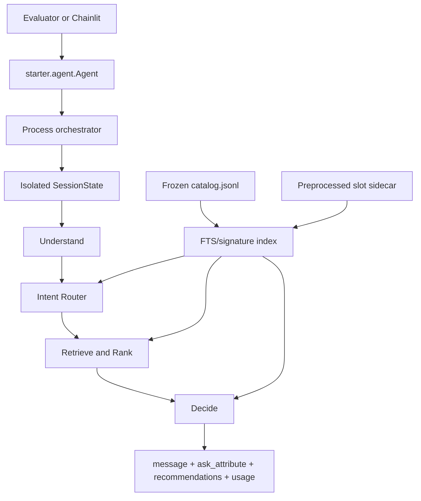

# WOW-WILDLOTUS Shopping Copilot

WOW-WILDLOTUS is a multi-turn shopping agent for the TechJam Conversational E-Commerce Search Challenge. It searches a frozen 50,000-product Amazon catalog for a hidden target product, returns up to ten ranked `parent_asin` values per turn, and decides which structured attribute to ask about next. A session ends at the first target hit or after ten turns. Official contest deliverables are in [Submission](#submission).

This Branch is a submission version specially designed for TikTok TechJam 2026's recommended layout, the origin layout is applied in The Main Branch.



## Contents

- [Quick start](#quick-start)
  - [Prerequisites](#prerequisites)
  - [Windows](#windows)
  - [macOS / Linux](#macos--linux)
  - [Already-activated venv, any platform](#already-activated-venv-any-platform)
  - [What the first run does](#what-the-first-run-does)
  - [After setup](#after-setup)
- [Submission](#submission)
  - [Agent entry](#agent-entry)
  - [Helper modules](#helper-modules)
  - [Setup](#setup)
  - [Method, model, and limitations](#method-model-and-limitations)
  - [Public-set evaluation](#public-set-evaluation)
  - [Latency, token usage, and cost](#latency-token-usage-and-cost)
  - [Submission boundaries](#submission-boundaries)
- [Architecture notes](#architecture-notes)
- [Competition objective](#competition-objective)
- [System architecture](#system-architecture)
  - [Agent](#agent)
  - [Catalog and preprocessing](#catalog-and-preprocessing)
  - [Evaluators](#evaluators)
  - [Chainlit demo](#chainlit-demo)
- [Repository map](#repository-map)
- [Requirements](#requirements)
- [Prepare the catalog](#prepare-the-catalog)
- [Run the evaluators](#run-the-evaluators)
- [Run the Chainlit demo](#run-the-chainlit-demo)
- [Runtime configuration](#runtime-configuration)

## Quick start

From a fresh clone this creates `.venv`, installs the Chainlit extras, downloads the 50k catalog, builds the slot sidecar, checks Ollama, warms the FTS index, and starts the demo on port 8006. Chainlit always uses `demo/.chainlit/config.toml` (APP_ROOT=`demo/`). Do not create or run against a repository-root `.chainlit/` directory. Do not reuse an old `http://localhost:8005` tab; that origin caches the previous Chainlit shell.

### Prerequisites

Install these before the commands below. Official scoring (`starter.agent.Agent`) only needs the first row.


| Need                                                                                                                  | Required for                                                                            |
| --------------------------------------------------------------------------------------------------------------------- | --------------------------------------------------------------------------------------- |
| Python **3.10+** with **SQLite FTS5** and `python -m venv`                                                            | Agent, index, and `scripts/setup.ps1` / `setup.sh`                                      |
| pip (the setup scripts upgrade it inside `.venv`)                                                                     | `requirements-demo.txt` → `chainlit==2.12.0` (pin matches `demo/.chainlit/config.toml`) |
| Network on first run                                                                                                  | GitHub Release download of `data/catalog.jsonl`; optional `ollama pull`                 |
| Several GB free disk                                                                                                  | catalog JSONL, `.cache/` sidecar + FTS index, and `qwen3.5:4b` (~3 GB)                  |
| [Ollama](https://ollama.com/download) + model in `scripts/nlu.env` (default `qwen3.5:4b`) at `http://127.0.0.1:11434` | default live NLU (localhost; works without internet after pull). Missing Ollama → regex fallback |
| Windows PowerShell (or bash on macOS/Linux)                                                                           | one-command launchers. Use the repo `.venv`, not Anaconda `(base)` `python`             |


Already in the clone (no extra install): `data/public_set.jsonl`, `scripts/nlu.env`, `scripts/catalog_preprocess/aliases/*.json`, `demo/.chainlit/config.toml`, `demo/public/` (CSS, JS, logos, custom elements), `demo/chainlit.md`, `demo/chainlit_app.py`.

`data/catalog.jsonl` is **not** committed; the commands below fetch and SHA-256-check it. Sidecar extract reads the committed alias JSON. Product photos (`data/catalog_images.jsonl`) and the Qwen reranker are optional and are **not** on this path.

### Windows

```powershell
powershell -ExecutionPolicy Bypass -File scripts/setup.ps1
```

Later launches:

```powershell
.\scripts\run_demo.ps1
```


### macOS / Linux

```bash
bash scripts/setup.sh
```

Later launches:

```bash
bash scripts/run_demo.sh
```


### Already-activated venv, any platform

```bash
python scripts/bootstrap.py --check
python scripts/bootstrap.py --extras demo --run demo
```

`bootstrap.py` is stdlib-only, so `--check` works before extras are installed.

### What the first run does

1. Verifies Python 3.10+ and SQLite FTS5.
2. Installs `requirements-demo.txt` (`chainlit==2.12.0`).
3. Copies `.env.example` to `.env` when `.env` is missing (Scenario Buyer keys only).
4. Downloads and SHA-256-checks `data/catalog.jsonl` (50,000 products).
5. Builds `.cache/catalog_preprocess/product_slots.sqlite3` (a few minutes).
6. Starts Ollama if needed and pulls `qwen3.5:4b`.
7. Builds or reuses the FTS/signature index (several minutes the first time).
8. Starts Chainlit with `cwd=demo` and `CHAINLIT_APP_ROOT=demo` at [http://localhost:8006](http://localhost:8006), loading `demo/.chainlit/config.toml` and `demo/public/`.


### After setup

```bash
python scripts/bootstrap.py --check
python scripts/nlu_console.py
python -m evaluator.local_evaluator --catalog data/catalog.jsonl --dataset data/public_set.jsonl --output results.json
python -m unittest discover -s tests -v
```

Default live NLU uses local Ollama (`qwen3.5:4b` on localhost). Once the model is pulled, scoring does **not** need internet. Optional semantic reranking is a large extra: `python scripts/bootstrap.py --extras demo,reranker`.

Full extras table, env files, and every operator script: [`scripts/README.md`](scripts/README.md).

## Submission

Contest deliverables from `[docs/submission_rules.md](docs/submission_rules.md)`. The official harness imports `starter.agent.Agent` and calls only `reset` / `respond`.

### Agent entry

`starter/agent.py` re-exports `Agent` from `agent/orchestrator.py`.

```python
from starter.agent import Agent

agent = Agent("data/catalog.jsonl")
agent.reset(session_id, user_profile)
response = agent.respond(session_id, user_message, turn, top_k)
# {message: str, ask_attribute: str|None, recommendations: [{parent_asin}], usage: {prompt_tokens, completion_tokens}}
```


### Helper modules


| Path                                        | Role                                                |
| ------------------------------------------- | --------------------------------------------------- |
| `agent/`                                    | Understand, Intent Router, Retrieve, Decide         |
| `scripts/catalog_preprocess/aliases/*.json` | color/material maps and three-level category tree   |
| `scripts/nlu.env`                           | local Ollama host/model/timeout (no secrets)        |
| `scripts/reranker.env`                      | optional local cross-encoder; default stays offline |
| `requirements.txt`                          | core Agent: no third-party packages                 |


Do not submit `.env`, API keys, `data/catalog.jsonl`, or `.cache/` sidecars. Catalog is downloaded; the sidecar is rebuilt with `python scripts/extract_catalog_slots.py`.

### Setup

Python **3.10+** with SQLite FTS5. Core Agent code needs no `pip` packages. Default observe/router NLU is **local Ollama** (`scripts/nlu.env`, model `qwen3.5:4b` at `http://127.0.0.1:11434`). After the model is on disk, the Agent talks only to localhost — organizer network cuts do not require a different observe path.

```bash
# Install Ollama, then once: ollama pull qwen3.5:4b
python scripts/download_catalog.py
python scripts/extract_catalog_slots.py
python -m evaluator.local_evaluator --catalog data/catalog.jsonl --dataset data/public_set.jsonl --output results.json
```

Demo UI is optional (`requirements-demo.txt` / [Quick start](#quick-start)). Kit test: `python -m unittest tests.test_evaluator -v`.

Regex observe is **not** the offline story. It is (1) the automatic fallback after three failed local-NLU attempts, and (2) an optional pin (`AGENT_UNDERSTAND_MODE=regex` or `Agent(..., understand_mode="regex")`) only if the harness forbids the Ollama process itself. If scoring cannot even guarantee third-party installs, that does not change the Agent: `requirements.txt` stays empty and Retrieve/Decide remain stdlib SQLite.

### Method, model, and limitations

**Method.** Each `respond()` is `understand → intent router → retrieve/rank → decide`. Understand writes a grounded `turn_delta` only. Router commits constraints, builds exact pools, and labels Buying/Browsing. Retrieve is exact-first or hybrid BM25/structured fusion (optional local head rerank). Decide plans `ask_attribute` and slate size with expected utility. Hits are exact `parent_asin` matches; the LLM never scores a recommendation.

**Models.**


| Use | Model | Where |
|---|---|---|
| Observe + Router (default) | `qwen3.5:4b` via Ollama | localhost only; three NLU attempts then regex fallback |
| Observe (no local LLM process) | none | optional `understand_mode="regex"` |
| Retrieve / Decide | none | SQLite + CPU planner |
| Optional rerank | `Qwen/Qwen3-Reranker-0.6B` | local weights; `auto` falls back if missing |


**Limitations.** Buying/Browsing has no numeric cutoff. Exact pools can be `None` for unseen phrasing (hybrid recall still runs). Clarification uses catalog-signature approximations, not a full counterfactual rerun. `usage` counts Router tokens only. Chainlit is diagnostic; judging is headless.

Longer write-up: `[docs/IMPLEMENTATION.md](docs/IMPLEMENTATION.md)`.

### Public-set evaluation

Local evaluator on committed `data/public_set.jsonl` (200 sessions). Same `starter.agent.Agent` as the official harness. These are development measurements, not private-set scores.

**Live NLU** (`qwen3.5:4b`, default observe path):


|                 | Sessions | Hit@10 | MRR   | MTTC | Efficiency | Technical |
| --------------- | -------- | ------ | ----- | ---- | ---------- | --------- |
| **Overall**     | 200      | 93.0%  | 0.584 | 3.88 | 71.2%      | **0.783** |
| buying          | 80       | 93.8%  | 0.649 |      |            |           |
| browsing        | 80       | 96.3%  | 0.529 |      |            |           |
| intent_override | 30       | 80.0%  | 0.654 |      |            |           |
| boundary        | 10       | 100.0% | 0.295 |      |            |           |




A prior **regex-observe** ablation (Ollama not used) on the same 200 sessions scored Technical **0.9788** (Hit@10 1.0, MRR 1.0, MTTC 2.06, 0 tokens). See [`docs/IMPLEMENTATION.md`](docs/IMPLEMENTATION.md). That path is a harness contingency and historical baseline, not the shipping shopper default.

### Latency, token usage, and cost


| Item                          | Live NLU (`qwen3.5:4b`, local)                                               | Regex observe (ablation)      |
| ----------------------------- | ---------------------------------------------------------------------------- | ----------------------------- |
| Per-turn latency (warm Agent) | **25–35 s** (sequential Ollama chats)                                        | SQLite + planner only; no LLM |
| Process startup               | minutes on first index build + model load                                    | index build only              |
| `respond()["usage"]`          | Router only (~200–1,500 prompt, ~10–80 completion typical)                   | `{0, 0}`                      |
| Understand tokens             | ~2.5k–6k prompt, ~150–500 completion per successful turn; **not** in `usage` | 0                             |
| API cost                      | **$0** (local weights + electricity; public-set NLU ≪ $1 power)              | **$0**                        |
| Network                       | localhost only (no internet after model pull)                                | none                          |


Live-NLU public-set Eval (default `qwen3.5:4b`): Technical **0.783**, Hit@10 93.0%, MRR 0.584, MTTC 3.88, Efficiency 71.2% on 200 sessions ([screenshot](docs/images/public_set_eval.png)). A live-NLU replay of ~400 turns is on the order of 1–3M prompt + 0.1–0.3M completion tokens including Understand. Optional reranker is local, not in `usage`. No paid API key is required for `reset` / `respond`. Regex observe remains an automatic fallback and an optional pin only if the harness forbids the local Ollama process.

### Submission boundaries

- Do not modify `evaluator/` for the official package.
- Frozen catalog stays read-only; recommend only IDs in it.
- `message` is a string; `ask_attribute` is an allowed name or `null`; only the first ten valid unique `parent_asin` values are scored.


## Architecture notes

Detailed implementation notes live in:

- `[agent/README.md](agent/README.md)` — orchestrator, session state, and the end-to-end turn pipeline.
- `[agent/understand/README.md](agent/understand/README.md)` — NLU, typed constraints, grounding, and turn deltas.
- `[agent/intent_router/README.md](agent/intent_router/README.md)` — L1/L2 override handling, exact pools, and Buying/Browsing routing.
- `[agent/retrieve/README.md](agent/retrieve/README.md)` — exact/lenient pools, hybrid recall, scoring, weighted RRF, and semantic reranking.
- `[agent/decide/README.md](agent/decide/README.md)` — clarification selection, dynamic slate sizing, response construction, and writeback.
- `[scripts/catalog_preprocess/README.md](scripts/catalog_preprocess/README.md)` — catalog normalization, all attribute extractors, and the sidecar SQLite schema.


## Competition objective

The evaluator holds a target `parent_asin`, but the Agent receives only a safe
aggregate `user_profile`, ordinary natural-language shopper messages, a turn
number, and `top_k`. Agent logic does not depend on generated customer
templates, public labels, session IDs, or known targets. Correctness is always
an exact catalog-ID match; an LLM never decides whether a recommendation is
correct.

The official score is:

```text
HitRate@10     = successful sessions / N
MRR            = sum(1 / target_rank, misses = 0) / N
MTTC           = sum(first_hit_turn, misses = 11) / N
Efficiency     = clip((11 - MTTC) / 10, 0, 1)
TechnicalScore = 0.50 × HitRate@10 + 0.30 × MRR + 0.20 × Efficiency
```

A miss contributes reciprocal rank `0` and turn `11` to MTTC. Metrics are also reported for Buying, Browsing, Intent Override, and Boundary sessions.

## System architecture




The production flow is `understand → intent router → retrieve/rank → decide`. The process-wide orchestrator owns one shared catalog retriever and a map of per-session states. Each `reset()` creates a clean session; each `respond()` validates the 1–10 turn contract and runs one pipeline turn.

### Agent

`starter/agent.py` exports the required `Agent` class from `agent/orchestrator.py`:

```python
class Agent:
    def reset(self, session_id: str, user_profile: dict) -> None:
        ...

    def respond(
        self,
        session_id: str,
        user_message: str,
        turn: int,
        top_k: int,
    ) -> dict:
        return {
            "message": "Do you have a material preference?",
            "ask_attribute": "material",
            "recommendations": [{"parent_asin": "B000..."}],
            "usage": {"prompt_tokens": 120, "completion_tokens": 30},
        }
```

The four stages have distinct responsibilities:


| Stage         | Input                                     | Responsibility                                                                                                                                 | Output                                         |
| ------------- | ----------------------------------------- | ---------------------------------------------------------------------------------------------------------------------------------------------- | ---------------------------------------------- |
| Understand    | current message and prior session context | Normalize aliases, classify category layers, extract grounded typed slots, mark hard/soft requirements, and create a non-committed delta       | `turn_delta` and `disclosure_empty`            |
| Intent Router | prior committed state and `turn_delta`    | Detect L1/L2 overrides, update committed constraints, build strict/lenient exact pools, and label Buying/Browsing                              | updated `SessionState`, exact pools, intention |
| Retrieve      | committed constraints and pools           | Exact-first or hybrid recall, structured/lexical scoring, three-route weighted RRF, optional semantic reranking, and probability normalization | ranked candidate posterior                     |
| Decide        | ranked posterior and session memory       | Jointly select `ask_attribute` and recommendation count with two-step expected-utility planning; persist the action                            | official response dictionary                   |


Important runtime behavior:

- `SessionState` is isolated by `session_id`; the catalog index is shared.
- Turns outside `1..10` and non-positive `top_k` values are rejected.
- Understand makes at most three complete NLU attempts, then uses regex.
Grounding repairs are field-local within an attempt, and Understand writes
new evidence only to `turn_delta`.
- Router L1 requires category evidence in the delta. Only after L1/L2 finish at
level 0 does the strong explicit fallback run, and it maps only to L2.
- Strict exact requires known matches; lenient exact allows match-or-unknown
but never a known mismatch. Retrieve uses lenient only for a represented
strict pool below 150 when lenient is non-empty.
- The base candidate score is
`1.15*w_lex*lexical + 0.003*structured + catalog_prior + w_text*soft_text`.
Profile fit is diagnostic and has zero final-score weight.
- Usable active-intent text enables weighted RRF over strict/base, relaxed, and
raw routes with weights `1.40/0.90/1.25` and `k=60`.
- Ranking uses an optional Qwen head reranker; deterministic fallback uses
fixed temperature `0.12` for ordinary scores and an adaptive clipped
temperature for RRF scores.
- Decide runs production Dynamic Slate with two answer observations. Seeded
epsilon exploration (`0.20`) chooses uniformly from the pre-viability
informative, unasked attributes and never changes the planned slate.
`eligible_questions()` does not directly filter an attribute merely because
it is already present in `typed_constraints`.
- Turn 10 returns the full allowed prefix with no question. The current
sequential gate is a no-op.
- Displayed slate IDs are immediately recorded as shown/excluded. At the start of turn `t > 1`, the gate-aware miss-feedback step conditionally unions the prior slate again when the prior gate was open; that union is idempotent with current writeback.
- A no-information response can page unshown products from the prior ranking
without rerunning Router or Retrieve when `turn_delta` is absent and
`disclosure_empty` is not false.
- The optional recommendation-preference slider changes only the runtime planner's HitRate/MRR trade-off before turn 1. It does not change the official evaluator formula.
- User-profile `preference_tags` are weak, reset-time context. The current retrieval score computes profile similarity for diagnostics, but its final score contribution is deliberately disabled in code.
- Response `usage` includes this turn's Intent Router prompt/completion tokens;
Understand token counts are not currently reported.


### Catalog and preprocessing

`data/catalog.jsonl` is read-only. `scripts/extract_catalog_slots.py` scans it once and creates `.cache/catalog_preprocess/product_slots.sqlite3`. The sidecar contains three business tables—`product_slots`, `product_text`, and `slot_stats`—plus a `meta` control table used for version and catalog-fingerprint validation.

At runtime, the retriever attaches a current sidecar as SQLite schema `slots`. A missing or stale sidecar never triggers an automatic rebuild; the Agent falls back to its catalog signature index. Set `AGENT_SLOTS_PATH=:none:` to disable the sidecar explicitly.

### Evaluators

`evaluator/local_evaluator.py` is the deterministic public harness. For each sample it:

1. creates a random session ID and calls `Agent.reset()`;
2. materializes hidden intent/behavior fields only inside the evaluator when the public row omits them;
3. sends the scenario-dependent first customer message;
4. calls `Agent.respond(..., top_k=10)` for at most ten turns;
5. normalizes recommendations to the first ten unique, catalog-valid IDs;
6. records the first eligible target hit, its rank, and its turn; and
7. returns overall and per-scenario HitRate@10, MRR, MTTC, Efficiency, TechnicalScore, and reported token usage.

Invalid responses and exceptions are treated as empty misses. Intent Override sessions cannot convert until the evaluator has sent the replacement intent.

`evaluator/scenario_evaluator.py` supplies alternate Buyer-language modes while preserving the same scoring contract:


| Mode | Buyer behavior                                |
| ---- | --------------------------------------------- |
| 1    | Original deterministic customer wording       |
| 2    | Controlled paraphrase with protected keywords |
| 3    | Natural semantic paraphrase                   |
| 4    | Meaning-preserving imperfect English          |


Modes 2–4 validate that the rewritten message preserves the intended meaning and fall back deterministically when a model response is missing or invalid. They can use a configured OpenAI-compatible endpoint or local Ollama; the scoring path remains exact code matching.

### Chainlit demo

`demo/chainlit_app.py` runs the same process Agent and full catalog as the evaluator-facing API. It is a diagnostic UI, not a second recommendation implementation. Skin, CSS, JS, and logo come only from `demo/.chainlit/config.toml` and `demo/public/`.

On chat start it creates a UUID-backed Agent session, initializes ten-turn UI state, lazily builds the process-wide Agent once, warms NLU, and displays the recommendation-preference control. On every message it:

1. allocates the next turn and locks the preference slider after the first turn;
2. creates a per-turn `PipelineCircuit` and inspector state;
3. runs `agent.respond_traced()` in a worker thread;
4. listens to progress events and lights the exact pipeline nodes used by that turn;
5. renders product cards, a product shelf, the clarification prompt, and contextual quick-reply actions; and
6. stores completed circuit/trace data in the Chainlit user session for sidebar inspection.

The **Eval** composer command opens `EvalDock`. It can select one sample, a range, a random subset, or all public samples; run the Local or Scenario evaluator automatically; step through turns using the same `handle_user_text()` path; cancel a run; and render session/group score cards. The Agent package itself never reads public labels during a normal chat.

The frontend is split into small backend adapters and custom elements:


| Component                              | Responsibility                                                                                 |
| -------------------------------------- | ---------------------------------------------------------------------------------------------- |
| `demo/session.py`                      | maps one Chainlit conversation to a UUID Agent session and monotonically allocates turns 1–10  |
| `demo/progress_ui.py`                  | reduces Agent progress events and final traces into circuit/inspector props                    |
| `demo/render.py`                       | hydrates the official response with catalog metadata and constructs shelves/cards/actions      |
| `demo/actions.py`                      | derives focused quick replies from `ask_attribute`, active dialog text, and product trade-offs |
| `demo/turn_monitor.py`                 | prints stage-completed trace snapshots to the terminal without reading evaluator labels        |
| `PipelineCircuit.jsx`                  | shows the complete branch graph and highlights only nodes used this turn                       |
| `NodeInspector.jsx`                    | keeps per-turn stage inputs/outputs available in the sidebar                                   |
| `ProductShelf.jsx` / `ProductCard.jsx` | renders ranked recommendations with catalog metadata                                           |
| `RecommendationPreference.jsx`         | sets planner HitRate/MRR preference before the first turn, then locks                          |
| `EvalDock.jsx` / `EvalScoreCard.jsx`   | configures public evaluation and displays session/group metrics                                |


The turn executes off the async UI loop with `asyncio.to_thread()`. A thread-safe listener forwards progress events into an `asyncio.Queue`; an async pump updates the already-sent circuit element as nodes start, finish, skip, or fail. The assistant reply also updates a placeholder message and retries updates before creating a fallback message, which makes long local-NLU turns resilient to frontend reconnects.

Quick-reply callbacks send their stored natural-language text back through `handle_user_text()` rather than mutating Agent state. Inspector callbacks only switch selected nodes/graphs. Eval callbacks delegate to `eval_ui.py`, which keeps cancellation and step state in the Chainlit user session while reusing the process-wide Agent and official scoring helpers.

## Repository map

```text
agent/
  orchestrator.py              required API and process/session ownership
  pipeline.py                  one-turn stage orchestration
  understand/                  message → grounded turn delta
  intent_router/               override, state commit, exact pools, route label
  retrieve/                    catalog index, recall, scoring, and fusion
  decide/                      reranking, clarification, slate, and response
demo/
  .chainlit/config.toml        only Chainlit APP_ROOT (skin, CSS, JS, logo)
  chainlit_app.py              live application and callbacks
  eval_harness.py              public-set selection and evaluator wrappers
  eval_ui.py                   EvalDock actions and score cards
  public/                      stylesheet, eval-composer.js, logos, elements/
evaluator/
  local_evaluator.py           official deterministic local evaluator
  scenario_evaluator.py        Buyer-language robustness evaluator
scripts/
  bootstrap.py                 one-command local setup, doctor, and launch
  setup.ps1 / setup.sh         create .venv and start the Chainlit demo
  run_demo.ps1 / run_demo.sh   later demo launches against .venv
  download_catalog.py          fetch and verify the frozen 50k catalog
  extract_catalog_slots.py     one-pass preprocessing entry point
  catalog_preprocess/          normalization and attribute extractors
  README.md                    extras, env files, and full script catalog
starter/
  agent.py                     competition import surface
docs/
  problem_requirements/        problem statement
  competition_specification.md protocol and scoring
  submission_rules.md          packaging and reproducibility rules
```


## Requirements


| Layer                         | File                          | What it installs                            |
| ----------------------------- | ----------------------------- | ------------------------------------------- |
| Core Agent / official scoring | `requirements.txt`            | nothing (Python 3.10+ and SQLite FTS5 only) |
| Chainlit demo                 | `requirements-demo.txt`       | `chainlit==2.12.0`                          |
| Optional Qwen reranker        | `requirements-reranker.txt`   | sentence-transformers (pulls PyTorch)       |
| Rebuild color aliases         | `requirements-preprocess.txt` | pandas + pyarrow                            |
| Full workstation              | `requirements-dev.txt`        | the three extras above                      |


Also required on disk:

- `data/catalog.jsonl` (downloaded; not committed)
- `data/public_set.jsonl` for local evaluation (committed)
- `scripts/nlu.env` plus Ollama `qwen3.5:4b` for the default NLU path
- `scripts/catalog_preprocess/aliases/*.json` (committed; sidecar extract)
- Demo UI only: `demo/.chainlit/config.toml` and `demo/public/` (never a repo-root `.chainlit/`)

```bash
python -m pip install -r requirements-demo.txt      # Chainlit UI
python -m pip install -r requirements-reranker.txt  # optional; large
```

`requirements.txt` has no packages; official scoring does not need pip. Prefer `python scripts/bootstrap.py --extras demo` so catalog, sidecar, and Ollama are prepared in the same step. Full extra and script tables: `[scripts/README.md](scripts/README.md)`.

## Prepare the catalog

`python scripts/bootstrap.py` downloads the catalog and writes `.cache/catalog_preprocess/product_slots.sqlite3` when they are missing. Manual equivalents:

```bash
python scripts/download_catalog.py
python scripts/extract_catalog_slots.py
```

The alias JSON and three-level category tree are committed runtime assets. Rebuild them only when their source data or the frozen catalog changes:

```bash
python scripts/build_aliases_color.py
python scripts/build_aliases_material.py
python scripts/build_category_tree.py
python scripts/extract_catalog_slots.py
```

Only the two alias-builder commands require their documented source downloads. Color-alias rebuild needs `requirements-preprocess.txt`. The category-tree builder and `extract_catalog_slots.py` read the local catalog; the latter writes the validated sidecar atomically through a temporary SQLite file.

The primary FTS/signature index is built automatically on first Agent startup and reused by a catalog size/mtime fingerprint. Configure its location with `AGENT_INDEX_PATH` or `AGENT_CACHE_DIR`; set `AGENT_INDEX_PATH=:memory:` for a process-local database.

## Run the evaluators

Run the deterministic public evaluator:

```bash
python -m evaluator.local_evaluator --catalog data/catalog.jsonl --dataset data/public_set.jsonl --output results.json
```

On PowerShell, keep that as one line (do not use bash `\` continuations).

The same command is `python scripts/bootstrap.py --run eval` after extras and data are ready. Default scoring uses local Ollama; no internet is required once `qwen3.5:4b` is pulled.

Run a single readable session trace:

```bash
python scripts/demo_session.py
```

`scripts/check_parity.py` verifies that the Agent's catalog protocol copy remains aligned with the evaluator-visible deterministic helpers:

```bash
python scripts/check_parity.py
```

Kit tests:

```bash
python -m unittest discover -s tests -v
```

Demo tests import Chainlit, so install `requirements-demo.txt` (or pass `--extras demo`) before discovery.

## Run the Chainlit demo

Preferred: `scripts/setup.ps1`, `scripts/setup.sh`, `.\scripts\run_demo.ps1`, `bash scripts/run_demo.sh`, or `python scripts/bootstrap.py --extras demo --run demo`. Those launchers use `.venv` and set `CHAINLIT_APP_ROOT` to `demo/` so `demo/.chainlit/config.toml` and `demo/public/` load.

Do not run `chainlit` from the repository root (that would create an unused `.chainlit/` next to `README.md`). Use the repo `.venv`, not Anaconda `(base)` `python`. Close leftover tabs on `http://localhost:8005` — that origin caches the old “Assistant” shell even when the new app is running.

Manual launch (same APP_ROOT), from `demo/` after setup:

```bash
cd demo
# Windows:  . ..\scripts\load_nlu_env.ps1
# Unix:     source ../scripts/load_nlu_env.sh
python -m chainlit run chainlit_app.py -w --port 8006
```

The UI allows at most ten main-chat turns, mirroring the official session contract.

## Runtime configuration


| Variable                          | Meaning                                                         |
| --------------------------------- | --------------------------------------------------------------- |
| `AGENT_NLU_MODEL`                 | Ollama NLU/router model; default `qwen3.5:4b`                   |
| `AGENT_NLU_HOST`                  | Ollama base URL; default `http://127.0.0.1:11434`               |
| `AGENT_NLU_TIMEOUT`               | per-request NLU timeout in seconds                              |
| `AGENT_INDEX_PATH`                | explicit primary index path; `:memory:` disables persistence    |
| `AGENT_CACHE_DIR`                 | parent directory for fingerprinted primary indexes              |
| `AGENT_SLOTS_PATH`                | explicit slot-sidecar path; `:none:` disables it                |
| `AGENT_RERANKER_MODE`             | `off`, `auto`, or `required`                                    |
| `AGENT_RERANKER_MODEL`            | optional CrossEncoder model; default `Qwen/Qwen3-Reranker-0.6B` |
| `AGENT_RERANKER_LOCAL_FILES_ONLY` | offline-safe model loading; default true                        |
| `CONVERGE_LLM_*`                  | optional Scenario Buyer OpenAI-compatible backend settings      |


Default NLU talks only to localhost Ollama and does not need internet after the model pull. The complete extraction pipeline is attempted at most three times, then falls back to regex. `Agent(..., understand_mode="regex")` skips Ollama entirely when the harness forbids that process. Optional semantic reranking also fails safely in `auto` mode when the model is unavailable.
