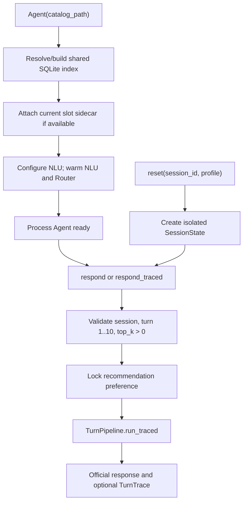
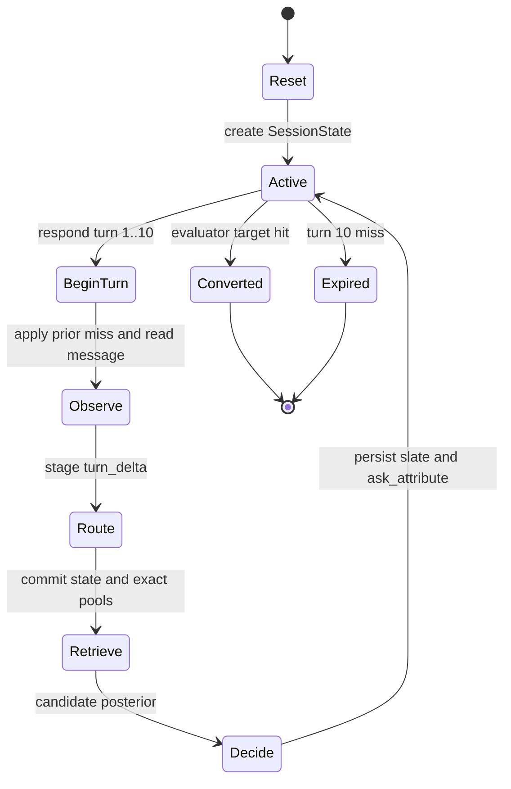
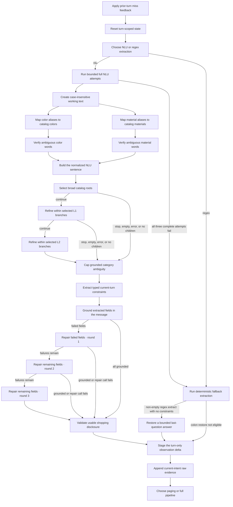
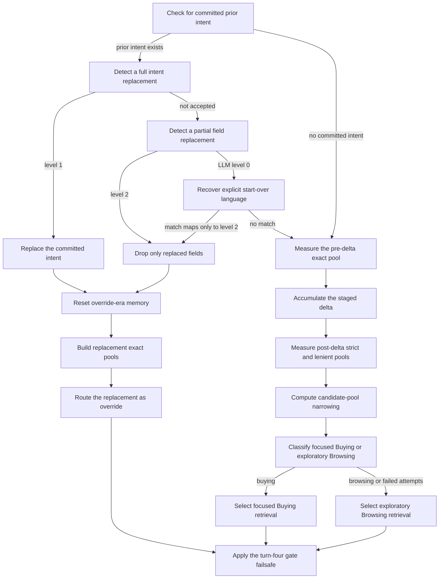
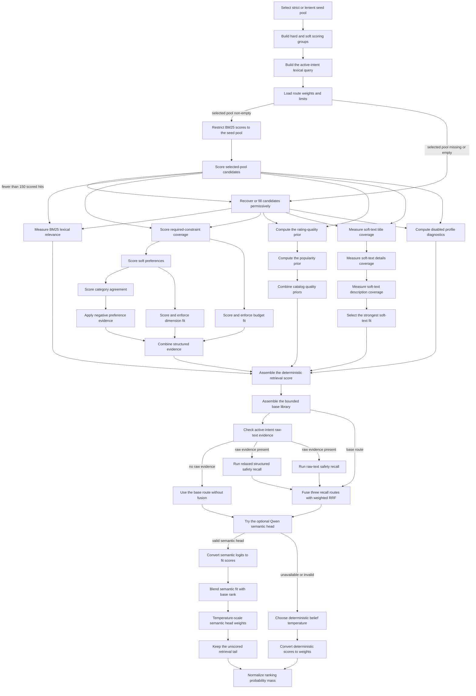
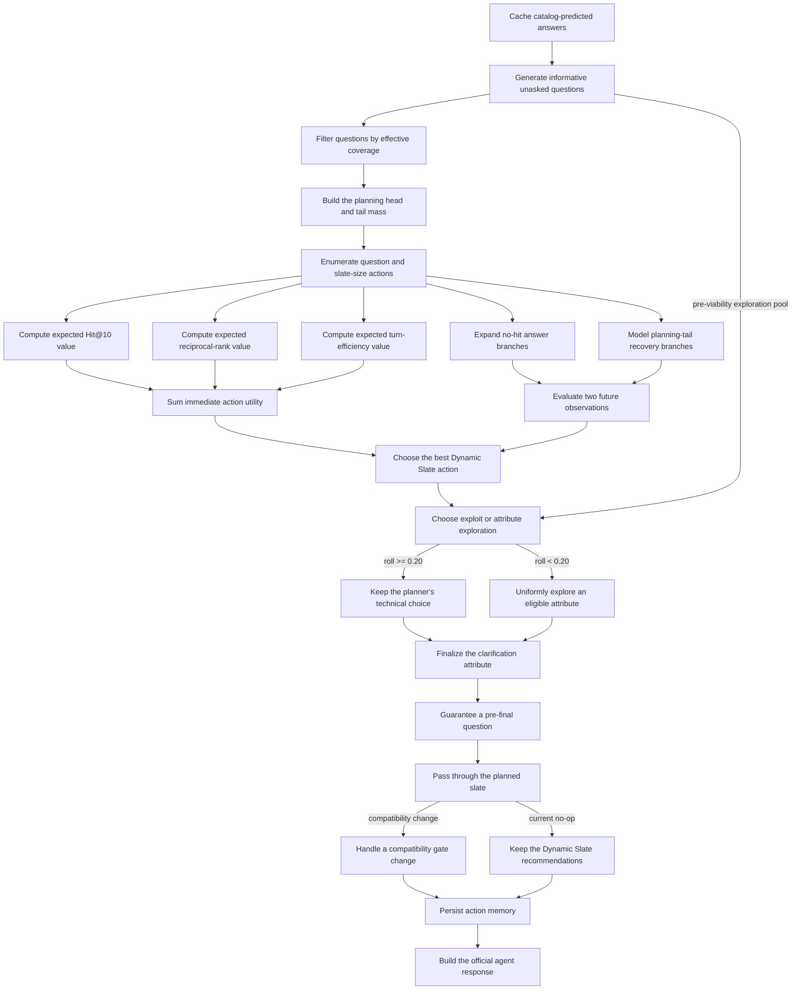

# Agent architecture

The `agent` package is the production implementation behind `starter.agent.Agent`. Its highest-level orchestrator owns shared catalog resources, creates isolated conversation sessions, enforces the ten-turn API contract, and sends every normal turn through four stages:

```text
Understand → Intent Router → Retrieve/Rank → Decide
```

The Agent treats every `user_message` as ordinary shopper language. It does not
receive or depend on a target ID, generated intent template, public label, or
scenario state. Its runtime inputs are `session_id`, aggregate `user_profile`,
natural-language messages, turn number, and `top_k`.

Stage-specific documentation:

- [`understand/README.md`](understand/README.md)
- [`intent_router/README.md`](intent_router/README.md)
- [`retrieve/README.md`](retrieve/README.md)
- [`decide/README.md`](decide/README.md)

## Top-level execution



`agent/orchestrator.py` is the process-level supervisor:

- creates one `CatalogRetriever` shared by every session;
- creates the pipeline and bounded planning configuration once;
- keeps `sessions: dict[str, SessionState]`;
- uses an `RLock` around session creation, validation, and preference updates;
- loads `scripts/nlu.env` unless regex mode was explicitly requested;
- starts/checks the local LLM runtime and warms both NLU and Intent Router clients in NLU mode; and
- exposes `respond()` for the evaluator and `respond_traced()` for diagnostics/Chainlit.

The lock protects the session registry and turn-boundary changes. The longer pipeline call receives the isolated state object after validation, so all meaningful dialogue memory remains per session while the expensive catalog index is process-wide.

## Required interface

```python
agent = Agent("data/catalog.jsonl")
agent.reset("session-123", user_profile)
response = agent.respond(
    session_id="session-123",
    user_message="I need waterproof running shoes under $120.",
    turn=1,
    top_k=10,
)
```

The returned dictionary is:

```python
{
    "message": "I narrowed this to 3 high-confidence options. Which color would you prefer?",
    "ask_attribute": "color",
    "recommendations": [
        {"parent_asin": "..."},
        {"parent_asin": "..."},
        {"parent_asin": "..."},
    ],
    "usage": {
        "prompt_tokens": 0,
        "completion_tokens": 0,
    },
}
```

`message` is customer-facing prose. `ask_attribute` is the structured question
field for downstream callers, so they do not need to infer it from prose. Only
valid unique IDs among the first ten recommendations are scored.

## Session lifecycle



`reset()` always replaces any prior state with the same session ID. The Agent does not infer turns; the caller supplies them, and only integers `1..10` are accepted.

At each `begin_turn`:

1. if `turn > 1` and the prior action's conversion gate was open, the previous `last_slate` is unioned into `excluded_asins` as implicit miss feedback; current response writeback already records displayed IDs there, so this union is idempotent;
2. the turn/message fields are advanced and transient Router accounting is cleared;
3. Understand observes the message and writes a `turn_delta` without committing it; and
4. a non-empty disclosure is appended to `current_intent_messages`, the active-intent text used by raw-text safety recall.

## SessionState

`understand/state/session.py` is the complete mutable memory for one conversation.

### Intent and conversion control

| Field | Meaning |
|---|---|
| `category` | current primary category surface |
| `intention` | current `buying`, `browsing`, or `override` retrieval track |
| `intent_version` | increments when an accepted override opens a new intent |
| `gate_open` | whether a recommendation may be treated as conversion/miss evidence |
| `override_seen` | accepted override has reset old-intent leftovers |
| `last_gate_open` | gate state attached to the previous action |

### Constraints and disclosures

| Field | Meaning |
|---|---|
| `typed_constraints` | committed typed `ConstraintSlot` rows |
| `active_constraints` | regex/legacy cited strings |
| `legacy_hints` | provisional category-attached hints kept until override |
| `turn_delta` | current Understand result waiting for Router commit |
| `disclosed` | values already disclosed by the simulated/user conversation |
| `disclosure_empty` | whether this turn added no product/attribute direction |
| `preference_tags` | deduplicated reset-time aggregate profile tags |
| `reply_value_lookup` | normalized mapping used to restore compact follow-up answers |

### Recommendation and question memory

| Field | Meaning |
|---|---|
| `asked`, `last_ask` | previously requested structured attributes |
| `last_slate` | recommendations returned on the immediately prior action |
| `last_ranked` | complete normalized ranking saved for paging |
| `excluded_asins` | missed or otherwise blocked products |
| `shown_asins` | all products displayed under the current intent |

### Messages and route evidence

| Field | Meaning |
|---|---|
| `latest_message` | current original utterance |
| `message_history` | full session message log |
| `current_intent_messages` | non-empty messages since the last accepted override |
| `candidate_count_before_delta` | strict exact-pool size before this turn's delta |
| `candidate_count` | strict exact-pool size after the delta |
| `previous_candidate_count` | prior turn's committed count |
| `exact_strict`, `exact_lenient` | pools computed by Intent Router |

### Planner and accounting

| Field | Meaning |
|---|---|
| `router_prompt_tokens`, `router_completion_tokens` | per-turn Intent Router model usage included in the response |
| `scoring_weights` | immutable HitRate/MRR/Efficiency utility weights |
| `recommendation_preference_position` | UI slider position |
| `recommendation_preference_locked` | prevents changes after the first response begins |

`preference_tags` are copied from `user_profile["preference_tags"]` only at reset, blank values are dropped, and duplicates are removed case-insensitively. No raw purchase history or direct identity data is expected.

Catalog scoring may compute profile similarity for diagnostics, but the
profile contribution to its final weighted score is disabled (`0.0`). The
optional Qwen reranker can still receive those tags as explicitly weak context.

## Normal turn pipeline

The identifiers below are the production progress-node IDs. Solid edges are
the active chain; dotted edges identify bounded retries or compatibility nodes
that can be skipped.

### Understand node chain

<!-- workflow-schema:understand -->

<!-- /workflow-schema -->

### Router node chain

<!-- workflow-schema:router -->

<!-- /workflow-schema -->

### Retrieve and rank node chain

<!-- workflow-schema:retrieve -->

<!-- /workflow-schema -->

### Decide node chain

<!-- workflow-schema:decide -->

<!-- /workflow-schema -->

The main path is implemented in `TurnPipeline.run_traced()`:

1. `StateDetector.apply()` runs Understand.
2. `IntentRouter.apply()` commits or replaces state and returns the strict exact pool.
3. `CandidateOrganizer.apply()` performs exact-first/hybrid retrieval and weighted route fusion.
4. `Ranker.apply()` converts search scores into a normalized candidate posterior, optionally using a local Qwen cross-encoder for the head.
5. `Clarifier.apply()` jointly chooses a recommendation prefix and `ask_attribute`.
6. `ResponseBuilder.apply()` persists the action and emits the official response shape.

`Clarifier` uses `DynamicSlatePlanner`, not `ScoreAwarePlanner.plan()`.
The compatibility `ScoreAwarePlanner` instance supplies only the outer
candidate-cap setting. Dynamic Slate decomposes immediate value into Hit,
MRR, and Efficiency terms, expands two answer observations, and then applies a
seeded epsilon policy (`0.20`) to the pre-viability informative/unasked
attribute list while leaving the planned slate unchanged. Question eligibility
does not directly suppress an attribute just because that attribute already
exists in `typed_constraints`.

Every stage emits structured progress events. `respond()` does not register a listener, so official evaluation has no UI dependency. `respond_traced()` returns the same response plus a read-only `TurnTrace` used by the demo and tests.

## Empty-disclosure shortcut

The shortcut is taken when all of the following are true after Understand:

- `turn_delta is None`;
- `disclosure_empty is not False` (`True` or `None`); and
- `last_ranked` still contains an ASIN not in `excluded_asins ∪ shown_asins`;

the pipeline skips Intent Router and Retrieve. It returns the next unshown prefix from `last_ranked`, capped by `min(top_k, 10)`, and asks a recovery question before turn 10. This treats “no additional preference” as a request to continue through existing evidence instead of repeating expensive retrieval.

If no leftover product exists, the shortcut is not taken and the normal route/retrieval path runs.

## Conversion gate and implicit negative feedback

The conversion gate controls modeled conversion utility and records whether the next turn should apply the explicit miss-feedback step:

- `record_action()` stores both `last_slate` and `last_gate_open`.
- At the next turn, only a slate shown with `last_gate_open=True` is unioned by `apply_miss_feedback()`; current response writeback already adds every shown slate to `excluded_asins`, so the conditional union does not change membership.
- An accepted override calls `open_conversion_gate()`, increments `intent_version`, sets `override_seen`, clears old misses/shown products/questions/legacy hints, and resets active-intent raw text.
- If a provisional path leaves the gate closed, the Router fail-safe opens it at turn 4. This fail-safe does not claim an override and does not increment `intent_version`.

## Runtime recommendation preference

Before the first `respond()`, `set_recommendation_preference(session_id, position)` maps a slider in `[0,100]` to planner weights:

- total HitRate + MRR budget is fixed at `0.80`;
- Efficiency is fixed at `0.20`;
- position `0` produces `HitRate=0.72`, `MRR=0.08`;
- position `100` produces `HitRate=0.08`, `MRR=0.72`;
- position `34.375` is the official-like default `0.50/0.30/0.20`;
- interior positions linearly change the HitRate share from 90% to 10% of the `0.80` recommendation budget.

The per-hit planner utility at turn `t` and rank `r` is:

\[
U(t,r)=w_H+\frac{w_M}{r}+0.20\cdot\frac{11-t}{10}.
\]

The setting is locked after the first response begins and affects planning only. The official evaluator still computes the fixed `0.50/0.30/0.20` TechnicalScore.

## Package map

```text
agent/
  orchestrator.py             process Agent and official API
  pipeline.py                 normal and empty-disclosure turn paths
  domain.py                   shared allowed attributes and text helpers
  progress.py                 optional progress-event protocol
  trace.py                    read-only stage traces
  understand/                 message observation and SessionState
  intent_router/              state commit and route selection
  retrieve/
    catalog/                  SQLite FTS/signature facade and scoring
    candidates/               exact-first organization and route fusion
  decide/
    ranking/                  semantic/fallback belief normalization
    clarification/            question and slate planner
    response/                 response construction and turn writeback
```

## Operating modes and failure behavior

### Understand mode

- `understand_mode="nlu"` or default: local Ollama extraction, three full attempts, then deterministic regex fallback.
- `understand_mode="regex"`: no Ollama initialization; use deterministic regex extraction and the bounded colon restore.

### Semantic reranker

- `AGENT_RERANKER_MODE=auto`: use the local model when available; otherwise use deterministic belief ranking.
- `off`: always use deterministic belief ranking.
- `required`: model load/inference failure raises a runtime error.

### Catalog assets

- A persistent FTS/signature index is fingerprinted by catalog path, size, and mtime and rebuilt automatically when stale.
- The separately preprocessed slot sidecar must already exist and be current. Missing/stale sidecars degrade safely; they are never rebuilt during a turn.

## Invariants

- Understand stages evidence but does not commit it.
- Intent Router is the only normal owner of typed-constraint writeback.
- Values within one typed attribute are OR alternatives; different attributes are AND requirements for exact filtering.
- Soft constraints never remove products from the strict exact pool.
- Old-intent raw messages are cleared on override and are never replayed into the new raw-text route.
- ASINs recorded in `excluded_asins`—including every displayed slate under current writeback—are removed before fusion and ranking.
- Decide returns only a prefix of the current ranking; it does not invent or reorder IDs independently.
- Turn 10 asks no further question and exposes the full allowed final prefix.
