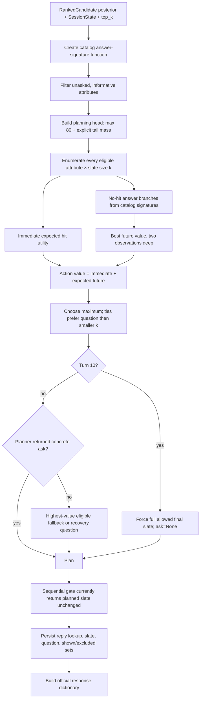

# Decide stage

Decide consumes Retrieve's normalized candidate posterior and jointly chooses:

1. which ranked prefix to recommend now (`k`, from zero to at most ten); and
2. which structured attribute to ask about next.

The current production policy is a two-observation dynamic slate planner backed by catalog-derived answer signatures. It optimizes expected TechnicalScore-style utility, preserves probability mass outside the planning head, forces a full final-turn slate, and writes the selected action back into session memory.

## Strict flow



## Inputs

### Ranked posterior

Retrieve supplies ordered `RankedCandidate` rows:

```python
RankedCandidate(
    parent_asin="...",
    score=<search/RRF/semantic weight>,
    probability=<normalized probability>,
)
```

Probabilities sum to one across the full current ranking. Decide does not create a new product order; every slate is a prefix of the ranking represented in its planning state.

### Session context

Decide reads:

- `turn` and `gate_open`;
- already `asked` attributes and current `disclosed` values;
- `disclosure_empty` to exhaust `other` after no-additional information;
- runtime recommendation utility weights; and
- retriever answer signatures for counterfactual replies.

## Answer signatures

`make_answer_signature()` wraps `CatalogRetriever.predict_reply(parent_asin, attribute, disclosed)`. For a candidate and question it predicts up to the catalog-supported values that remain undisclosed. A distinguished `NO_ADDITIONAL` signature represents a product with no useful remaining answer for that attribute.

These signatures are deterministic catalog approximations. Planning does not call the live Understand, Router, or Retrieve pipeline for every counterfactual branch.

## Eligible questions

Question order is:

```text
other → feature → material → color → style → size → use_case → budget
```

`category` and `brand` remain valid API attributes, but the released question ordering omits them because the current answer-signature coverage is less useful for the simulator.

### Normal ranking

Before turn 10, an attribute is eligible only when at least one candidate among the planning candidate cap has an informative non-`NO_ADDITIONAL` signature. Already asked attributes are removed. `other` is also removed after either an explicit empty disclosure or a prior `other` question.

### Empty ranking

When retrieval has no head, the recovery list is `feature`, `material`, `color`, and `other`, excluding attributes already asked. The tail model can still decide whether a zero-slate question has recovery value.

### Final turn

At turn 10 the only question is `None`; there is no future interaction to purchase with another clarification.

## Transition viability priors

`CatalogSignatureTransitionModel` combines measured catalog coverage with conservative parser-reliability configuration.

| Attribute | catalog coverage | parser reliability | useful probability `q=coverage×reliability` |
|---|---:|---:|---:|
| other | 1.0000 | 0.65 | 0.650000 |
| feature | 0.9580 | 0.80 | 0.766400 |
| material | 0.5730 | 0.90 | 0.515700 |
| color | 0.4270 | 0.95 | 0.405650 |
| style | 0.1620 | 0.85 | 0.137700 |
| size | 0.0757 | 0.90 | 0.068130 |
| use_case | 0.0163 | 0.75 | 0.012225 |
| budget | 0.0053 | 0.95 | 0.005035 |

Root-state viability requires `q ≥ 0.10`. Under current constants, other, feature, material, color, and style pass; size, use_case, and budget are filtered out of the dynamic root even if the earlier eligibility scan found an answer. This threshold is a planner approximation, not the Intent Router's Buying/Browsing decision.

When no viable pre-final question remains, the root injects the first viable attribute among feature, material, color, and other. If none can be injected, it uses `None`.

## Planning head and tail mass

The transition model plans over at most 80 ranked candidates even though Retrieve may return 150–500.

Let raw head probability mass be:

\[
H_{raw}=\sum_{d\in first\ 80}P(d).
\]

Natural mass outside the head is:

\[
T_{natural}=\max(0,1-H_{raw}).
\]

With non-empty candidates, planning reserves at least `tail_floor=0.20`:

\[
T=\max(T_{natural},0.20).
\]

With no candidates, `T=1`. Head probabilities are rescaled into the remaining budget:

\[
P_{head}'(d)=P(d)\cdot\frac{1-T}{H_{raw}},
\]

or zero when `H_raw=0`. This prevents a bounded head from pretending that unmodeled catalog products have zero probability.

The root gate probability is `1.0` when `state.gate_open`, otherwise `0.0`.

## Action space

An action is:

```python
DynamicSlateAction(
    ask_attribute=<eligible attribute or None>,
    slate_size=k,
)
```

For every current question, the planner tests all:

\[
k\in\{0,1,\ldots,\min(10,top\_k,|head|)\}.
\]

`allow_zero=True`, so a question-only turn is legal when expected information gain is worth more than exposing low-confidence products.

## Immediate recommendation utility

For turn `t`, rank `r`, and runtime weights `(w_H,w_M,w_E)`:

\[
u(t,r)=w_H+\frac{w_M}{r}+w_E\frac{11-t}{10}.
\]

Defaults are:

```text
w_H = 0.50
w_M = 0.30
w_E = 0.20
```

`w_H+w_M` is fixed at `0.80`; `w_E` is always `0.20`. The Chainlit pre-turn slider may redistribute the first `0.80` but cannot change the total or Efficiency weight.

For state gate probability `g` and slate size `k`, immediate expected value is:

\[
V_{now}(s,k)=g\sum_{r=1}^{k}P_s(d_r)\,u(t,r).
\]

When the conversion gate is closed (`g=0`), the current slate has zero modeled immediate conversion value.

## No-hit candidate mass

Only probability mass that continues after the current slate enters future branches. For candidate index `i`:

\[
m_i=
\begin{cases}
P_i(1-g), & i<k\\
P_i, & i\ge k.
\end{cases}
\]

With an open gate, displayed candidates contribute no no-hit continuation mass. With a probabilistically/fully closed gate, some or all of their mass survives to future planning.

The current-turn hit mass is:

\[
M_{hit}=g\sum_{i<k}P_i.
\]

All branch mass must be at most `1-M_hit`; otherwise the planner raises a transition-model error.

## Answer branches

For concrete attribute `a`, define:

\[
q_a=coverage_a\cdot reliability_a.
\]

For each surviving candidate mass `m_i`:

- if its signature is `NO_ADDITIONAL`, all `m_i` enters that branch;
- otherwise `m_i q_a` enters the candidate's typed signature branch; and
- `m_i(1-q_a)` enters `__no_information__`.

If `ask_attribute=None`, every surviving candidate enters `__no_information__`.

Candidates with the same signature share a branch. Each branch probability is the sum of its member masses, and its next candidate posterior is:

\[
P(d_i\mid branch)=\frac{m_i}{\sum_{j\in branch}m_j}.
\]

Typed questions retain the largest 12 branch groups. `other` retains the largest 4. Excess groups are merged into `__other_answers__`, ordered by their accumulated mass.

## Future question set and gate

For a non-empty posterior, the next state begins with `None` and may retain other unasked viable attributes. A future attribute remains only when its candidate signatures either vary or contain at least one informative non-`NO_ADDITIONAL` value. The attribute asked by the current action is removed.

The approximate next gate probability is:

\[
g'=\min(1,g+0.5).
\]

This models increasing likelihood of an open conversion gate over the two-step horizon without claiming an exact future Router result.

## Tail branches

Tail mass `T` is not attached to a specific product signature. For concrete attribute `a`:

\[
T_{useful}=Tq_a,\qquad T_{noinfo}=T-T_{useful}.
\]

The useful tail branch represents successful future recovery and has terminal value:

\[
V_{tail}=0.55\cdot u(t+1,1).
\]

The no-information tail branch has value zero. Both next states carry tail probability one and no explicit head candidates. If no attribute is asked, `q=0` and all tail mass becomes no-information.

`tail_retrieval_success=0.55` is a conservative configuration prior, not an evaluated probability.

## Two-observation lookahead

The planner configuration is:

```text
lookahead_steps = 2
allow_zero = True
force_full_final_slate = True
```

For action `a` in state `s` with remaining depth `h`:

\[
Q_h(s,a)=V_{now}(s,k_a)+\sum_b P(b\mid s,a)V_{h-1}(s_b).
\]

The state value is:

\[
V_h(s)=\max_a Q_h(s,a).
\]

At depth zero, the terminal approximation is the best immediate slate among allowed actions. The default depth expands answers at turns `t` and `t+1`, then uses the best immediate slate at `t+2`.

When no explicit candidates remain, the state returns its precomputed `tail_value`.

## Selection and tie-breaks

The action with greatest expected value wins. Exact ties prefer:

1. a concrete informative question over `None`; then
2. the smaller slate.

The selected recommendations are exactly the first `k` ASINs from the planning head.

### Final turn

At turn 10 the planner bypasses lookahead, sets `ask_attribute=None`, and returns the complete allowed prefix:

```text
k = min(10, top_k, number of planning candidates)
```

This maximizes final-turn hit opportunity because no subsequent answer can be used.

## Pre-final fallback question

Production response policy requires a concrete question before turn 10. If the dynamic planner returns `None`, `_choose_fallback_question()`:

1. considers concrete attributes from the original eligibility result;
2. prefers attributes never asked before;
3. evaluates every feasible `k` with the same two-step `_action_value` and keeps each attribute's best score; and
4. chooses the highest-value attribute with deterministic ordering.

If no concrete eligible attribute exists, `recovery_question()` cycles through the global question order while trying not to repeat `last_ask`.

The fallback keeps the planner's original recommendations and expected value; it does not rerun the expensive joint optimization after substituting the question.

`ResponseBuilder` performs the same recovery guard once more, so a pre-final response cannot accidentally expose `ask_attribute=None` through a downstream plan object.

## Sequential gate

`apply_sequential_gate()` currently returns `plan.recommendations` unchanged. Slate-size risk is already part of the joint expected-utility objective, so there is no contradictory post-planning rank-1 truncation.

The progress trace retains `sequential_gate`, `gate_rank1`, and `keep_planned` nodes for observability and compatibility, but the current implementation does not modify `k` after planning.

## Response writeback

Before building the external dictionary, `persist_turn()` writes the action into session memory.

### Reply lookup

When `ask_attribute` is concrete, the retriever predicts that attribute's answer for every candidate ASIN in the search-hit list, not only the displayed slate. `build_reply_lookup()` converts those options into a normalization map used by Understand for compact next-turn replies. When `ask_attribute=None`, the lookup is cleared.

### Action memory

`record_action()` currently performs:

```text
last_slate = slate
last_gate_open = gate_open
last_ask = ask_attribute
excluded_asins += slate
shown_asins += slate
asked += ask_attribute, when non-null
```

Therefore displayed ASINs are immediately blocked from later retrieval under the same intent. The next turn's gate-aware miss-feedback union is idempotent with this current writeback; gate state is still stored for pipeline diagnostics and planning.

Accepted intent override later clears both shown and excluded sets.

## External response

`ResponseBuilder` returns:

```python
{
    "message": <natural-language summary and question>,
    "ask_attribute": <allowed attribute or None>,
    "recommendations": [
        {"parent_asin": asin} for asin in slate
    ],
    "usage": {
        "prompt_tokens": state.router_prompt_tokens,
        "completion_tokens": state.router_completion_tokens,
    },
}
```

With a non-empty slate, the message says how many high-confidence options were found and appends the attribute-specific question template. With an empty slate, it explains that low-confidence matches are being withheld and asks the selected question. The evaluator follows `ask_attribute`, not natural-language template parsing.

## Files

```text
decide/
  ranking/
    normalize.py             posterior normalization
    belief.py                deterministic score-to-belief transform
    semantic.py              optional Qwen cross-encoder
  clarification/
    stage.py                 production Decide entry
    questions.py             question eligibility and templates
    replies.py               catalog answer signatures
    dynamic_adapter.py       signature/tail transition model
    dynamic_slate.py         finite-horizon planner
    utility.py               runtime TechnicalScore-style utility
    slate.py                 no-op post-plan execution gate
    planner.py               legacy planner retained for compatibility/cap
  response/
    builder.py               official response shape
    writeback.py             session action and reply lookup
```

## Invariants

- Slate products remain a ranked prefix; Decide does not independently retrieve.
- Recommendation count and question are optimized jointly.
- At most 80 candidates are expanded, but at least 20% tail mass is reserved.
- Action size never exceeds ten, caller `top_k`, or available planning candidates.
- A zero-product clarification turn is legal before turn 10.
- Turn 10 always asks nothing and returns the full allowed prefix.
- Question branches are catalog-signature approximations with explicit no-information mass.
- Displayed products are immediately added to shown and excluded sets in current writeback.
- The response always uses the official `message`, `ask_attribute`, `recommendations`, and `usage` shape.
