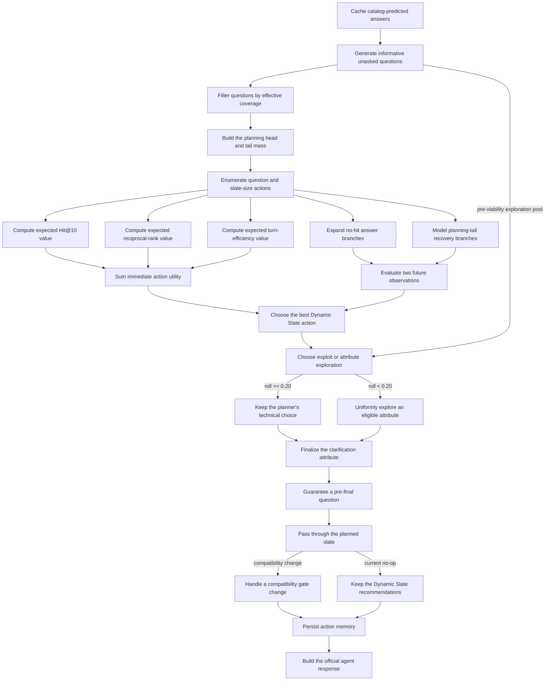

# Decide: ranking, clarification, and dynamic slating

Decide consumes Retrieve's ordered `SearchHit` library, optionally reranks its
head, converts ranking weights into a normalized decision belief, and jointly
chooses:

1. which ranked prefix to recommend now (`k`, from zero to at most ten); and
2. which structured attribute to ask about next.

The current production policy is a two-observation dynamic slate planner backed
by catalog-derived answer signatures. It optimizes expected
TechnicalScore-style utility, preserves probability mass outside the planning
head, forces a full final-turn slate, and writes the selected action back into
session memory.

## Stage boundary

```text
SearchHit[] from Retrieve
        |
        v
Ranker
  optional Qwen semantic head, otherwise deterministic score belief
        |
        v
RankedCandidate[] = (parent_asin, score, probability)
        |
        v
Clarifier
  eligible questions + catalog answer signatures + tail approximation
        |
        v
DynamicSlatePlanner
  joint search over (ask_attribute, slate_size)
        |
        v
ResponseBuilder
  action writeback + official response dictionary
```

Decide may change the order through its bounded semantic reranker, but it never
adds a product that Retrieve did not supply. After ranking, every recommendation
slate is a prefix of the `RankedCandidate` order represented in the planner
state. The natural-language `message` is customer-facing; the evaluator uses
the structured `ask_attribute` to choose its next reply.

The legacy one-step `ScoreAwarePlanner` remains as a compatibility baseline and
provides the candidate cap used by `Clarifier`. Production action selection uses
`DynamicSlatePlanner`.

## Dynamic Slate objective

Dynamic Slate selects the clarification question and recommendation count as one
joint action:

```math
u_t=(a_t,k_t), \qquad k_t\in\{0,1,\ldots,10\}.
```

For candidate `d_i`, the ranking belief is:

```math
p_i=P(X=d_i\mid S_t),
```

including probability mass outside the explicit planning head:

```math
\sum_{i=1}^{N}p_i+p_{\mathrm{tail}}=1.
```

If the hidden target is first found at turn `t` and recommendation rank `r`,
the runtime utility is:

```math
U(t,r)=w_H+\frac{w_M}{r}+w_E\frac{11-t}{10},
\qquad (w_H,w_M,w_E)=(0.50,0.30,0.20)\text{ by default}.
```

The immediate expected value of exposing the first `k_t` candidates is:

```math
I_t(S_t,k_t)
=g_t\sum_{r=1}^{k_t}p_rU(t,r),
```

where `g_t` is the probability that the current intent is eligible to convert.
For normalized answer `y`, the no-hit answer branch has joint probability:

```math
q_t(y\mid a_t,k_t)
=\sum_{i=1}^{N}
p_i\left[1-g_t\mathbf{1}(i\leq k_t)\right]\ell_i^t(y)
+p_{\mathrm{tail}}\ell_{\mathrm{tail}}^t(y),
```

with answer likelihood:

```math
\ell_i^t(y)=P(Y_{t+1}=y\mid X=d_i,a_t,S_t).
```

After a miss and answer, the transition adapter constructs the next planning
state:

```math
S_{t+1}^{y,k_t}
=\mathrm{UpdateAndRetrieve}(S_t,a_t,k_t,y).
```

The bounded finite-horizon recursion is:

```math
V_t^{(0)}(S_t)=\max_{a_t,k_t}I_t(S_t,k_t),
```

```math
Q_t^{(h)}(S_t,a_t,k_t)
=I_t(S_t,k_t)
+\sum_y q_t(y\mid a_t,k_t)
V_{t+1}^{(h-1)}\left(S_{t+1}^{y,k_t}\right),
```

```math
V_t^{(h)}(S_t)=\max_{a_t,k_t}Q_t^{(h)}(S_t,a_t,k_t).
```

Production expands two answer observations and selects:

```math
(a_t^*,k_t^*)
=\underset{a_t,k_t}{\mathrm{arg\,max}}\;
Q_t^{(2)}(S_t,a_t,k_t).
```

Thus `k_t` is not a fixed intent-to-size rule. It is the recommendation count
with the greatest modeled immediate-plus-future value for the current turn,
ranking belief, gate state, and possible clarification answers. The detailed
transition approximation remains documented in
[`clarification/README.md`](clarification/README.md).

## Strict flow

<!-- workflow-schema:decide -->

<!-- /workflow-schema -->

## Inputs

### Ranking path

`Ranker.apply()` first offers the retrieved head to `QwenSemanticReranker`.
When the configured cross-encoder is disabled, unavailable, or returns no
weights, ranking falls back deterministically to a shifted softmax over
retrieval scores:

```math
w_i=\exp\left(\frac{s_i-s_{max}}{\tau}\right).
```

Ordinary structured scores use temperature `0.12`. Weighted-RRF scores operate
at a much smaller numeric scale, so `belief_temperature()` uses a clipped
adaptive temperature derived from the score range. Both paths end in
`normalize_probabilities()`. These values are decision beliefs derived from
retrieval evidence, not calibrated probabilities that a shopper will purchase
an item.

Semantic reranking is bounded to the retrieved head and fails safely to the
deterministic path. Runtime configuration and model-loading behavior are
documented in [`ranking/README.md`](ranking/README.md).

### Ranked posterior

The internal Ranker supplies ordered `RankedCandidate` rows:

```python
RankedCandidate(
    parent_asin="...",
    score=<search/RRF/semantic weight>,
    probability=<normalized probability>,
)
```

Probabilities sum to one across the full current ranking. Decide does not create a new product order; every slate is a prefix of the ranking represented in its planning state.

### Session context

Decide reads:

- `turn` and `gate_open`;
- already `asked` attributes and current `disclosed` values;
- `disclosure_empty` to exhaust `other` after no-additional information;
- runtime recommendation utility weights; and
- retriever answer signatures for counterfactual replies.

## Answer signatures

`make_answer_signature()` wraps `CatalogRetriever.predict_reply(parent_asin, attribute, disclosed)`. For a candidate and question it predicts up to the catalog-supported values that remain undisclosed. A distinguished `NO_ADDITIONAL` signature represents a product with no useful remaining answer for that attribute.

These signatures are deterministic catalog approximations. Planning does not call the live Understand, Router, or Retrieve pipeline for every counterfactual branch.

## Eligible questions

Question order is:

```text
other → feature → material → color → style → size → use_case → budget
```

`category` and `brand` remain valid API attributes, but they are not members of
the current `QUESTION_ATTRIBUTES` planning order.

### Normal ranking

Before turn 10, an attribute is eligible only when at least one candidate among the planning candidate cap has an informative non-`NO_ADDITIONAL` signature. Already asked attributes are removed. `other` is also removed after either an explicit empty disclosure or a prior `other` question.

`eligible_questions()` does **not** directly filter an attribute merely because
`typed_constraints` already contains that attribute. A committed color, size,
or material can still be eligible when it has not been asked and at least one
candidate has a remaining informative answer signature.

### Empty ranking

When retrieval has no head, the recovery list is `feature`, `material`, `color`, and `other`, excluding attributes already asked. The tail model can still decide whether a zero-slate question has recovery value.

### Final turn

At turn 10 the only question is `None`; there is no future interaction to purchase with another clarification.

## Transition viability priors

`CatalogSignatureTransitionModel` combines measured catalog coverage with conservative parser-reliability configuration.

| Attribute | catalog coverage | parser reliability | useful probability `q=coverage×reliability` |
|---|---:|---:|---:|
| other | 1.0000 | 0.65 | 0.650000 |
| feature | 0.9580 | 0.80 | 0.766400 |
| material | 0.5730 | 0.90 | 0.515700 |
| color | 0.4270 | 0.95 | 0.405650 |
| style | 0.1620 | 0.85 | 0.137700 |
| size | 0.0757 | 0.90 | 0.068130 |
| use_case | 0.0163 | 0.75 | 0.012225 |
| budget | 0.0053 | 0.95 | 0.005035 |

Root-state viability requires `q ≥ 0.10`. Under current constants, other, feature, material, color, and style pass; size, use_case, and budget are filtered out of the dynamic root even if the earlier eligibility scan found an answer. This threshold is a planner approximation, not the Intent Router's Buying/Browsing decision.

## Deterministic attribute exploration

Before turn 10, question selection uses a deterministic epsilon-greedy policy.
The Dynamic Slate question is retained 80% of the time. The other 20% uniformly
selects from the pre-viability eligible attributes, so informative low-coverage
attributes such as size, use case, and budget can still be asked.

Exploration does not bypass answer-signature eligibility, prior-question
exclusion, or the explicit empty-disclosure rule for `other`. It is disabled
when the ranked candidate list or exploration pool is empty. The recommendation
prefix and slate size remain the values chosen by Dynamic Slate.

The local random generator is seeded with `session_id`, `intent_version`, and
`turn`. Repeated runs are reproducible, while an accepted override starts a new
deterministic exploration sequence after clearing the asked-attribute history.

When no viable pre-final question remains, the root injects the first viable attribute among feature, material, color, and other. If none can be injected, it uses `None`.

## Planning head and tail mass

The transition model plans over at most 80 ranked candidates even though Retrieve may return 150–500.

Let raw head probability mass be:

```math
H_{raw}=\sum_{d\in first\ 80}P(d).
```

Natural mass outside the head is:

```math
T_{natural}=\max(0,1-H_{raw}).
```

With non-empty candidates, planning reserves at least `tail_floor=0.20`:

```math
T=\max(T_{natural},0.20).
```

With no candidates, `T=1`. Head probabilities are rescaled into the remaining budget:

```math
P_{head}'(d)=P(d)\cdot\frac{1-T}{H_{raw}},
```

or zero when `H_raw=0`. This prevents a bounded head from pretending that unmodeled catalog products have zero probability.

The root gate probability is `1.0` when `state.gate_open`, otherwise `0.0`.

## Action space

An action is:

```python
DynamicSlateAction(
    ask_attribute=<eligible attribute or None>,
    slate_size=k,
)
```

For every current question, the planner tests all:

```math
k\in\{0,1,\ldots,\min(10,top\_k,|head|)\}.
```

`allow_zero=True`, so a question-only turn is legal when expected information gain is worth more than exposing low-confidence products.

## Immediate recommendation utility

### Pre-chat recommendation-preference slider

The Chainlit demo displays an optional preference slider before the shopper's
first message. Its user-facing endpoints are:

| Slider position | Displayed endpoint label | Planner emphasis | Runtime weights `(w_H, w_M, w_E)` |
|---|---|---|---|
| `0` (left) | **Recommend more products** | favor broader slates and HitRate | `(0.72, 0.08, 0.20)` |
| `34.375` (default) | — | match the official scoring proportions | `(0.50, 0.30, 0.20)` |
| `100` (right) | **More precise recommendations** | favor high-ranked results and MRR | `(0.08, 0.72, 0.20)` |

Positions between the endpoints interpolate linearly. The slider redistributes
only the fixed `0.80` recommendation budget between HitRate and MRR; the
Efficiency weight remains `0.20`.

The selected position is stored in the session and passed into Decide's joint
question-and-slate planner. It can therefore change the selected slate size and,
when actions have close utility, the chosen clarification action. It does not
change retrieval, reorder the candidate ranking, alter candidate probabilities,
or modify the official evaluator formula.

The setting is available only before the first `respond()` begins. At that point
the session locks it, so every later turn uses the same preference. Evaluator
sessions and callers that do not set a preference use the balanced default.

For turn `t`, rank `r`, and runtime weights `(w_H,w_M,w_E)`:

```math
u(t,r)=w_H+\frac{w_M}{r}+w_E\frac{11-t}{10}.
```

Defaults are:

```text
w_H = 0.50
w_M = 0.30
w_E = 0.20
```

`w_H+w_M` is fixed at `0.80`; `w_E` is always `0.20`.

For state gate probability `g` and slate size `k`, immediate expected value is:

```math
V_{now}(s,k)=g\sum_{r=1}^{k}P_s(d_r)\,u(t,r).
```

When the conversion gate is closed (`g=0`), the current slate has zero modeled immediate conversion value.

## No-hit candidate mass

Only probability mass that continues after the current slate enters future branches. For candidate index `i`:

```math
m_i=P_i\left(1-g\,z_i(k)\right),
```

where `z_i(k)=1` when candidate `i` is included in the displayed slate and
`z_i(k)=0` otherwise. Thus an open gate removes displayed candidates from the
no-hit continuation branch, while a closed gate preserves their mass.

With an open gate, displayed candidates contribute no no-hit continuation mass. With a probabilistically/fully closed gate, some or all of their mass survives to future planning.

The current-turn hit mass is:

```math
M_{hit}=g\sum_{i=0}^{k-1}P_i.
```

All branch mass must be at most `1-M_hit`; otherwise the planner raises a transition-model error.

## Answer branches

For concrete attribute `a`, define:

```math
q_a=coverage_a\cdot reliability_a.
```

For each surviving candidate mass `m_i`:

- if its signature is `NO_ADDITIONAL`, all `m_i` enters that branch;
- otherwise `m_i q_a` enters the candidate's typed signature branch; and
- `m_i(1-q_a)` enters `__no_information__`.

If `ask_attribute=None`, every surviving candidate enters `__no_information__`.

Candidates with the same signature share a branch. Each branch probability is the sum of its member masses, and its next candidate posterior is:

```math
P(d_i\mid branch)=\frac{m_i}{\sum_{j\in branch}m_j}.
```

Typed questions retain the largest 12 branch groups. `other` retains the largest 4. Excess groups are merged into `__other_answers__`, ordered by their accumulated mass.

## Future question set and gate

For a non-empty posterior, the next state begins with `None` and may retain other unasked viable attributes. A future attribute remains only when its candidate signatures either vary or contain at least one informative non-`NO_ADDITIONAL` value. The attribute asked by the current action is removed.

The approximate next gate probability is:

```math
g'=\min(1,g+0.5).
```

This models increasing likelihood of an open conversion gate over the two-step horizon without claiming an exact future Router result.

## Tail branches

Tail mass `T` is not attached to a specific product signature. For concrete attribute `a`:

```math
T_{useful}=Tq_a,\qquad T_{noinfo}=T-T_{useful}.
```

The useful tail branch represents successful future recovery and has terminal value:

```math
V_{tail}=0.55\cdot u(t+1,1).
```

The no-information tail branch has value zero. Both next states carry tail probability one and no explicit head candidates. If no attribute is asked, `q=0` and all tail mass becomes no-information.

`tail_retrieval_success=0.55` is a conservative configuration prior, not an evaluated probability.

## Two-observation lookahead

The planner configuration is:

```text
lookahead_steps = 2
allow_zero = True
force_full_final_slate = True
```

For action `a` in state `s` with remaining depth `h`:

```math
Q_h(s,a)=V_{now}(s,k_a)+\sum_b P(b\mid s,a)V_{h-1}(s_b).
```

The state value is:

```math
V_h(s)=\max_a Q_h(s,a).
```

At depth zero, the terminal approximation is the best immediate slate among allowed actions. The default depth expands answers at turns `t` and `t+1`, then uses the best immediate slate at `t+2`.

When no explicit candidates remain, the state returns its precomputed `tail_value`.

## Selection and tie-breaks

The action with greatest expected value wins. Exact ties prefer:

1. a concrete informative question over `None`; then
2. the smaller slate.

The selected recommendations are exactly the first `k` ASINs from the planning head.

### Final turn

At turn 10 the planner bypasses lookahead, sets `ask_attribute=None`, and returns the complete allowed prefix:

```text
k = min(10, top_k, number of planning candidates)
```

This maximizes final-turn hit opportunity because no subsequent answer can be used.

## Pre-final fallback question

Production response policy requires a concrete question before turn 10. If the dynamic planner returns `None`, `_choose_fallback_question()`:

1. considers concrete attributes from the original eligibility result;
2. prefers attributes never asked before;
3. evaluates every feasible `k` with the same two-step `_action_value` and keeps each attribute's best score; and
4. chooses the highest-value attribute with deterministic ordering.

If no concrete eligible attribute exists, `recovery_question()` cycles through the global question order while trying not to repeat `last_ask`.

The fallback keeps the planner's original recommendations and expected value; it does not rerun the expensive joint optimization after substituting the question.

`ResponseBuilder` performs the same recovery guard once more, so a pre-final response cannot accidentally expose `ask_attribute=None` through a downstream plan object.

## Sequential gate

`apply_sequential_gate()` currently returns `plan.recommendations` unchanged. Slate-size risk is already part of the joint expected-utility objective, so there is no contradictory post-planning rank-1 truncation.

The progress trace retains `sequential_gate`, `gate_rank1`, and `keep_planned` nodes for observability and compatibility, but the current implementation does not modify `k` after planning.

## Response writeback

Before building the external dictionary, `persist_turn()` writes the action into session memory.

### Reply lookup

When `ask_attribute` is concrete, the retriever predicts that attribute's answer for every candidate ASIN in the search-hit list, not only the displayed slate. `build_reply_lookup()` converts those options into a normalization map used by Understand for compact next-turn replies. When `ask_attribute=None`, the lookup is cleared.

### Action memory

`record_action()` currently performs:

```text
last_slate = slate
last_gate_open = gate_open
last_ask = ask_attribute
excluded_asins += slate
shown_asins += slate
asked += ask_attribute, when non-null
```

Therefore displayed ASINs are immediately blocked from later retrieval under the same intent. The next turn's gate-aware miss-feedback union is idempotent with this current writeback; gate state is still stored for pipeline diagnostics and planning.

Accepted intent override later clears both shown and excluded sets.

## External response

`ResponseBuilder` returns:

```python
{
    "message": <natural-language summary and question>,
    "ask_attribute": <allowed attribute or None>,
    "recommendations": [
        {"parent_asin": asin} for asin in slate
    ],
    "usage": {
        "prompt_tokens": state.router_prompt_tokens,
        "completion_tokens": state.router_completion_tokens,
    },
}
```

With a non-empty slate, the message says how many high-confidence options were
found and appends the attribute-specific question wording. With an empty slate,
it explains that low-confidence matches are being withheld and asks the
selected question. Downstream callers should use the structured
`ask_attribute`; they need not parse the prose.

## Files

```text
decide/
  ranking/
    normalize.py             posterior normalization
    belief.py                deterministic score-to-belief transform
    semantic.py              optional Qwen cross-encoder
  clarification/
    stage.py                 production Decide entry
    questions.py             question eligibility and templates
    replies.py               catalog answer signatures
    dynamic_adapter.py       signature/tail transition model
    dynamic_slate.py         finite-horizon planner
    utility.py               runtime TechnicalScore-style utility
    slate.py                 no-op post-plan execution gate
    planner.py               legacy planner retained for compatibility/cap
  response/
    builder.py               official response shape
    writeback.py             session action and reply lookup
```

## Invariants

- Slate products remain a ranked prefix; Decide does not independently retrieve.
- Recommendation count and question are optimized jointly.
- At most 80 candidates are expanded, but at least 20% tail mass is reserved.
- Action size never exceeds ten, caller `top_k`, or available planning candidates.
- A zero-product clarification turn is legal before turn 10.
- Turn 10 always asks nothing and returns the full allowed prefix.
- Question branches are catalog-signature approximations with explicit no-information mass.
- Displayed products are immediately added to shown and excluded sets in current writeback.
- The response always uses the official `message`, `ask_attribute`, `recommendations`, and `usage` shape.

## Design rationale

The planner couples question choice and recommendation count because the two
actions consume the same turn. Showing a wider slate increases immediate hit
coverage, but a first hit at a lower rank receives less MRR credit. Asking an
informative question can improve the next ranking, while waiting also loses
turn-efficiency value. Optimizing `(ask_attribute, slate_size)` together keeps
that trade-off in one objective instead of applying a question heuristic and a
separate fixed `k` policy.

Within the counterfactual planner, the conversion gate prevents pre-override
recommendations from receiving immediate hit value or being treated as certain
negative feedback. Tail mass prevents the bounded planning head from claiming
that the hidden target must be among its explicit candidates. These are
planning abstractions; neither exposes the evaluator's hidden target or private
scenario state to the Agent.

## Limitations

- Score softmaxes are ranking beliefs, not out-of-fold calibrated target
  probabilities. Overconfidence can make a slate too narrow; a flat belief can
  make it too wide.
- Counterfactual branches partition the current planning head. They do not run
  Understand, Router, and Retrieve again for every hypothetical answer, so new
  entrants are represented only by the coarse tail-recovery branch.
- Catalog coverage, parser reliability, tail recovery, and future gate movement
  are global engineering priors rather than category-conditioned measurements.
- The released simulator gives `other` unusual disclosure behavior. Parser
  discounting and branch compaction reduce, but do not eliminate, sensitivity
  to that behavior.
- Live writeback immediately excludes every displayed ID, regardless of gate
  state, although an accepted intent override clears those exclusions. The
  planner's probabilistic gate model is therefore more nuanced than the current
  between-turn retrieval memory.
- The two-observation horizon is deliberately bounded. Questions whose value
  appears only after three or more additional turns may be underestimated.
- The competition objective has no explicit cognitive-load cost for displaying
  more products. The planner is metric-aligned but is not a complete model of
  real shopper fatigue or choice overload.

## Verification and useful ablations

Run the focused unit tests from the repository root:

```bash
python3 -m unittest discover -s tests -p 'test_dynamic_slate.py'
python3 -m unittest discover -s tests -p 'test_recommendation_preference.py'
```

When reporting planner quality, compare fixed `k` baselines, the legacy
one-step planner, Dynamic Slating with and without zero-product turns, and the
semantic versus deterministic ranking paths on the same sessions. Report
HitRate@10, MRR, MTTC, slate-size distribution, repeated-recommendation rate,
and planner latency. Public-set scenario labels are correlated with the
released sample construction, so per-scenario differences are diagnostic and
should not be presented as clean causal effects.
