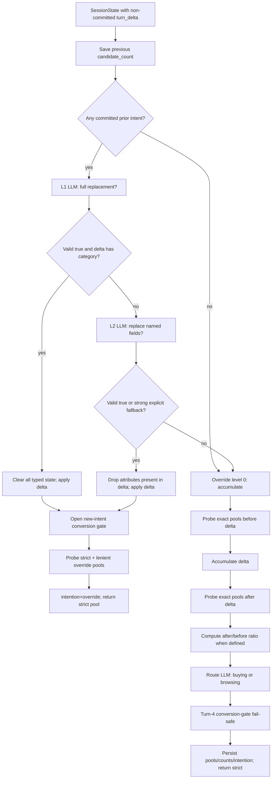

# Intent Router stage

Intent Router is the only normal stage that commits Understand's `turn_delta` to session constraints. It first decides whether the message replaces prior state, then computes strict and match-or-unknown exact pools, and finally selects the Buying or Browsing retrieval track when no override was accepted.

The stage returns the strict exact set (or `None`) and stores both strict and lenient sets in `SessionState` for Retrieve.

## Strict flow



All Router LLM calls use the same local model settings as Understand but a separate process-wide client. They require strict JSON, use temperature `0.0`, `num_ctx=8192`, and are tried up to three times. Prompt/completion tokens are accumulated in the session and returned by `ResponseBuilder` as this turn's usage.

## Inputs and outputs

### Inputs

- committed `SessionState.category`, `typed_constraints`, `active_constraints`, and legacy hints;
- current original message and recent history;
- Understand's non-committed `turn_delta`;
- `CatalogRetriever` exact signature/slot/numeric lookup; and
- prior candidate counts and conversion-gate state.

### State written

| Field | Write |
|---|---|
| `typed_constraints` | accumulated or replacement slots |
| `active_constraints` | accumulated/replaced legacy strings |
| `category` | synchronized to the latest hard category row |
| `intention` | `buying`, `browsing`, or `override` |
| `candidate_count_before_delta` | strict pool size before accumulate writeback |
| `candidate_count` | strict pool size after writeback |
| `exact_strict` | strict hard-constraint pool or `None` |
| `exact_lenient` | match-or-unknown hard-constraint pool or `None` |
| gate/miss/question fields | reset when an override opens a new intent |

`None` is semantically different from `set()`: `None` means an exact pool cannot be represented from the available hard signals; an empty set means all relevant signals were representable but their intersection contains no product.

## Two override levels

Override is intentionally a two-level decision. L1 is evaluated first; L2 runs only if L1 is not accepted.

### L1: full intent replacement

The L1 model answers exactly `{"full": true|false}`. It may return true only when the shopper explicitly discards the complete prior need and supplies a distant replacement product category, such as sandals → backpack.

The code accepts L1 only when `turn_delta` actually contains a category. This grounding guard prevents a model from erasing all state after a phrase such as “ignore my earlier preference; I need polyester,” which names an attribute but no replacement product family.

Accepted L1 behavior:

1. clear `typed_constraints`, `active_constraints`, `legacy_hints`, and primary category;
2. apply the entire current delta;
3. open the conversion gate for a new intent;
4. clear prior ranked leftovers; and
5. probe the new strict/lenient pools.

### L2: partial field replacement

The L2 model answers exactly `{"override": true|false}`. L2 means the shopper clearly replaces one or more named fields while preserving unrelated intent—for example, blue instead of pink, polyester instead of leather, or formal shoes instead of running shoes.

Accepted L2 behavior:

1. derive all attribute names present in the delta;
2. remove committed typed rows with those attributes;
3. remove legacy active strings whose classified attribute is being replaced;
4. clear the primary category only when category is among the replacement fields;
5. apply the current delta; and
6. perform the same new-intent gate cleanup as L1.

“Also black and blue,” ordinary follow-up answers, hedges, or stock “ignore” phrases without a replacement field are accumulation, not L2.

### Strong explicit fallback

If both model levels return no override but prior intent exists, a conservative anchored regex recognizes explicit start-over language such as “ignore my earlier preference,” “forget the old requirement,” “I changed my mind,” or “I no longer want…”. It maps only to L2, never L1. That allows named delta fields to be replaced without risking an ungrounded full reset.

## New-intent gate cleanup

Both accepted levels call `finish_override_gate()`:

```text
intent_version += 1
override_seen = True
gate_open = True
legacy_hints = []
excluded_asins = ∅
shown_asins = ∅
asked = []
last_ranked = []
current_intent_messages = [latest_message]
```

Resetting `current_intent_messages` is critical: the raw-text retrieval route cannot replay words from the superseded need. Clearing misses and shown products also allows a product rejected under the old intent to be considered again under the new one.

An override branch sets `candidate_count_before_delta=None`, stores the new strict count in `candidate_count`, sets `intention="override"`, and skips the Buying/Browsing classifier for that turn.

## Accumulation writeback

When override level is zero, the stage probes before and after applying the delta.

`apply_delta()` behavior:

- empty/absent delta: no state change;
- slot rows: split/deduplicate by `(attribute, value)` and upsert into `typed_constraints`;
- category: synchronize the primary category to the last hard category row, which is normally the most specific selected tree layer;
- cited strings: add to legacy `active_constraints`/`disclosed` state;
- provisional hint: retain it as a soft legacy hint and close the conversion gate when applied through the regex category path.

Same-attribute alternatives are preserved as separate value rows but later grouped as OR. Hardness is value-specific, so a later mention may change one value from hard to soft without deleting other alternatives.

## Exact-pool construction

Only hard constraints participate. Soft slots are excluded from all exact intersections.

Let each hard attribute `a` have alternatives `v₁…vₘ`. The attribute match set is:

\[
M_a=\bigcup_{j=1}^{m}\operatorname{Match}(a,v_j).
\]

Different attributes are combined with AND:

\[
P_{strict}=\bigcap_a M_a.
\]

Thus `color=blue OR orange` remains one group, while `color AND material AND category` intersect.

### Category treatment

- Category is probed before the other hard groups.
- A category hit contributes normally.
- A category miss is skipped when another non-category hard group remains, because an NLU category phrase may be broader than a sidecar node.
- A category-only miss yields `(strict=None, lenient=None)` rather than searching the whole catalog.

### Unrepresented non-category values

If a non-category hard group has no exact match, that empty group is retained for lenient construction and strict becomes `None`. It is not silently ignored.

### Response-only versus broader aliases

Regex/legacy slots normally use response-only normalized signature values. Typed slots carrying sidecar canonicals allow broader search aliases. This preserves exact evaluator-like response values when appropriate while allowing the structured preprocessing vocabulary to match catalog attributes.

## Lenient match-or-unknown pool

Lenient exact keeps products that either match each hard attribute or do not expose that attribute at all. For attribute `a`, let `K_a` be all products with a known value for `a`, and `U` the catalog universe:

\[
L_a=M_a\cup(U-K_a).
\]

The final lenient pool is:

\[
P_{lenient}=\bigcap_a L_a.
\]

This does not treat a known mismatch as acceptable. A product with price `$130` still fails `price ≤ $100`; only a product with unknown price survives that attribute's lenient test.

### Example

Hard constraints:

```text
category = running shoes
color = blue OR orange
budget <= 100
```

Strict requires a category match, a matching color, and a present price at most 100. Lenient additionally permits a product whose color or price is unknown, but not a known red product or a known price above 100.

## Numeric exact filtering

Budget and structured dimensions are removed from string groups and applied with numeric comparisons.

Numeric filters refine an existing signature-derived pool; they do not create a universe-wide pool by themselves. If category/string hard groups produce `(None, None)`, a budget-only or dimension-only probe remains unrepresentable and Retrieve uses its hybrid path, where hard numeric checks can still apply.

### Budget interval

Multiple hard budget slots combine into one interval:

- `gte x`: lower bound becomes the maximum stated lower bound;
- `lte x`: upper bound becomes the minimum stated upper bound;
- `eq x`: code interprets “around x” as `[0.8x, 1.2x]` and expands combined equality bands using their minimum low / maximum high.

Strict numeric filtering uses `allow_missing=False`; missing price fails. Lenient filtering uses `allow_missing=True`; missing price survives, but a present out-of-range value fails.

### Dimensions

The first hard structured dimension is used. Length, width, and height are inches; weight is pounds. Equality tolerance for each stated axis is:

\[
\tau=\max(\tau_{abs},0.10\cdot|wanted|),
\]

where `τ_abs=0.25` inches for dimensions and `0.05` pounds for weight. `lte` permits `have ≤ wanted + τ`; `gte` permits `have ≥ wanted - τ`; `eq` requires absolute difference at most `τ`.

As with price, missing axes fail strict and survive lenient; present mismatches fail both.

## Before/after evidence and route classification

For accumulation, the Router stores:

```text
before = size(strict pool before applying delta)
after  = size(strict pool after applying delta)
ratio  = after / before
```

`ratio` is `None` when either pool is unrepresentable or `before == 0`.

The current code does not contain a fixed ratio threshold. Instead, `classify_route()` receives:

- current category;
- committed typed constraints;
- recent message context/current message;
- pool `before`, `after`, and `ratio`; and
- the instruction that an actionable type/locked requirements or a much smaller pool supports Buying, while a vague need or still-large pool supports Browsing.

It must return exactly `{"intention":"buying"}` or `{"intention":"browsing"}`. After three invalid/failed replies it defaults to `browsing`, preserving breadth rather than aggressively narrowing on an uncertain route.

### Route meaning

- `buying`: high-confidence constraints; Retrieve uses a smaller exact-first library and stronger structured weights.
- `browsing`: exploratory intent; Retrieve retains a wider library and stronger lexical/soft-text influence.
- `override`: accepted state replacement; Retrieve uses the buying-sized exact-first route for this transition turn.

These are runtime retrieval decisions, not evaluator scenario labels.

## Turn-4 gate fail-safe

After either branch, `apply_override_failsafe()` opens `gate_open` when it is still closed at turn 4 or later. It does not:

- set `override_seen`;
- increment `intent_version`;
- clear misses/questions; or
- relabel the intention as override.

Its purpose is only to prevent a missed paraphrase from suppressing conversion forever.

## Files

```text
intent_router/
  router.py       branch orchestration and route state
  llm.py          strict JSON L1, L2, and Buying/Browsing classifiers
  writeback.py    accumulate/replace typed session state
  exact_pool.py   strict and match-or-unknown intersections
  probe.py        pool counts and ratio
```

## Invariants

- Understand evidence is not committed before override classification.
- L1 requires a grounded replacement category.
- L2 removes only attributes named by the current delta.
- Soft constraints never prune exact pools.
- Alternatives within an attribute are OR; attributes are AND.
- `None` and an empty exact set are never conflated.
- Known mismatches never enter the lenient pool.
- There is no hard-coded Buying/Browsing pool-ratio threshold in the current implementation.
- Old-intent raw messages, misses, shown products, and questions are cleared only for an accepted override, not for ordinary accumulation.
