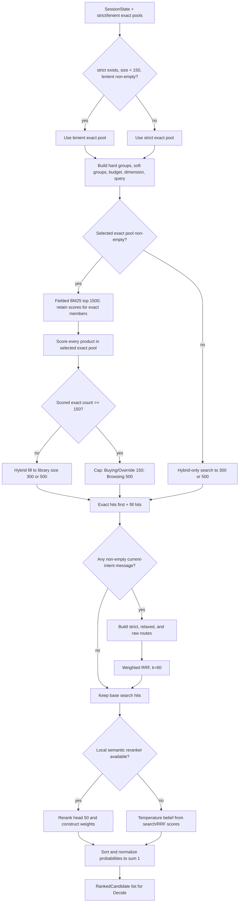
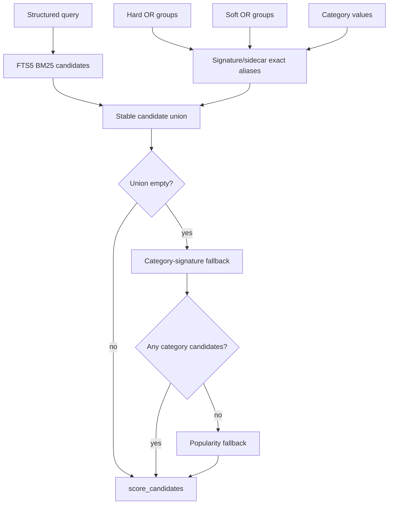
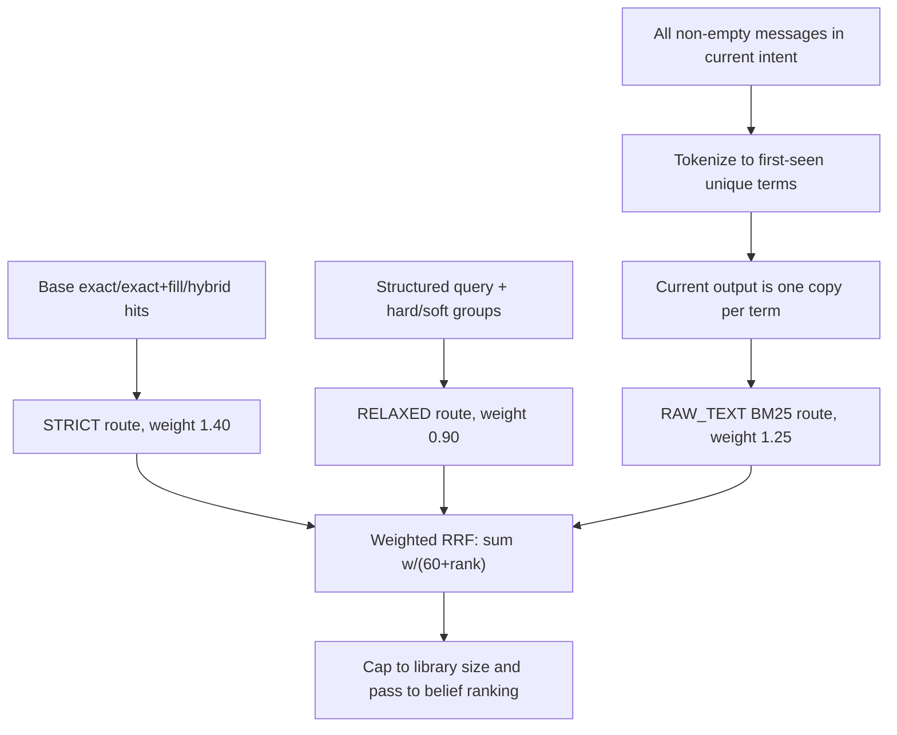

# Retrieve and ranking stage

Retrieve turns committed session constraints plus Intent Router's exact pools into a ranked probability distribution for Decide. The stage is exact-first when hard evidence can be represented, hybrid when recall is small or unavailable, and protected by three-route weighted reciprocal-rank fusion (RRF) whenever active-intent raw text exists.

This README documents current constants and formulas. In particular, current Buying/Override output is capped at 150 search hits, not 300. The minimum candidate library is 300 only for small-exact fill, hybrid-only search, and safety fusion.

## Strict end-to-end flow



## Track routing and candidate sizes

`routing.py` maps `SessionState.intention` to score weights and limits:

| Intention | direct exact cap | minimum library | BM25 candidate limit |
|---|---:|---:|---:|
| `buying` | 150 | 300 | 1,500 |
| `override` | 150 | 300 | 1,500 |
| `browsing` | 500 | 500 | 1,500 |
| unset/other | 500 | 500 | 1,500 |

Constants:

```text
BUYING_LIMIT = 150
BROWSING_LIMIT = 500
CANDIDATE_FLOOR = 150
LIBRARY_MIN = 300
DEFAULT_CANDIDATE_LIMIT = 1500
```

The `exact_first` routing flag is true for every current route.

## Retrieval signals

`from_slots.py` converts typed state into Retrieve inputs:

- hard same-attribute values become OR groups;
- different hard attributes remain separate required groups;
- hard category is passed separately;
- hard numeric budget becomes a `(minimum, maximum)` interval and is removed from string groups;
- the first structured dimension slot becomes `DimensionSpec`;
- soft slots become preferred OR groups and soft text terms; and
- query terms include every committed hard and soft slot value.

`rewrite_query()` constructs:

```text
query = current primary category + all typed slot search values
```

It falls back to `latest_message` only if committed category/slot terms produce an empty query. Raw dialogue is not appended to an already structured query, because it may contain negated or superseded language.

The function also returns profile tags separately. They are never inserted into the BM25 query.

## Strict versus lenient exact selection

Intent Router already computed both pools. Retrieve selects lenient only when:

```python
strict is not None and len(strict) < 150 and bool(lenient)
```

Otherwise it keeps strict. Lenient means “match or catalog value unknown,” not relaxed mismatch; see [`../intent_router/README.md`](../intent_router/README.md).

An empty selected set follows the hybrid-only branch. `None` also follows hybrid-only. A non-empty pool is scored in full.

One current-code nuance matters for numeric unknowns: Router's lenient pool may contain a product with missing price/dimension, but exact-path `score_candidates()` is called with hard budget/dimension flags still enabled. It therefore removes those numeric-missing rows again. Match-or-unknown survives exact scoring for string attributes; current numeric scoring behaves strictly. The small-exact hybrid fill then excludes the complete selected exact set, including numeric-missing rows that were filtered during scoring.

## Exact-pool lexical scoring

For a non-empty selected exact pool:

1. run fielded FTS5 BM25 over the query, capped at 1,500 rows;
2. retain lexical scores only for returned ASINs that are in the exact pool; and
3. call `score_candidates()` on every ASIN in the exact pool.

Products in the exact pool but outside the BM25 top 1,500 are not discarded; they receive lexical score zero and remain eligible through structured/catalog-prior scoring. This is stricter to the current code than describing the pool as a simple BM25/exact intersection.

### BM25 fields

SQLite `bm25(product_fts, ...)` uses a zero weight for the stored ASIN column and these field weights:

| Field | Weight |
|---|---:|
| title | 3.0 |
| categories | 6.0 |
| features | 4.0 |
| details | 5.0 |
| store | 3.5 |
| description | 1.2 |

The query is tokenized, capped to 48 terms for FTS search, and joined with OR. SQLite returns lower/more-negative BM25 values for better matches. Code converts each raw score to a non-negative value:

\[
S_{lex}(d)=\log\left(1+\max(0,-BM25_{raw}(d))\right).
\]

## Exact floor and hybrid fill

After scoring the exact pool:

- if at least 150 hits survive, take the top route cap: 150 for Buying/Override or 500 for Browsing;
- if fewer than 150 survive, keep all exact hits first and request enough hybrid fill to reach the track's library size: 300 for Buying/Override or 500 for Browsing;
- fill excludes all prior misses and every ASIN in the selected exact pool.

Fill disables hard required, budget, and dimension pruning. This ensures a sparse or imperfect exact representation cannot collapse recall. Exact hits still stay in front of the fill before RRF.

If there is no non-empty exact pool, hybrid search directly targets the same library size.

## Hybrid recall

`CatalogRetriever.search()` builds a candidate union:



The current pipeline calls hybrid with `hard_required=False`, so exact signature sets add recall candidates but do not intersect/prune the union. `hard_budget` and `hard_dimension` remain enabled only on the hybrid-only normal path when those shopper constraints are hard; the small-exact fill explicitly disables them.

## Candidate scoring

Each candidate receives lexical, structured, prior, and soft-text components.

### Signature similarity

For query value `q` and candidate values `V`, the best similarity is:

- `1.0` if any normalized/attribute-specific alias matches exactly;
- at least `0.9` if one alias is a substring of the other; otherwise
- maximum token overlap:

\[
sim(q,v)=\frac{|tokens(q)\cap tokens(v)|}{\max(|tokens(q)|,|tokens(v)|)}.
\]

### Rarity

For sidecar IDF:

\[
rarity(a,v)=0.5+0.5\cdot clip\left(\frac{idf(a,v)}{max\_idf},0,1\right).
\]

A missing statistic yields `1.0`. Exact-pool candidates force rarity to `1.0` because their hard match is already established.

### Structured score

For candidate `d`, required groups `R`, preferred groups `P`, category values `C`, and optional numeric fits:

\[
\begin{aligned}
S_{struct}(d)=
&\sum_{g\in R,\,sim_g>0}w_{req}\,sim_g\,rarity_g \\
&+\sum_{g\in R,\,sim_g=0}w_{miss}\,rarity_g \quad\text{(hybrid candidates only)}\\
&+\sum_{g\in P,\,sim_g>0}w_{pref}\,sim_g\,rarity_g\\
&+w_{cat}\max_{c\in C}sim_c\,rarity_c\\
&+w_{budget}\,I[price\ in\ interval]\\
&+w_{dim}\,I[dimensions\ match]\\
&+w_{excluded}\max sim_{excluded}.
\end{aligned}
\]

Values inside a group use their maximum similarity. `required_coverage` is the arithmetic mean of required-group similarities, or `1.0` when there are no required groups.

Prior misses are removed by ASIN before scoring. Generic excluded-constraint similarity is also supported: a similarity of at least `0.9` is a hard exclusion under default settings; smaller similarities receive the negative excluded weight.

### Budget and dimensions

- A hard budget rejects missing or out-of-range price on strict/hard paths.
- Budget fit contributes `1` only when a known price is inside the interval.
- Around/equality budgets are represented as ±20% intervals.
- Dimension equality tolerance is `max(0.25 in, 10%)` per spatial axis and `max(0.05 lb, 10%)` for weight.
- `lte` and `gte` apply the same tolerance in the permissive direction.

### Catalog prior

\[
S_{prior}(d)=w_{rating}\cdot clip\left(\frac{rating_d}{5},0,1\right)
+w_{pop}\cdot\frac{\log(1+count_d)}{\log(1+count_{max})}.
\]

### Soft text fit

Soft-slot terms are compared with sidecar `product_text`:

\[
cover(field)=\frac{|softTokens\cap fieldTokens|}{|softTokens|}
\]

and:

\[
S_{text}(d)=\max(cover(title),0.7\,cover(details),0.5\,cover(description)).
\]

Missing sidecar text or no soft terms yields zero.

### Final pre-fusion score

The actual code formula is:

\[
S(d)=1.15\,w_{lex}S_{lex}(d)+0.003\,S_{struct}(d)+S_{prior}(d)+w_{text}S_{text}(d).
\]

`profile_fit` is computed and can appear in diagnostic reasons, but `w_profile × profile_fit` is commented out of the final score. The `profile` values in `SearchWeights` therefore have no ranking effect in the current implementation.

Candidates sort by:

```text
final score descending
required coverage descending
lexical score descending
parent_asin ascending
```

## Search weight table

Unspecified values in Buying/Browsing inherit the default `SearchWeights` value.

| Component | Default | Buying/Override | Browsing | Raw route |
|---|---:|---:|---:|---:|
| lexical | 1.00 | 0.40 | 1.60 | 2.20 |
| required | 5.00 | 6.00 | 2.50 | 0.00 |
| preferred | 1.75 | 1.75 | 1.75 | 0.00 |
| category | 3.00 | 4.00 | 2.00 | 0.00 |
| budget | 1.25 | 1.25 | 1.25 | 0.00 |
| rating | 0.08 | 0.08 | 0.08 | 0.03 |
| popularity | 0.12 | 0.12 | 0.12 | 0.05 |
| missing required | -0.35 | -0.50 | -0.10 | 0.00 |
| excluded | -8.00 | -8.00 | -8.00 | -8.00 |
| dimension | 1.75 | 1.75 | 1.75 | 0.00 |
| text | 1.00 | 0.50 | 1.00 | 0.00 |
| profile | 0.30 | 0.30 | 0.30 | 0.00 |

The structured terms appear numerically large, but the final formula multiplies their sum by `0.003`. Their main purpose is controlled ordering/coverage evidence alongside BM25, text overlap, and priors, not an unscaled point total.

## Three-route safety retrieval

Route fusion runs only when `current_intent_messages` contains non-empty disclosures. It removes excluded ASINs before and after fusion.



### STRICT route

Input is the already organized base list:

- non-empty exact pool: exact score/cap, possibly exact-first hybrid fill;
- no exact pool: normal hybrid results.

It carries the strongest route weight, `1.40`, because it best reflects current structured evidence and numeric filtering.

### RELAXED route

Runs a second hybrid search with:

- the structured query;
- required and preferred groups still available for scoring;
- no hard category argument;
- no budget or dimension filter;
- `hard_required=False`, `hard_budget=False`, `hard_dimension=False`;
- track-specific Buying/Browsing weights;
- soft `product_text` query and profile diagnostics; and
- result limit equal to the library size (300 or 500).

Its weight is `0.90`. Meaning: preserve products that are semantically/structurally close when one extracted hard slot, category, price, or dimension is uncertain.

### RAW_TEXT route

Builds raw evidence only from `current_intent_messages`, which is cleared on accepted override. `_build_frequency_weighted_raw_text()` contains an intended repeat-up-to-three loop, but the shared `tokenize()` function deduplicates terms before `Counter` sees them. Every frequency is therefore `1` in the current implementation, and the output is first-seen unique terms rather than frequency-boosted text. FTS tokenization deduplicates once more. This distinction is documented because the helper's name/docstring describes an intended behavior that current code does not realize.

It runs BM25 with:

- no required/preferred groups;
- no categories, budget, dimension, text-query, or profile tags;
- candidate limit at least 2,000;
- lexical weight `2.20`, rating `0.03`, popularity `0.05`, excluded `-8`, all other weights zero; and
- result limit equal to the library size.

Its RRF weight is `1.25`. Meaning: restore recall directly from what the shopper actually said when typed parsing or canonical mapping lost useful vocabulary.

## Weighted reciprocal-rank fusion

For each ASIN `d`, duplicates within a route are ignored. With `K=60`, the fused score is:

\[
S_{RRF}(d)=
\frac{1.40}{60+rank_{strict}(d)}
+\frac{0.90}{60+rank_{relaxed}(d)}
+\frac{1.25}{60+rank_{raw}(d)},
\]

omitting any route where `d` is absent.

RRF uses rank positions rather than incomparable raw scores. A product appearing in multiple independent routes accumulates evidence; the heavier strict/raw routes protect respectively structured precision and utterance-level recall.

The fused `SearchHit.score` becomes the RRF score. For inspection, lexical/structured/prior components are copied from the route occurrence with the highest original pre-fusion score, and a reason such as `route:strict+raw` records membership. Final ties use first-seen order, then ASIN.

## Belief ranking

Search hits must become a normalized posterior for Dynamic Slate planning.

### Optional Qwen semantic head

The default optional model is `Qwen/Qwen3-Reranker-0.6B`, loaded through `sentence-transformers.CrossEncoder`. Default configuration:

| Setting | Value |
|---|---:|
| scored head | 50 |
| batch size | 8 |
| max length | 512 |
| Buying/Override semantic weight | 0.35 |
| Browsing semantic weight | 0.55 |
| temperature | 0.20 |
| local files only | true |

The query document contains current category, required groups, hard budget, preferred groups, and weak profile tags. Each product document contains title, category, store, price, features, details, and description. Raw cross-encoder logits pass through a sigmoid:

\[
semantic(d)=\frac{1}{1+e^{-logit(d)}}.
\]

For original rank index `i` starting at zero:

\[
base_i=\frac{1}{\log_2(i+2)}
\]

and:

\[
combined_i=(1-w_{sem})base_i+w_{sem}semantic_i.
\]

The scored head is reordered by `combined`. Its unnormalized weight is:

\[
W_i=\exp\left(\frac{combined_i-combined_{max}}{0.20}\right).
\]

The unscored tail remains behind the head. Its first anchor is `0.95 × min(head weight)` and offset `j` decays as:

\[
W_{tail,j}=anchor\cdot e^{-j/80}.
\]

`auto` mode falls back safely when the model cannot load or infer. `required` mode raises; `off` bypasses it.

### Deterministic score belief

Without semantic output:

\[
W(d)=\exp\left(\frac{S(d)-S_{max}}{T}\right).
\]

For ordinary structured scores, `T=0.12`. For RRF scores, the smaller score scale uses:

\[
T=clip\left(\frac{S_{max}-S_{min}}{4},0.0025,0.02\right).
\]

This prevents hundreds of fused candidates from becoming almost uniform under the structured-score temperature.

Finally, weights are floored at `1e-12`, sorted by descending weight then ASIN, and normalized:

\[
P(d)=\frac{W(d)}{\sum_j W(j)}.
\]

The resulting `RankedCandidate(parent_asin, score, probability)` list is stored in `state.last_ranked` and passed to Decide.

## Files

```text
retrieve/
  from_slots.py                  SessionState → retrieval signals
  candidates/
    query.py                     active-intent structured query
    routing.py                   limits and track weights
    retrieve.py                  exact-first/hybrid organization
    multi_route.py               strict/relaxed/raw weighted RRF
  catalog/
    retriever.py                 SQLite facade
    index.py                     FTS/signature index build
    search.py                    hybrid candidate union
    scoring.py                   score components and numeric filters
    signatures.py                aliases, similarity, budget parsing
    slots_sidecar.py             preprocessed sidecar attach/validation
    profile_embed.py             diagnostic profile fit
    types.py                     SearchWeights and SearchHit
  ../decide/ranking/
    semantic.py                  optional Qwen cross-encoder
    belief.py                    deterministic temperature transform
    normalize.py                 RankedCandidate probability normalization
```

## Invariants

- A small non-empty strict pool switches to lenient only below 150 and only when lenient is non-empty.
- Exact products outside BM25 top 1,500 remain scoreable with lexical score zero.
- Exact hits remain before hybrid fill until route fusion recomputes evidence.
- Hybrid fill cannot hard-prune on a possibly misparsed required, budget, or dimension field.
- Safety raw text contains only non-empty messages from the current post-override intent.
- Previously excluded ASINs cannot re-enter through another route.
- RRF combines rank evidence, not incompatible raw score scales.
- Profile similarity has no final-score contribution in current code.
- Semantic reranking never removes the deterministic fallback.
