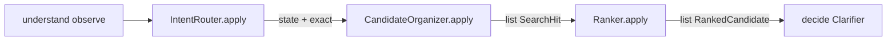
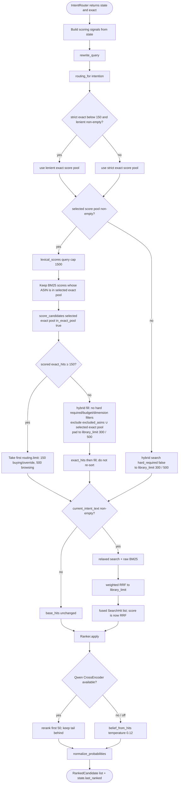
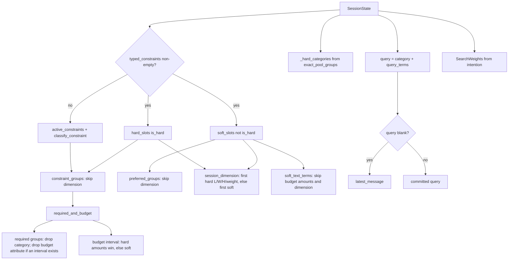
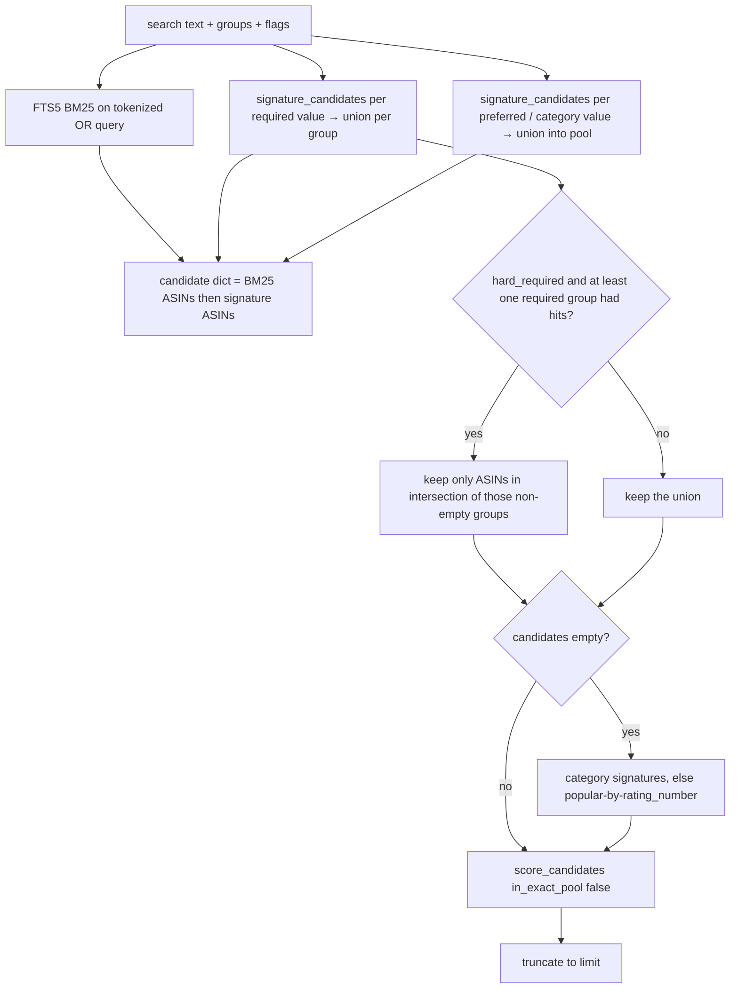
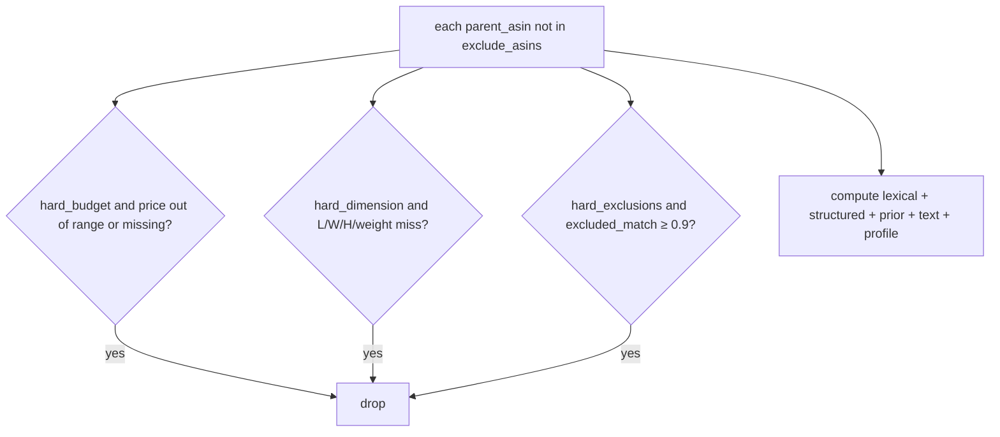
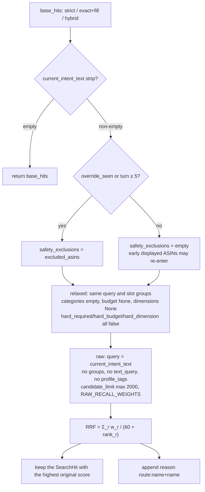

# retrieve — after the intention router: score, recover, fuse, rank

This document is the post-router retrieve chain as implemented in
`TurnPipeline.run_traced`. It starts the moment
`IntentRouter.apply(state, retriever)` returns, and it ends when
`Ranker.apply` writes `state.last_ranked`. Decide (question, slate, respond
copy) is out of scope here.

The router has already committed `SessionState` and produced an optional
exact ASIN set (`exact_strict`) plus a match-or-unknown superset
(`exact_lenient`). Retrieve **does not recompute** that hard intersection.
When `exact_strict` is below the candidate floor, retrieve scores the non-empty
`exact_lenient` superset instead; otherwise it scores `exact_strict`.
Subpackage READMEs (`catalog/`, `candidates/`) stay short; this file is the
full walkthrough.

## 1. Handoff: what the router actually passes

```text
exact = IntentRouter.apply(state, retriever)   # strict pool; also writes state
hits  = CandidateOrganizer.apply(state, exact, exact_lenient=state.exact_lenient)
ranked = Ranker.apply(hits, state)
state.last_ranked = [item.parent_asin for item in ranked]
```

| Token | Type | Meaning |
|---|---|---|
| `state` | `SessionState` | Constraints are already committed (`typed_constraints` or fallback `active_constraints`). `intention` is `buying` / `browsing` / `override`. `exact_strict` / `exact_lenient` are the last router probe. |
| `exact` / `exact_strict` | `set[str] \| None` | Hard signature intersection (group OR, groups AND), then hard budget / LWH / weight. Missing attributes fail. Built in `intent_router/exact_pool.py`. |
| `exact_lenient` | `set[str] \| None` | Same groups, but each hard attribute may match **or** be unknown (not indexed). Superset of strict when strict is a set. It replaces a strict pool below `CANDIDATE_FLOOR` when non-empty. |
| `exact is None` | — | At least one **hard** signal has no catalog exact hit. This is not count 0. |
| `exact == set()` | — | Every hard signal hit the index, but the intersection (or numeric filter) emptied the pool. |
| `exact` at or above `CANDIDATE_FLOOR` | — | Router already AND-ed hard groups. Retrieve scores / pads / fuses the strict pool. |
| `exact` below `CANDIDATE_FLOOR` | — | Retrieve uses non-empty `exact_lenient` as the score pool, then pads or fuses only if that score pool remains below the floor. |

Soft slots are **not** in `exact`. They score later as preferred / `text_fit`.
`preference_tags` never enter the exact pool or the BM25 query string.

Retrieve also reads session fields the router does not recompute:

- `excluded_asins` — previous-slate miss feedback (drop from strict scoring)
- `current_intent_text` — last four active-intent utterances; empty skips safety fusion
- `override_seen`, `turn` — whether safety routes may recover a previously shown ASIN
- `preference_tags` — weak cosine / reranker tie-break only

### When this chain does not run

If observe produced an empty-disclosure turn **and** `last_ranked` still has
an unshown ASIN, `pipeline.pages_empty_disclosure` skips router and retrieve and
pages the leftover list. That shortcut is not retrieve.

## 2. Pipeline placement



Progress nodes under stage `retrieve` (see `progress.RETRIEVE_NODES`):

```text
slot_groups → rewrite_query → routing
  → lexical_in_pool → score_exact     (skipped when exact is empty / missing)
  → hybrid_search                    (skipped when scored exact ≥ 150)
  → cap_hits
  → qwen_rerank → belief_hits → normalize
```

`qwen_rerank` / `belief_hits` / `normalize` live in `agent/decide/ranking/` but
the pipeline still emits them as retrieve nodes, and `retrieve` is not
`completed` until ranking finishes.

## 3. End-to-end flowchart (authoritative)



Numbers in that chart:

| Name | Buying / override | Browsing | Unset intention |
|---|---|---|---|
| `routing.limit` (exact cap when floor is met) | 150 | 500 | 500 |
| `CANDIDATE_FLOOR` (hybrid skip) | always 150 | always 150 | always 150 |
| `library_limit` = `max(routing.limit, 300)` | 300 | 500 | 500 |
| `candidate_limit` (FTS / signature recall width) | 1500 | 1500 | 1500 |

The floor is **`len(exact_hits)` after scoring**, not `len(exact)`. Hard budget,
hard dimension, and `excluded_asins` can shrink the scored set below 150 even
when the router pool was larger.

## 4. Signal construction (`from_slots` + `query` + `routing`)



Semantics used everywhere downstream:

- Same attribute, multiple values: **OR**.
- Different attributes: **AND** for the router pool; retrieve scoring **sums**
  per-group similarities (it does not re-intersect).
- Hard budget / hard dimension **drop** products in selected-exact and
  hybrid-only paths. Hybrid fill disables those filters and uses their fit as
  a ranking bonus.
- Soft budget / soft dimension never drop; they only add a 0/1 bonus.
- `query_terms` includes **hard and soft** search values. Canonical alternatives
  beat the cited paraphrase (`slot_search_values`).
- Profile tags are returned by `rewrite_query` but `retrieve_candidates`
  ignores that copy and passes `state.preference_tags` into scoring.

Buying vs browsing weights (`candidates/routing.py`; unspecified fields keep
`SearchWeights` defaults):

| Weight | Buying / override | Browsing |
|---|---|---|
| `lexical` | 0.4 | 1.6 |
| `required` | 6.0 | 2.5 |
| `category` | 4.0 | 2.0 |
| `missing_required` | −0.5 | −0.1 |
| `text` | 0.5 | 1.0 |
| `profile` | 0.3 | 0.3 |
| `preferred` (default) | 1.75 | 1.75 |
| `budget` (default) | 1.25 | 1.25 |
| `dimension` (default) | 1.75 | 1.75 |
| `rating` / `popularity` | 0.08 / 0.12 | 0.08 / 0.12 |

Path A (`in_exact_pool=True`) does **not** multiply required matches by IDF and
does **not** apply `missing_required`.

## 5. Three recall skeletons

`CandidateOrganizer.apply` is a thin wrapper around `retrieve_candidates`.

### 5.1 Selected exact pool, scored size ≥ 150

```text
lexical = retriever.lexical_scores(query, 1500) ∩ exact
exact_hits = retriever.score_candidates(exact, lexical_scores=in_pool, in_exact_pool=True, ...)
capped = exact_hits[:routing.limit]
skip hybrid_search
```

Strict pools below 150 first select a non-empty lenient superset. Exact-pool
hits stay in score order. Buying/override keep 150; browsing keeps up to 500.
Safety fusion may still **grow** a buying list from 150 to 300.

### 5.2 Selected exact pool, scored size < 150

```text
exact_hits = score_candidates(...)          # hard segment, already sorted
need = library_limit - len(exact_hits)
fill = retriever.search(
  ..., hard_required=False, hard_budget=False, hard_dimension=False,
  exclude_asins=excluded ∪ selected_exact_pool, limit=need,
)
combined = exact_hits + fill               # concatenate; do not re-sort
```

The fill candidate pool is the union of fielded-BM25 top 1500, every hard
constraint signature hit, every soft constraint signature hit, and category
signature hits. It excludes `excluded_asins` and every selected-exact ASIN, so
it only contributes new candidates. The hard segment stays in front **until**
safety fusion runs. Fusion, when it runs, replaces this order with RRF.

Fill ranks candidates rather than requiring each hard condition to pass:

```text
fill_score = w.lexical * BM25(query)
       + sum(hard match * w.required * rarity)
       + sum(soft match * w.preferred * rarity)
       + w.missing_required * unmatched_hard_group_rarity
       + w.category * category_match * rarity
       + w.budget * budget_fit
       + w.dimension * dimension_fit
       + rating/popularity/text/profile signals
```

`rarity` is derived from the sidecar IDF for the matched attribute value: a
value present on fewer catalog products has a larger contribution. Hard matches
use `w.required`; soft matches use the smaller `w.preferred`, so preferences
cannot outweigh equally strong hard evidence. An unmatched hard group receives
the existing negative `w.missing_required` signal instead of removing the
candidate. Budget and dimension matches add `budget_fit` and `dimension_fit`;
an out-of-range or missing value receives no bonus in fill, but remains eligible
for BM25 and other evidence.

### 5.3 No selected exact pool

When strict and lenient are missing or empty, skip `lexical_in_pool` and
`score_exact`. One hybrid `search(..., hard_required=False)` to
`library_limit`. Same `score_kwargs` as the exact path (required groups,
preferred, category, budget, dimensions, exclusions).

## 6. What `retriever.search` does (hybrid / relaxed / raw)

Used for: hybrid fill, hybrid-only recovery, relaxed safety, raw safety. It
never rebuilds the router pool. Fill passes committed hard and soft groups into
this method for ranking, but deliberately sets `hard_required`, `hard_budget`,
and `hard_dimension` to `False`.



FTS query string inside `search` is richer than `rewrite_query`:

```text
" ".join([text, *required values, *preferred values, *category values])
```

Fielded BM25 weights (`protocol_copy.DEFAULT_FIELD_WEIGHTS`): title 6.0,
categories 5.0, features 3.0, details 1.0, store 2.0, description 0.8.
SQLite `bm25()` is negated then `log1p`. Token cap is 48. The FTS5 index uses
the Porter stemmer with `unicode61`; query tokens remain unstemmed in Python
so FTS stems each MATCH term once. This aligns `shoe` with `shoes`, while
Porter may over-stem words such as `plus`, `earrings`, `running`, and
`clothing`.

`hard_required=True` would intersect required signature sets, but **this
pipeline always calls search with `hard_required=False`**. Unknown paraphrases
must not empty the library. The router already did the strict AND. Hybrid-only
recovery may retain hard budget/dimension filters; hybrid fill always disables
them so numeric conditions become fit bonuses.

If FTS + signatures yield nothing, search falls back to category signatures,
then to popular products.

## 7. `score_candidates` (shared ranker, no recall)

Both the selected-exact path and `search` end here. It loads product rows,
signatures, optional slot extras (L/W/H/weight), `product_text`, and slot IDF.
Selected-exact scoring uses `in_exact_pool=True`: it trusts router membership,
does not apply `missing_required`, and does not scale matching required/category
signals by rarity. Hybrid fill uses `in_exact_pool=False`: it scores new
candidates by their individual BM25 relevance and the discriminating power of
their matched hard and soft constraints.



NLU does not currently pass attribute-level `excluded=` pairs (that argument
is leftover). The live drop list is `exclude_asins`.

### Score formula

```text
score = w.lexical * lexical_score
      + structured
      + prior
      + w.text * text_fit
      + w.profile * profile_fit

structured =
    Σ_required  w.required * sim * rarity          if sim > 0
  + Σ_required  w.missing_required * group_rarity  if sim == 0 and not in_exact_pool
  + Σ_preferred w.preferred * sim * rarity
  + w.excluded * excluded_match
  + w.category * category_match * rarity
  + w.budget * budget_fit                          1 if in range, else 0
  + w.dimension * dim_fit                          1 if axes match, else 0

prior = w.rating * clip(rating/5, 0, 1)
      + w.popularity * log1p(rating_number) / log1p(corpus max)
```

`signature_similarity` (on `search_values`, not protocol-response values):

1. alias set overlap → 1.0
2. one alias is a substring of the other → at least 0.9
3. else token Jaccard-style overlap

Within one required/preferred group, the best value wins (OR).
`required_coverage` is the mean of those per-group similarities (1.0 if no
required groups).

Rarity (hybrid path only): `0.5 + 0.5 * clip(idf / max_idf)`. Exact-pool
required and category matches force rarity 1.0.

`text_fit` is token coverage of `soft_text_terms` against sidecar
`product_text` (title 1.0, details 0.7, description 0.5). Hard required hits
do not use this channel.

`profile_fit` is optional MiniLM cosine of `preference_tags` vs the same
surfaces (`catalog/profile_embed.py`). Mode `auto` / `off` / `required`.
Unavailable model → zeros. Never BM25, never exact-pool.

Sort key after scoring:

```text
(-score, -required_coverage, -lexical_score, parent_asin)
```

## 8. Safety routes and weighted RRF

`_safe_route_fusion` runs on **every** skeleton, then no-ops when
`state.current_intent_text` is blank (no live utterance for this intent).



| Route | Weight | Role |
|---|---|---|
| `strict` | 1.40 | Router pool and/or hybrid fill. Authoritative. |
| `relaxed` | 0.90 | Same structured signals, but no hard numeric / category filter. Recovers over-pruning. |
| `raw` | 1.10 | Active-intent BM25 only. Independent of NLU slots. |

Fusion limit is `library_limit` (300 / 500), not `routing.limit`. After fusion,
`SearchHit.score` **is the RRF value**. Lexical / structured / coverage fields
are copied from the best original hit.

RRF ordering: `(-rrf, first_seen serial, asin)`. A candidate that only the
safety routes like can outrank a strict-only head (see
`tests/test_multi_route_retrieval.py`).

Raw-route weights (`RAW_RECALL_WEIGHTS`): lexical 2.2, tiny rating/popularity,
`excluded −8`, every structured / text / profile weight 0.

## 9. Ranking (still the retrieve stage)

```mermaid
flowchart TD
  H[fused SearchHit list] --> CHK{state and retriever present?}
  CHK -->|no| BEL
  CHK -->|yes| QW[QwenSemanticReranker.belief]
  QW --> OK{scores returned?}
  OK -->|yes| FUSE2["semantic_belief: combined = (1-α)/log2(i+2) + α·sigmoid(logit)"]
  FUSE2 --> HEAD[reorder scored head of 50]
  FUSE2 --> TAIL[unscored tail stays behind, decaying weights]
  OK -->|no / mode off| BEL[belief_from_hits: exp((s-max)/0.12)]
  HEAD --> NORM[normalize_probabilities → RankedCandidate]
  TAIL --> NORM
  BEL --> NORM
  NORM --> LR[state.last_ranked = ranked ASINs]
```

| Knob | Default |
|---|---|
| Model | `Qwen/Qwen3-Reranker-0.6B` |
| Head size | 50 (`AGENT_RERANKER_TOP_N`) |
| Buying α | 0.35 |
| Browsing α | 0.55 |
| Semantic temperature | 0.20 |
| Deterministic temperature | 0.12 |
| Mode | `auto` (offline; never download during a request) |

The cross-encoder query is committed state only (`build_shopping_query`):
category, required groups, budget, preferred, weak profile tags. It does not
replay raw dialogue. Product docs are catalog-native title / category / brand /
price / features / details / description.

If the model is off or missing, ranking is a shifted softmax of retrieval
`hit.score`. After fusion that score is RRF, not the structured hand score.

`RankedCandidate.probability` is a ranking belief for the planner, not a
purchase probability. Sum is 1.

## 10. What leaves retrieve

| Output | Consumer |
|---|---|
| `hits: list[SearchHit]` | `candidate_asins` passed into `ResponseBuilder` (library order) |
| `ranked: list[RankedCandidate]` | `Clarifier.apply` (question × slate) |
| `state.last_ranked` | next-turn empty-disclosure paging |

Retrieve does **not** choose `ask_attribute`, slate length, or respond copy.

## 11. Catalog surface this chain may call

| Method | Used by |
|---|---|
| `lexical_scores` | exact path BM25 tie-break |
| `score_candidates` | exact path |
| `search` | hybrid fill / hybrid-only / relaxed / raw |
| `signature_candidates` | inside `search`; **not** called again for the router AND |
| `all_parent_asins` / `asins_with_attribute` | router lenient unknown-attribute sets |
| `get_product` | Qwen documents |
| `filter_hard_numeric` | router only (already done before this chain; `allow_missing` for lenient) |

SQL stays inside `CatalogRetriever`. Session code does not query SQLite.

## Core code

- Slot mapping: `from_slots.py`
- Query rewrite: `candidates/query.py`
- Caps and weights: `candidates/routing.py`
- Fusion entry: `retrieve_candidates` in `candidates/retrieve.py`
- RRF: `fuse_routes` in `candidates/multi_route.py`
- Recall: `SearchMixin.search` in `catalog/search.py`
- Scoring: `ScoringMixin.score_candidates` in `catalog/scoring.py`
- Facade: `CatalogRetriever` in `catalog/retriever.py`
- Ranking: `Ranker.apply` in `decide/ranking/__init__.py`
- Exact pools: `exact_pools_for_state` in `intent_router/exact_pool.py`
