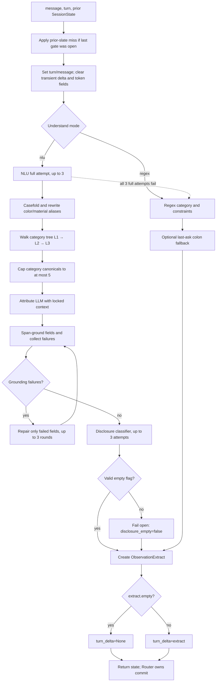
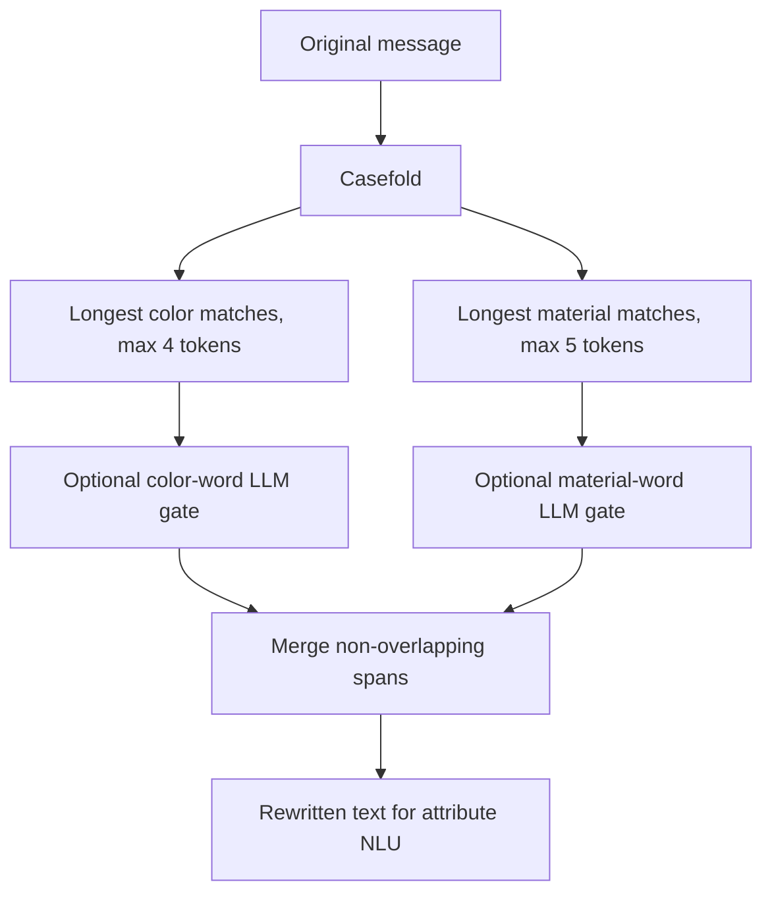

# Understand stage

Understand converts exactly one shopper utterance into a grounded, typed `ObservationExtract`. It reads prior session context only to avoid repeating locked constraints and to interpret compact follow-ups; it does not commit the new evidence. The result is staged as `SessionState.turn_delta`, and Intent Router later decides whether to accumulate it, partially replace old attributes, or reset the whole intent.

Default mode uses a local Ollama model (`qwen3.5:4b`) for alias-aware NLU. The deterministic regex parser is an explicit mode and the safe fallback after three failed full NLU attempts.

## Strict flow



The model calls use JSON mode, temperature `0.0`, `num_ctx=8192`, and bounded output tokens. Category, attribute, repair, alias verification, and disclosure are separately validated; malformed model output is not accepted as structured state.

## Turn-boundary work

`StateDetector.apply()` calls `begin_turn()` before extraction:

1. `apply_miss_feedback()` adds `last_slate` to `excluded_asins` only for `turn > 1` and `last_gate_open=True`.
2. It writes `turn`, `latest_message`, and appends the original text to `message_history`.
3. It clears `last_reply_informative`, `turn_delta`, `disclosure_empty`, `candidate_count_before_delta`, and per-turn Router token counters.
4. It calls `observe()`.
5. When `disclosure_empty is False`, it appends the original message to `current_intent_messages` for Retrieve's active-intent raw-text route.

Messages marked empty are intentionally excluded from raw-text recall.

## Output contract

`ObservationExtract` is immutable and contains:

| Field | Meaning |
|---|---|
| `category` | primary category surface for compatibility and display |
| `provisional_hint` | optional soft hint attached to regex category phrasing |
| `constraints` | cited constraint strings, primarily for regex/legacy writeback |
| `slots` | grounded typed `ConstraintSlot` rows |
| `override`, `override_value` | compatibility fields; current override routing is performed independently by Intent Router |
| `track` | optional compatibility route hint; current route is independently classified by Intent Router |
| `empty` | true when the turn contains no usable new evidence |
| `source` | `llm` or `regex` |
| `repair_rounds` | number of targeted attribute-repair calls used |
| `disclosure_empty` | whether the original utterance disclosed any product or attribute direction |

`observe()` stores `None` instead of an empty extract:

```python
state.disclosure_empty = extract.disclosure_empty
state.turn_delta = None if extract.empty else extract
```

That distinction drives the no-information paging shortcut in `agent/pipeline.py`.

## Typed constraint schema

Every slot is a `ConstraintSlot`:

| Field | Type | Meaning |
|---|---|---|
| `attribute` | string | category, material, color, size, style, brand, budget, feature, use_case, or other |
| `surface` | string | grounded span; attribute rows use the alias-rewritten message, while category rows cite the original message |
| `canonical` | tuple of strings or `None` | normalized OR alternatives |
| `amount` | float or `None` | budget, shoe/apparel size, or dimension amount |
| `op` | `lte`, `gte`, `eq`, or `None` | numeric comparison operator |
| `system` | `us`, `uk`, `eu`, or `None` | explicit size system only |
| `kind` | `shoe`, `apparel`, `dimension`, or `None` | size interpretation |
| `unit` | `in` or `None` | normalized dimension unit |
| `length`, `width`, `height` | float or `None` | dimension axes normalized to inches |
| `weight` | float or `None` | normalized pounds |
| `is_hard` | bool | hard filter versus soft preference |

The OR-capable attributes are color, material, style, brand, feature, use_case, and other. “Blue or orange” is parsed as one temporary slot with `canonical=("blue", "orange")`; Router writeback later splits it into value-addressable rows.

### Hard versus soft

The attribute prompt defaults `is_hard=True`. It sets `False` only for the exact span whose wording makes the preference optional, such as “prefer”, “maybe”, “nice to have”, “also ok”, or “better to be”. Hardness is not inherited across unrelated spans and is never inferred from product copy.

This distinction is structural:

- hard slots participate in strict/lenient exact-pool filtering;
- soft slots affect query construction, structured preferred scores, text fit, and semantic ranking;
- a later row with the same `(attribute, canonical value)` overwrites the earlier row, including its hard/soft status.

## Alias rewrite

Before NLU, `rewrite_for_nlu()` case-folds the message and applies committed preprocess aliases:



The two verification calls run in parallel when both have non-trivial work. Identity aliases bypass verification. A same-span color and material hit concatenates both replacements; longer overlapping spans win. Gold, silver, and platinum tokens are excluded from the color rewrite so jewelry metal is not changed into a color bucket.

The original message is retained for category grounding, disclosure classification, override routing, active-intent raw recall, and session history. Attribute parsing and attribute span grounding use the rewritten text; therefore an alias-mapped slot surface may be the normalized replacement (for example `blue`) even when the original shopper surface was `navy`.

## Category classification

Category extraction is independent from attribute extraction. The attribute LLM is explicitly forbidden from returning category rows.

`walk_category_tree()` reads the committed three-level category asset without scanning the catalog at runtime:

1. L1 presents all roots.
2. L2 presents the combined children of every selected L1 node.
3. L3 presents the combined children of every selected L2 node.
4. Each level may choose 0–3 IDs and may stop.
5. Unknown IDs are dropped; the explicit `Unknown` node is not emitted as a constraint.

The classifier may choose a branch only when its meaning is broader than or equal to the named product. It must not add an unstated audience or subtype—for example, “running shoes” can select Shoes but cannot silently select Kids Shoes.

Selected nodes yield grounded category surfaces and their catalog canonicals. If the combined canonical set exceeds five, `cap_category_payload()` tries three model filters. A valid filter must copy exactly five allowed tags and retain grounded product tags. The deterministic fallback keeps grounded tags first, then fills by descending category `slot_stats.df`, with folded text as a stable tie-break.

## Attribute NLU

The attribute prompt receives:

- rewritten current message;
- current primary category;
- surfaces of already locked constraints; and
- `last_ask`, so a compact answer can be interpreted in context.

It emits only material, color, size, style, brand, budget, feature, use_case, and other.

### Closed attributes

- Color canonical values must be among the 11 evaluator buckets.
- Material canonical values must be among the 9 evaluator buckets.
- Apparel letters map to `xs`, `s`, `m`, `l`, `xl`, `xxl`, `xxxl`, or `one_size`.
- Size systems are accepted only when the shopper explicitly names US/UK/EU.

### Numeric attributes

- Budget: `under/max → lte`, `over/min → gte`, otherwise `eq`.
- Shoe/apparel size: `amount` plus optional explicit system and kind.
- Dimension: the model copies original values; code converts cm/mm to inches and oz/kg/g to pounds. A weight-only request does not invent length/width/height.

### Free attributes

Style, brand, feature, use_case, and other preserve grounded shopper spans and optionally normalized alternative strings. The model may not invent a catalog attribute or product identifier.

## Grounding and repair

Every `surface` and optional alternative surface must occur in the relevant grounding input, either case-insensitively or after canonical punctuation/whitespace folding. Attribute constraints are checked against the rewritten message; category rows are checked against the original shopper sentence. Canonical mapped values do not need to be verbatim spans.

After the first attribute JSON:

1. category constraints accidentally returned by the attribute model are dropped;
2. authoritative category-tree rows are inserted;
3. `collect_failures()` identifies only fields that failed schema/span grounding;
4. a repair prompt requests replacements only for those failed pieces;
5. `merge_repair_payload()` keeps valid prior fields and substitutes repaired fields; and
6. this repeats for at most three repair rounds.

Repair is field-local. Valid constraints are not regenerated, which reduces accidental drift.

## Disclosure classifier

After grounded extraction, a separate classifier receives the original message plus the extracted category and attribute rows. It must return exactly:

```json
{"empty": true}
```

or:

```json
{"empty": false}
```

`empty=true` is reserved for utterances that state no product type and no attribute direction: acknowledgements, “show more”, “not sure”, “use your judgment”, or no-additional-preference responses. A softly worded category or preference is still non-empty.

The classifier is tried three times. After three illegal responses it fails open with `disclosure_empty=False`, preserving evidence rather than silently erasing it.

## Full-attempt retry and regex fallback

`hybrid_extract()` calls the complete NLU extraction up to three times. Any successful `ObservationExtract`, including a valid empty disclosure, ends the retry loop. If all attempts fail—or when `understand_mode="regex"` is selected—the regex parser handles:

- “I'm looking for … A key requirement is: …”;
- “I'm looking for … but I'm still exploring”;
- “For that, what matters is: …”;
- explicit requirement/override-shaped phrases; and
- generic looking-for category templates.

Regex slots are hard by default except provisional hints, which are soft. If regex extraction has a non-empty message but no constraint, `colon_fallback()` can restore one or two semicolon-separated pieces after a prior `last_ask`. It refuses official no-preference markers such as “not quite right”, “use your judgment”, “no preference”, and “additional preference”.

## Delta merge semantics

Understand returns alternatives without mutating committed state. Router writeback uses `merge_or_attribute_slots()`:

1. split every multi-canonical slot into one row per value;
2. compute identity `(attribute, folded canonical-or-surface)`;
3. preserve first-seen row order; and
4. replace the earlier row when the same identity appears later.

Example:

```text
Committed: color=blue hard
Turn delta: color=(blue, orange) soft

After Router accumulate:
  color=blue soft      # later row changed hardness
  color=orange soft    # new alternative
```

Values within one attribute are OR alternatives in retrieval. Different hard attributes are AND-ed.

## Files

```text
understand/
  mode.py                         process-wide NLU/regex selection
  state/
    session.py                    complete per-session memory
    lifecycle.py                  turn boundary and observation entry
    miss_feedback.py              prior-slate negative feedback
    gate.py, failsafe.py          conversion-gate state
  observation/
    coordinator.py                stage turn_delta only
    hybrid.py                     3× NLU then regex
    llm_nlu.py                    Ollama client and NLU orchestration
    rewrite.py                    color/material alias rewrite
    category_tree.py              3-level bounded tree walk
    category_cap.py               ≤5-category safety cap
    disclosure.py                 empty-information judgment
    classify.py, patterns.py      deterministic fallback
    slots/                        attribute parsers, grounding, repair, merge
```

## Invariants

- Category surfaces cite the original message; attribute surfaces are grounded against the alias-rewritten message. The original text remains authoritative for disclosure, override routing, and raw-text recall.
- The active catalog is never scanned during Understand.
- Understand does not classify override or Buying/Browsing intent.
- Understand does not commit `typed_constraints`.
- Empty disclosure and failed extraction are distinguishable through `disclosure_empty` and `source`/retry behavior.
- No category may be invented by the attribute LLM; category rows come from the committed tree.
- A malformed model response never becomes session state without schema and grounding validation.
