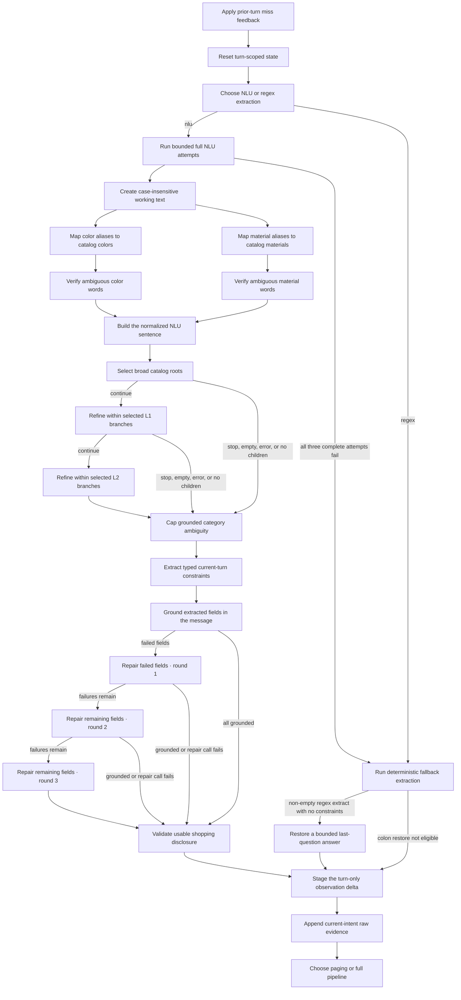
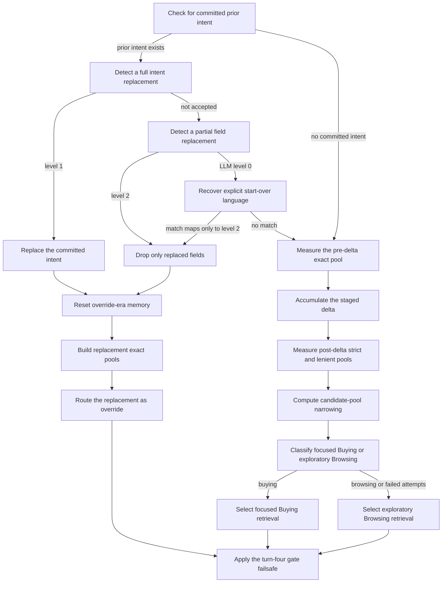
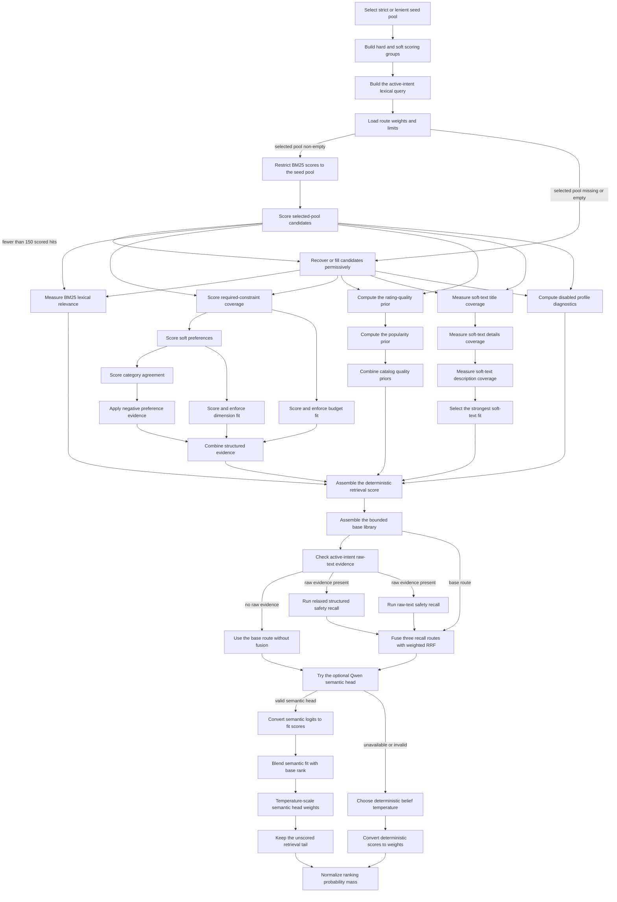
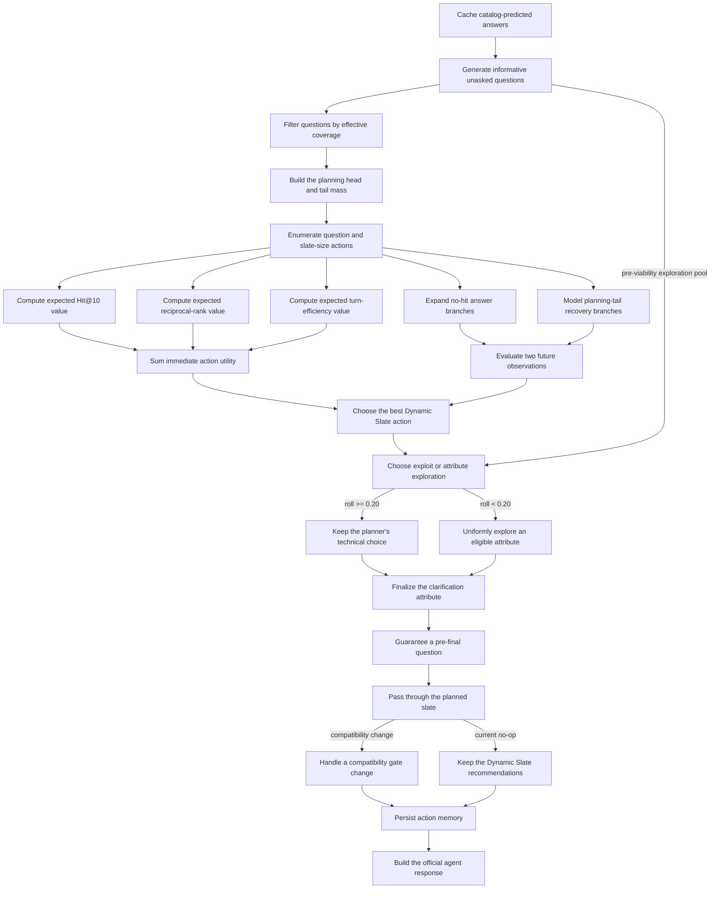

# Agent pipeline

This document is the code-level runtime map for the production shopping agent.
The implementation under `agent/` is authoritative. The agent treats
`user_message` as ordinary shopper language and does not route on evaluator
templates, public labels, session IDs, or known targets.

The official entry remains `starter.agent.Agent`, a thin re-export of
`agent.orchestrator.Agent`.

## Process and session lifetime

`Agent.__init__()` resolves or builds one shared `CatalogRetriever`, attaches a
current catalog-slot sidecar when available, configures Understand mode, and
constructs one `TurnPipeline`. NLU mode warms the observation and Intent Router
clients. Regex mode skips Ollama startup.

`reset(session_id, user_profile)` replaces that session's `SessionState`.
`respond()` and `respond_traced()` require an existing session, a turn in
`1..10`, and positive `top_k`. The recommendation-preference setting locks when
the first response starts.

Every normal turn follows:

```text
Understand → Intent Router → Retrieve and Rank → Decide and Respond
```

Understand stages evidence only in `turn_delta`. Intent Router is the normal
owner of committed constraint writeback.

## Turn-level shortcut

After Understand, `empty_disclosure_gate` pages the previous ranking when:

```text
turn_delta is None
and disclosure_empty is not False
and at least one last_ranked ASIN is not shown/excluded
```

The `not False` check intentionally includes `None`, which is possible on the
deterministic regex path. The shortcut skips all Router and Retrieve nodes and
all Decide planning nodes, returns up to `min(top_k, 10)` unshown leftovers,
asks a recovery question before turn 10, then still runs `persist_turn` and
`build_response`. If no reusable ASIN remains, the normal pipeline runs.

## Understand: exact node chain

<!-- workflow-schema:understand -->

<!-- /workflow-schema -->

One complete NLU attempt includes casefold/alias rewriting, the bounded
three-layer category walk, optional category cap, one attribute extraction,
field grounding, up to three field-local repairs, and disclosure judgment.
Repair calls do not count as extra full attempts. Already-grounded fields stay
unchanged when a failed field is repaired. After three failed complete
attempts, `regex_extract` runs.

`turn_delta` is either the immutable `ObservationExtract` or `None` when the
extract is empty. Understand does not write committed `typed_constraints`,
`active_constraints`, or category state.

## Intent Router: exact node chain

<!-- workflow-schema:router -->

<!-- /workflow-schema -->

The L1 model is accepted only when it returns full replacement and the current
delta contains category evidence. The model prompt judges semantic distance;
the code-level acceptance guard checks delta category presence. A rejected L1
continues to L2.

Only after the L1/L2 calls finish at level `0` does
`strong_override_fallback` inspect anchored explicit start-over language. A
match maps only to L2. L1 clears committed typed state before applying the
delta. L2 drops only attributes named by the delta, then applies it. Both clear
old-intent misses, shown products, questions, prior ranking, and raw intent
messages before probing the replacement intent.

The accumulate branch probes strict/lenient pools before and after
`apply_delta`, computes `after/before` only when both strict counts are
representable and the prior count is nonzero, then asks the route model for
`buying` or `browsing`. Three invalid route replies fall back to `browsing`.
There is no fixed pool-ratio threshold.

Router token counters include every L1, L2, and route-model attempt made on the
turn.

## Strict and lenient pool meaning

For each hard attribute, alternative values are unioned. Different attributes
are intersected. Soft slots never enter either exact pool.

Strict requires a known match for every represented hard group. Lenient uses
`match OR attribute unknown` for each group; a known mismatch still fails.
Hard budget and structured dimensions use numeric filters with missing values
rejected in strict and retained in lenient. Previously excluded ASINs are
subtracted from both pools.

`None` means the exact route cannot represent the active hard evidence.
`set()` means the evidence was represented but no candidate survived.

Retrieve selects lenient only when strict is not `None`, strict has fewer than
150 members, and lenient is non-empty. Otherwise strict remains selected.

## Retrieve and Rank: exact node chain

<!-- workflow-schema:retrieve -->

<!-- /workflow-schema -->

The base path is one of:

- score a non-empty selected exact pool;
- keep exact hits first and hybrid-fill to the library target when fewer than
  150 survive; or
- run hybrid-only recall when no selected exact pool is non-empty.

Buying/Override use a direct exact cap of 150 and a library target of 300.
Browsing uses 500. Hybrid fill disables hard required, budget, and dimension
pruning.

The detailed pre-fusion candidate score is:

```text
1.15 * w_lex * lexical
+ 0.003 * structured
+ rating_prior + popularity_prior
+ w_text * soft_text
```

`structured` contains required, missing-required, preferred, category, budget,
dimension, and exclusion terms. Soft text is the maximum of title coverage,
`0.7 * details coverage`, and `0.5 * description coverage`. Profile similarity
is computed for diagnostics, but its weighted final-score contribution is
disabled. The optional Qwen query can still include profile tags as explicitly
weak context.

When usable `current_intent_messages` exist, the base list is the strict RRF
route and Retrieve also runs relaxed structured and raw-text routes. Weighted
RRF is:

```text
1.40/(60 + strict_rank)
+ 0.90/(60 + relaxed_rank)
+ 1.25/(60 + raw_rank)
```

Without raw evidence, `base_only` bypasses the extra routes.

The optional Qwen cross-encoder reranks the first 50 candidates, blends sigmoid
logits with `1/log2(rank+1)`, applies temperature `0.20`, and retains the
unscored tail behind the head. If that path is unavailable, deterministic
belief uses `T=0.12` for ordinary search scores or
`clip((max-min)/4, 0.0025, 0.02)` for weighted-RRF scores. `normalize` turns
positive weights into the posterior consumed by Decide.

## Decide: exact node chain

<!-- workflow-schema:decide -->

<!-- /workflow-schema -->

Production planning is `DynamicSlatePlanner`. `ScoreAwarePlanner.plan()` is not
called; the compatibility object contributes only its
`max_planning_candidates` setting. Dynamic Slate plans over at most 80
candidates, reserves at least 0.20 tail mass, permits `k=0`, and evaluates two
future answer observations.

Immediate value decomposes into:

```text
Hit        = gate * Σ selected_probability * w_H
MRR        = gate * Σ selected_probability * w_M / rank
Efficiency = gate * Σ selected_probability * w_E * (11-turn)/10
```

Default weights are `0.50`, `0.30`, and `0.20`. The pre-chat preference control
may redistribute the first `0.80` between Hit and MRR; Efficiency stays `0.20`.

`eligible_questions` removes already asked attributes and requires at least one
informative answer signature. It does not directly filter an attribute merely
because that attribute is already present in `typed_constraints`.
`viability_filter` is separate and retains questions whose configured
coverage × parser reliability is at least `0.10`.

After Dynamic Slate chooses question and `k`, a deterministic random generator
seeded by `(session_id, intent_version, turn)` keeps the technical plan 80% of
the time. With probability `0.20`, it uniformly selects from the pre-viability
eligible list: concrete, informative, unasked attributes from before static
viability filtering. Exploration changes only `ask_attribute`; the planner's
slate and size remain unchanged.

Before turn 10, a null selected question is replaced by the highest-value
eligible fallback or a recovery question. On turn 10, Dynamic Slate skips
future interaction, returns the full allowed prefix, and sets
`ask_attribute=None`.

`apply_sequential_gate()` currently returns `plan.recommendations` unchanged.
`gate_rank1` remains only as a skipped compatibility/progress node;
`keep_planned` is the production branch.

## Response and writeback

`persist_turn` builds the next-turn reply lookup, stores the slate and
structured question, and immediately adds displayed ASINs to both
`shown_asins` and `excluded_asins`. The next turn's conditional miss union is
therefore idempotent in the current implementation.

`build_response` returns:

```text
message
ask_attribute
recommendations: ordered parent_asin objects
usage.prompt_tokens
usage.completion_tokens
```

Usage contains this turn's Intent Router tokens, including override and route
attempts. Understand NLU token counts are not currently reported.

## Main implementation files

- `agent/orchestrator.py`: process resources, sessions, API validation.
- `agent/pipeline.py`: normal and no-information paging paths.
- `agent/understand/`: turn-local observation and session lifecycle.
- `agent/intent_router/`: override, writeback, exact pools, route label.
- `agent/retrieve/`: base recall, score decomposition, safety fusion.
- `agent/decide/ranking/`: Qwen or deterministic belief normalization.
- `agent/decide/clarification/`: production Dynamic Slate policy.
- `agent/decide/response/`: session action writeback and response shape.

