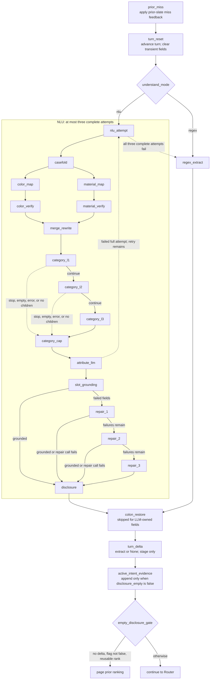

# Understand NLU path

Understand converts one ordinary shopper utterance into a grounded
`ObservationExtract` for the current turn. It does not classify override,
Buying, or Browsing, and it does not mutate committed constraints. Its normal
shopping-evidence output is `SessionState.turn_delta`; Intent Router decides
how to commit that delta later.

See also:

- [`agent/understand/README.md`](../../agent/understand/README.md)
- [`agent/understand/observation/README.md`](../../agent/understand/observation/README.md)
- [`agent/understand/observation/slots/README.md`](../../agent/understand/observation/slots/README.md)
- [`agent/intent_router/README.md`](../../agent/intent_router/README.md)
- [`agent_pipeline.md`](agent_pipeline.md)

## Strict node flow



## Mode resolution and startup

Understand mode is process-wide:

1. an explicit `Agent(..., understand_mode=...)` value;
2. `AGENT_UNDERSTAND_MODE`;
3. a false `AGENT_NLU_ENABLED` value selects regex;
4. otherwise the default is `nlu`.

In NLU mode, startup loads `scripts/nlu.env`, checks or starts the configured
Ollama runtime, and warms the observation and Router clients. It never pulls a
model. In explicit regex mode, startup skips the NLU environment load and
Ollama initialization.

The default observation model is `qwen3.5:4b`. Host, model, and timeout are set
with `AGENT_NLU_HOST`, `AGENT_NLU_MODEL`, and `AGENT_NLU_TIMEOUT`.

## Three complete attempts, then regex

`hybrid_extract()` permits at most three complete NLU attempts. A complete
attempt is the entire sequence:

1. alias rewrite;
2. category-tree walk and optional category cap;
3. one attribute extraction;
4. slot grounding and up to three local repairs; and
5. disclosure judgment.

A failed attribute JSON call can restart the complete attempt while attempts
remain. Repair rounds do not restart the whole pipeline and do not increase
the outer limit. A valid empty extract is still a successful NLU result. Only
after all three complete attempts return no usable extract does
`regex_extract` run.

## Alias rewrite

The original message is case-folded. Longest word-boundary color and material
aliases are collected independently. When both sides have nontrivial work,
their optional word-class verification calls run in parallel. Identity aliases
do not need verification. Non-overlapping verified spans are merged into the
rewritten text.

The original text remains in session history and is used for category
grounding, disclosure, Router classification, and active-intent raw recall.
Attribute extraction and attribute span grounding use the rewritten text.

## Category path

The committed category asset is walked at most three layers:

- L1 receives all roots.
- L2 receives the combined children of selected L1 nodes.
- L3 receives the combined children of selected L2 nodes.

Each layer may select up to three allowed IDs and may stop. Invalid IDs,
`Unknown`, merchandising shelves, and branches that add an unstated audience
are removed. A later layer runs only when the prior selection has children and
did not stop.

Selected nodes become category rows only when their surface can cite the
original shopper message. If the resulting rows expose more than five unique
category tags, `category_cap` makes up to three bounded selection attempts,
then uses a deterministic catalog-frequency fallback.

The attribute model does not own category. Any category rows it returns are
dropped, and the grounded tree rows are injected instead.

## Attribute extraction and grounding

The attribute prompt receives:

- the alias-rewritten current utterance;
- committed primary category;
- locked constraint surfaces; and
- `last_ask`.

It may emit material, color, size, style, brand, budget, feature, use case, and
other slots. Every cited surface must be grounded in the rewritten message.
Closed-list canonicals and normalized numeric metadata are classification
fields and are validated separately.

`slot_grounding` records failures by field. `repair_1`, `repair_2`, and
`repair_3` request only failed fields. `merge_repair_payload()` retains every
already-grounded constraint and replaces only failed category,
provisional-hint, or constraint content. If a repair call fails, parsing
continues with the still-valid fields rather than regenerating the whole
extract.

## Disclosure and delta write

The disclosure classifier receives the original utterance and grounded
category/attribute rows. It returns exactly `{"empty": true|false}`. It is
tried up to three times and fails open to `false` after three invalid replies.

`coordinator.observe()` then writes:

```text
state.disclosure_empty = extract.disclosure_empty
state.turn_delta = None if extract.empty else extract
```

For an LLM extract, `colon_restore` is skipped because the model-owned grounded
fields are authoritative. On a non-empty regex extract with no constraints,
the bounded restore may recover one or two values from a compact answer to the
previous `last_ask`.

After observation, only a message with `disclosure_empty is False` is appended
to `current_intent_messages`. Those messages are the input to Retrieve's raw
active-intent route. Empty or unknown-disclosure turns are not appended.

## Commit boundary

Understand never writes the newly extracted slots directly to
`SessionState.typed_constraints`. The path is:

```text
shopper message
→ ObservationExtract
→ SessionState.turn_delta
→ Intent Router override/accumulate decision
→ apply_delta or replacement writeback
→ committed typed_constraints/category
```

This boundary prevents a replacement utterance from contaminating prior state
before Router decides whether to accumulate, partially replace, or fully
replace it.

