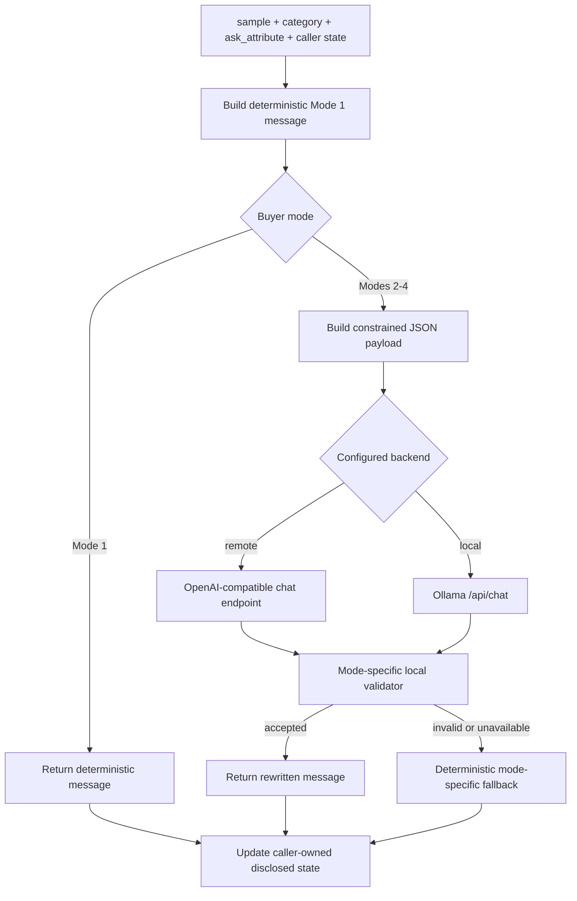

# Evaluators and controlled buyer language

This directory contains two distinct evaluation paths:

| Path | Buyer language | Purpose |
|---|---|---|
| `local_evaluator.py` | Deterministic competition-kit templates | Reproduce the public scoring protocol and metrics. |
| `scenario_evaluator.py` through `demo/eval_harness.py` | Four selectable wording modes | Probe robustness to controlled paraphrases without changing exact-ASIN scoring. |

The local evaluator is the competition harness. `ScenarioEvaluator` is an
optional development and demo tool; it does not replace the official protocol,
and its language validators do not decide whether an Agent recommendation is
correct. In both paths, a hit is an exact `parent_asin` match after catalog-ID,
duplicate, and Top-10 normalization.

Evaluator helpers, public labels, scenario templates, and generated intent
cards are scoring infrastructure. Agent code must treat `user_message` as
unconstrained shopper language and must not import or mirror this evaluator's
private simulation logic.

## Official local evaluator

For each public sample, `local_evaluator.evaluate()`:

1. creates a random session ID and calls `Agent.reset(session_id, user_profile)`;
2. materializes a deterministic intent card and scenario behavior inside the
   evaluator when those fields are absent from the public row;
3. sends a scenario-dependent initial customer message;
4. calls `Agent.respond(..., top_k=10)` for at most ten turns;
5. keeps the first ten unique recommendations whose IDs exist in the frozen
   catalog;
6. records the first eligible target hit, rank, and turn; and
7. reports overall and per-scenario metrics plus Agent-reported token usage.

Malformed responses and Agent exceptions become empty recommendation turns.
Intent Override sessions cannot convert before the replacement message has
been sent.

Run the official local path from the repository root:

```bash
python3 -m evaluator.local_evaluator \
  --catalog data/catalog.jsonl \
  --dataset data/public_set.jsonl \
  --output results.json
```

The reported metrics are:

```text
HitRate@10 = successful sessions / N
MRR = sum(1 / first-hit rank, with misses equal to 0) / N
MTTC = mean(first-hit turn, with misses assigned turn 11)
Efficiency = clip((11 - MTTC) / 10, 0, 1)
TechnicalScore = 0.50 * HitRate@10 + 0.30 * MRR + 0.20 * Efficiency
```

## ScenarioEvaluator scope

`scenario_evaluator.py` generates buyer messages from the same structured
sample semantics while varying how those semantics are expressed. It is useful
for checking whether NLU and dialog state survive paraphrases, synonyms, and
imperfect English.

The production integrations are:

- `demo/eval_harness.py`, which preserves the local evaluator's turn loop and
  scoring behavior while substituting ScenarioEvaluator buyer lines; and
- the Chainlit Eval Dock, which exposes Local and Scenario runs for selected
  public samples.

`evaluator.local_evaluator.evaluate()` remains deterministic and does not
silently opt into ScenarioEvaluator.

## Controlled generation flow



Every mode first constructs the deterministic Mode 1 message. That message
anchors which facts and speech act are allowed on the turn; an LLM may change
wording but does not choose new requirements. Models must return an object of
the form:

```json
{"message": "..."}
```

The generation payload includes the deterministic message, protected keywords,
structured answer values, semantic targets, intended speech act, scenario,
category, requested attribute, and safe aggregate profile. Local validation is
authoritative even when a model claims its own output is equivalent.

## Buyer modes

| Mode | Generation rule | Local acceptance requirement |
|---:|---|---|
| 1 | Return the original deterministic template. | No model client is created or called. |
| 2 | Rewrite surrounding language but preserve protected keywords verbatim. | Exact keyword case and order, original speech act, no negation reversal, and no extra known constraint. |
| 3 | Rewrite the full sentence with semantic equivalents. | Evidence for all expected semantics, preserved speech act, no unexpected constraint, and at least one meaningful wording change. |
| 4 | Apply Mode 3 semantics using imperfect English or circumlocution. | All Mode 3 checks plus a recognized grammar/spelling or descriptive-circumlocution signal. |

Example outputs for the same buying intent are:

```text
Mode 1: I'm looking for Men Shoes. A key requirement is: leather.
Mode 2: I would like Men Shoes; the key requirement is: leather.
Mode 3: I'm shopping for men's footwear, and genuine hide is what I need.
Mode 4: I am look for men's footwear, and I need the thing which comes from real animal skin, okay.
```

Modes 3 and 4 use a small transparent alias vocabulary plus token-level
evidence checks. This keeps validation local and deterministic, but it is not a
general semantic-equivalence model.

## Interfaces and state ownership

The compatibility form mirrors the original deterministic helper signatures:

```python
from evaluator.scenario_evaluator import ScenarioEvaluator

buyer = ScenarioEvaluator(mode=3)
disclosed: set[str] = set()
boundary_used = False

message = buyer.initial_message(sample, category, disclosed)
reply, boundary_used = buyer.customer_reply(
    sample,
    ask_attribute,
    disclosed,
    boundary_used,
)
```

For explicit multi-session use, register each sample and category first:

```python
buyer = ScenarioEvaluator(mode=4)
buyer.reset("session-001", sample, category)

message = buyer.initial_message("session-001", disclosed)
reply, boundary_used = buyer.customer_reply(
    "session-001",
    ask_attribute,
    disclosed,
    boundary_used,
)
```

State ownership is intentionally split:

| State | Owner | Behavior |
|---|---|---|
| sample and category | `ScenarioEvaluator` in session form | Stored in a lock-protected session map after `reset()`. |
| latest model usage | `ScenarioEvaluator` session | Recorded when the configured client returns usage metadata. |
| `disclosed` | caller | Mutated with canonical source values even when the returned message uses a synonym. |
| `boundary_used` | caller | Passed in and returned so the one-time Boundary response remains compatible with the deterministic harness. |

Calling the session form before `reset()` raises an error. Module-level
`initial_message()` and `customer_reply()` remain backward-compatible,
deterministic Mode 1 helpers.

## Backend selection and configuration

Mode 1 ignores model configuration. Modes 2–4 accept an injected client for
tests, or resolve one of two backends:

| Backend | Selection | Transport |
|---|---|---|
| local | `CONVERGE_LLM_BACKEND=local`, or remote configuration is incomplete | Ollama `/api/chat`, reusing the Agent NLU host, model, and timeout. |
| remote | `CONVERGE_LLM_BACKEND=remote` and both `CONVERGE_LLM_BASE_URL` and `CONVERGE_LLM_MODEL` are set | OpenAI-compatible `/chat/completions` using the Python standard library. |

Copy `.env.example` to `.env` and provide secrets only through local environment
configuration. Never commit credentials.

| Variable | Meaning |
|---|---|
| `CONVERGE_USER_MODE` | Default buyer mode, `1` through `4`. |
| `CONVERGE_LLM_BACKEND` | Requested backend: `remote` or `local`. |
| `CONVERGE_LLM_PROVIDER` | Optional provider defaults: OpenAI, DeepSeek, or Qwen/DashScope. |
| `CONVERGE_LLM_API_KEY` | Provider-neutral remote API key; provider-specific key variables are also supported. |
| `CONVERGE_LLM_BASE_URL` | Remote OpenAI-compatible base URL. |
| `CONVERGE_LLM_MODEL` | Remote model identifier. |
| `CONVERGE_LLM_TIMEOUT` | Remote request timeout in seconds; default `20`. |
| `CONVERGE_DOTENV_PATH` | Optional path overriding the repository `.env`. |
| `CONVERGE_CA_BUNDLE` | Optional CA bundle for verified TLS. |

The remote selector intentionally falls back to local Ollama unless both the
remote base URL and model are explicit. A missing client, timeout, malformed
JSON, transport error, validator rejection, or client exception produces a
deterministic mode-specific fallback message rather than aborting the session.

## Running and testing

Compare initial messages across all four modes:

```bash
python3 scripts/demo_user_agent_modes.py --samples 3 --seed 42
```

This script demonstrates buyer wording only; it does not call the shopping
Agent. Full Scenario evaluation is available through the Chainlit Eval Dock or
programmatically through `demo.eval_harness.run_evaluate_with_buyer()`.

Run focused tests:

```bash
python3 -m unittest discover -s tests -p 'test_scenario_evaluator.py'
python3 -m unittest discover -s tests -p 'test_demo_eval_harness.py'
```

The tests cover deterministic parity, protected-keyword enforcement, synonym
acceptance, semantic-reversal rejection, imperfect-English requirements,
Boundary state, canonical disclosure updates, backend resolution, and fallback
behavior.

## Limitations and interpretation

- Modes 3 and 4 validate against a deliberately small alias and phrase set.
  Valid unseen paraphrases may be rejected and replaced by fallback wording.
- The safety checks are precision-oriented heuristics, not a proof of semantic
  equivalence. They should be expanded with tests whenever new vocabulary is
  added.
- Deterministic fallbacks preserve progress but reduce language diversity, so a
  run should record which backend was active when interpreting robustness.
- Scenario evaluation measures behavior under this controlled perturbation
  family. It is not evidence of robustness to every typo, language, dialect, or
  adversarial instruction.
- Public-set results are development diagnostics. They are not private-set
  guarantees and must not be used to encode evaluator-specific behavior in the
  Agent.

## File map

```text
evaluator/
  local_evaluator.py       deterministic public harness and metric aggregation
  scenario_evaluator.py    controlled buyer-language generator and validators
demo/
  eval_harness.py          local/scenario orchestration with shared scoring
  eval_ui.py               Eval Dock controls and step/automatic runs
scripts/
  demo_user_agent_modes.py terminal comparison of four initial-message modes
tests/
  test_evaluator.py             official harness contract
  test_scenario_evaluator.py    buyer modes, validators, clients, and fallbacks
  test_demo_eval_harness.py     scenario integration and metrics
```
