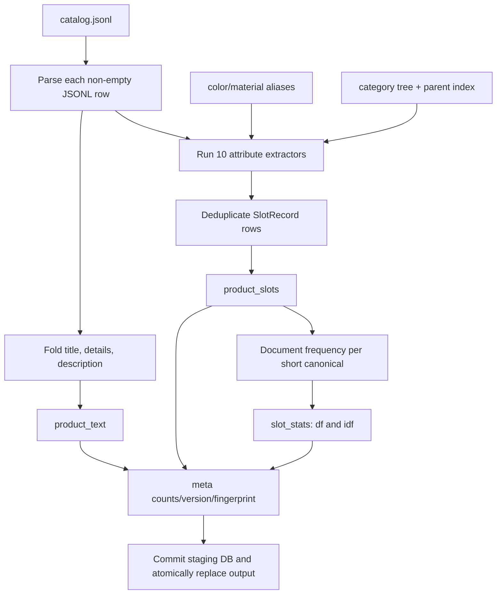
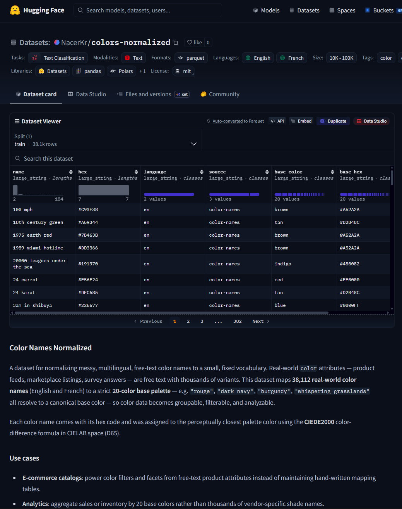
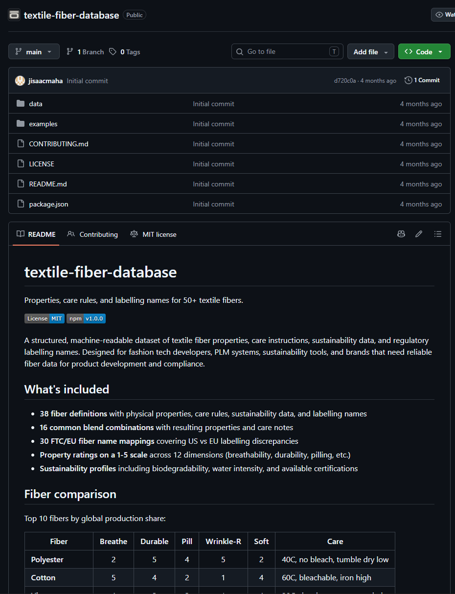

# Catalog preprocessing

This directory converts the frozen `data/catalog.jsonl` into a read-only slot sidecar used by exact filtering, structured scoring, numeric comparison, rarity weighting, and soft-text fit. Kit checkout: `python scripts/extract_catalog_slots.py`. Contest zip: `python extract_slots.py --catalog <catalog.jsonl>` from `submission/`. Runtime Agent code only attaches the finished SQLite database and never mutates or rebuilds the catalog.

The output is:

```text
.cache/catalog_preprocess/product_slots.sqlite3
```

The sidecar format version is `catalog-slots-v4`.

## End-to-end flow



`extract_catalog_slots.py` loads the committed alias files and category-parent index once, then scans the catalog once. Blank lines and products without a non-empty `parent_asin` are skipped. Slot and document rows are inserted with `INSERT OR IGNORE` in batches of 2,000. The build uses a temporary `*.tmp` database, commits it, closes it, and replaces the destination atomically. If a locked destination cannot be replaced, the completed database is retained as `*.new` and the command exits with an explanation.

## Build commands

First-time clones should run `python scripts/bootstrap.py` (or `scripts/setup.ps1` / `scripts/setup.sh`). That downloads the catalog and builds the sidecar. It does **not** rebuild committed alias JSON or the category tree.

Rebuild aliases and the tree only when their source data or the frozen catalog changes:

```bash
python scripts/build_aliases_color.py
python scripts/build_aliases_material.py
python scripts/build_category_tree.py
python scripts/extract_catalog_slots.py
```

For a smoke build, `extract_catalog_slots.py --limit N` stops after `N` valid products. Override locations with `--catalog` and `--output`.

`scripts/export_catalog_slots_csv.py` exports sidecar tables for inspection; it does not participate in Agent runtime.

## Upstream preprocessing assets

## Upstream preprocessing assets

### Color aliases

`scripts/build_aliases_color.py` builds `submission/src/assets/aliases/color_aliases.json` from the Hugging Face
[`NacerKr/colors-normalized`](https://huggingface.co/datasets/NacerKr/colors-normalized)
dataset.

#### Source dataset preview



*Example records from the upstream `colors-normalized` dataset used to construct
the color alias mapping.*

The upstream dataset provides a large vocabulary of color names together with
normalized base-color labels. We use these names as the starting point for
catalog and shopper-language normalization, then map them into the smaller
closed color vocabulary used by the competition evaluator.

This allows different surface forms to resolve to the same runtime value.

For example:

```text
navy          → blue
navy blue     → blue
burgundy      → red
ivory         → white
charcoal      → gray
lavender      → purple
lilac         → purple
coral         → orange
```

The preprocessing script:

1. normalizes every alias with Unicode NFKC, case folding, whitespace folding,
   and `colour → color` / `grey → gray`;
2. maps the source dataset's 20 base colors to the evaluator's 11 closed buckets;
3. prefers English aliases when the same spelling occurs in multiple languages;
4. adds direct evaluator colors, `grey`, and common fashion names such as
   navy, burgundy, khaki, ivory, charcoal, olive, coral, lavender, and lilac; and
5. writes a compact mapping from each alias to:

   ```text
   {
     "base": <source normalized color>,
     "eval": <competition evaluator color>
   }
   ```

A simplified example is:

```text
"navy"       → {"base": "blue",   "eval": "blue"}
"burgundy"   → {"base": "red",    "eval": "red"}
"lavender"   → {"base": "purple", "eval": "purple"}
```

The closed runtime color buckets are:

```text
black
white
blue
red
pink
green
brown
gray
purple
yellow
orange
```

The goal of this normalization is not to replace the original catalog wording.
Instead, the original surface value is retained while the canonical evaluator
color provides a consistent value for exact matching, filtering, and structured
scoring.

Conceptually:

```text
Catalog / shopper wording
        ↓
Color alias normalization
        ↓
Canonical evaluator color
```

For example:

```text
"navy running shoes"
        ↓
navy → blue
        ↓
color = blue
```

This reduces lexical mismatch between shopper language and catalog metadata
without requiring the runtime Agent to repeatedly interpret common color
variants.


---

### Material aliases

`scripts/build_aliases_material.py` builds `submission/src/assets/aliases/material_aliases.json` from the open-source
[`textile-fiber-database`](https://github.com/kobo-labs-open-source/textile-fiber-database)
together with FTC fiber terminology.

#### Source dataset preview



*Example records from the upstream textile-fiber database used to construct
the material alias mapping.*

The upstream material resources provide standardized fiber names together with
common names, industry terminology, alternative spellings, and related fiber
descriptions.

These names are consolidated into the smaller material vocabulary used by the
competition evaluator.

For example:

```text
polyamide        → nylon
elastane         → spandex
lycra            → spandex
viscose          → rayon
lyocell          → rayon
tencel           → rayon
modal            → rayon
cowhide          → leather
shell cordovan   → leather
```

The preprocessing script:

1. maps fiber IDs, common names, FTC names, EU names, and common blends to
   evaluator materials;
2. maps viscose, lyocell, modal, tencel, cupro, and bamboo-derived fiber wording
   to `rayon`;
3. maps polyamide to `nylon`, elastane/lycra to `spandex`, and wool-family
   fibers to `wool`;
4. adds leather-related aliases including leather, cowhide, suede,
   faux leather, vegan leather, PU leather, patent leather, and bonded leather;
5. adds common misspellings and spelling variants; and
6. maps unmatched textile names and fabric constructions such as satin,
   chiffon, canvas, fleece, mesh, linen, hemp, acrylic, knit, jersey, and denim
   to the generic evaluator bucket `fabric`.

A simplified example is:

```text
"polyamide"       → nylon
"lycra"           → spandex
"tencel"          → rayon
"cowhide leather" → leather
"denim"           → fabric
```

The nine evaluator material buckets are:

```text
cotton
polyester
nylon
leather
wool
spandex
silk
rayon
fabric
```

As with color normalization, the original material wording is not discarded.
The catalog keeps the source phrase for provenance while also storing a
canonical material value for matching and scoring.

Conceptually:

```text
Catalog / shopper wording
        ↓
Material alias normalization
        ↓
Canonical evaluator material
```

For example:

```text
"polyamide running shirt"
        ↓
polyamide → nylon
        ↓
material = nylon
```

or:

```text
"lycra blend leggings"
        ↓
lycra → spandex
        ↓
material = spandex
```

This normalization reduces mismatch between consumer terminology, manufacturer
terminology, and the evaluator's closed material vocabulary.


---

### Why alias normalization is done offline

Color and material normalization are built during catalog preprocessing rather
than repeatedly inferred at runtime.

This has several advantages:

- **Deterministic behavior**  
  The same alias always maps to the same canonical value.

- **Lower runtime cost**  
  Common color and material variants do not require an LLM call during every
  shopping turn.

- **Higher retrieval recall**  
  Shopper wording and catalog wording can still match even when their surface
  forms differ.

- **Easier debugging**  
  Every canonical value can be traced back to the original surface phrase and
  alias source.

- **Evaluator alignment**  
  Runtime values are constrained to the same closed color and material
  vocabularies expected by the competition evaluator.

The preprocessing flow is therefore:

```text
Upstream alias resources
        ↓
Normalize aliases
        ↓
Map to evaluator buckets
        ↓
Write committed alias JSON
        ↓
Extract catalog slots
        ↓
Store both surface and canonical values
```

At runtime, the Agent reads the prebuilt alias mappings and catalog sidecar.
It does not rebuild these resources.


---

### Resulting catalog representation

A catalog product may therefore retain both its original wording and its
normalized representation.

For example:

```json
{
  "attribute": "color",
  "surface": "Navy Blue",
  "canonical": "blue",
  "source": "details:color"
}
```

and:

```json
{
  "attribute": "material",
  "surface": "Polyamide Blend",
  "canonical": "nylon",
  "source": "details:material"
}
```

This distinction is important:

```text
surface
= what the product originally says

canonical
= the normalized value used for comparison
```

The normalization layer therefore improves consistency without removing the
original catalog evidence.

### Category tree and parent index

`scripts/build_category_tree.py` scans every unique catalog category path and writes:

- `submission/src/assets/aliases/category_tree.json`: the committed three-level Understand tree;
- `submission/src/assets/aliases/category_parents.json`: unique child-to-parent relationships, per-node aliases, and every valid L1–L3 home for each folded tag.

The builder seeds Amazon L1 roots, maps the catalog's `Clothing, Shoes & Jewelry` root to the corresponding Amazon root, removes merchandising/promotion paths, folds punctuation/glue words, singularizes safe plurals, merges same-fold children, merges same-fold siblings, and parks depth-4+ descendant tags on the L3 leaf. It also adds explicit cross-domain branches used by the catalog, including sports, baby, and phone-accessory structures. This makes runtime category classification bounded to three layers while retaining a tag for every catalog category that can be represented.

`category_parents.py` uses the parent asset to align each product path with its most plausible tree home. It preserves path order and disambiguates reused labels such as Men's Shoes versus Women's Shoes.

## Shared text normalization

`text.py` centralizes normalization used by every extractor:

- `fold_key`: Unicode NFKC, case folding, grey/colour normalization, and whitespace folding.
- `normalize_canonical`: additionally removes punctuation while preserving `$` and decimal points, so `1.99` remains parseable.
- `fold_document`: canonical folding plus removal of category glue words; no stemming.
- `fold_category`: document folding plus safe singularization of each token.
- `ngrams`: longest-first n-grams, normally up to four tokens, excluding trivial stop n-grams.
- `details_map`, `feature_lines`, and `categories_list`: safe coercion of heterogeneous catalog fields.
- `composition_parts`: extracts numeric percentages and material names.
- `to_inches` and `to_pounds`: normalizes dimensions and weights.

Irregular plurals such as `women → woman`, `men → man`, `children → child`, and `feet → foot` are handled explicitly. Ambiguous forms such as `jeans`, `pants`, `shorts`, `earrings`, and `sunglasses` are protected from singularization.

## Slot record contract

Every attribute extractor returns `SlotRecord`:

| Field | Meaning |
|---|---|
| `attribute` | one of category, color, material, size, style, brand, budget, feature, use_case, or other |
| `canonical` | normalized comparison/search value |
| `surface` | original catalog text that produced the slot |
| `source` | provenance such as `title`, `features`, `details:color`, or `categories:tree` |
| `extras` | optional structured numeric/type metadata serialized to `extras_json` |

The shared `slot()` constructor rejects blank canonical/surface values. `extract_product()` runs all ten extractors in a fixed order and deduplicates on `(attribute, canonical, surface, source)`.

## Attribute extraction

### Category

Input: `categories` plus `category_parents.json`.

- Excludes the generic roots `Clothing` and `Clothing, Shoes & Jewelry`.
- Emits a folded slot for every retained path node (`source=categories`).
- Emits the leaf (`categories:leaf`) and a coarse family fallback: shoe, watch, jewelry, costume, accessory, or clothing (`categories:family`).
- Maps the full product path into at most three Understand layers and emits each layer's identity aliases (`categories:tree`).
- Keeps one row per canonical, preferring sources in this order: tree, path, leaf, family.

### Color

Input: color-like `details` keys, title, and feature lines no longer than 80 characters.

- Splits detail alternatives, then applies longest-first alias n-grams up to four tokens.
- Maps all accepted names to the 11 closed color buckets.
- Prevents overlapping n-gram matches.
- In jewelry categories, does not reinterpret gold, silver, platinum, rose gold, white/yellow gold, or sterling silver as display colors; those values can be retained by `other` as metal information.

### Material

Input: material/fabric/fiber details, feature lines, and title.

- Extracts percentage compositions first and records the percentage as `extras_json={"pct": ...}`.
- Applies alias n-grams up to three tokens to structured material details.
- Searches feature lines only when their length is at most 48 characters, then searches the title.
- Suppresses generic `fabric` during the title/short-feature pass when a specific evaluator material was already found in composition or structured material details. If none was found at that point, title/feature alias matches may emit both a later specific material and `fabric`; the final literal-`fabric` fallback is added only when no earlier specific/detail match or fabric row exists.

### Size and dimensions

Input: size details and any detail key naming dimensions or weight.

- Maps apparel letters and synonyms to `xs`, `s`, `m`, `l`, `xl`, `xxl`, `xxxl`, or `one_size` and stores `kind=apparel`.
- Detects shoe context from categories/title, parses the first numeric amount, and stores `kind=shoe`; US/USA, UK, EU/EUR markers become `system=us|uk|eu`.
- Keeps generic numeric apparel sizes when the product is not shoe-like.
- Parses one-, two-, or three-axis dimensions. Centimeters and millimeters are converted to inches.
- Parses pounds, ounces, kilograms, and grams; weight is stored in pounds.
- Dimension rows use canonical `dimension` with extras:

| Extra | Meaning |
|---|---|
| `kind` | always `dimension` |
| `unit` | always `in` for dimension axes |
| `length`, `width`, `height` | normalized inches; nullable |
| `weight` | normalized pounds; nullable |
| `amount` | same as normalized length for compatibility |
| `source_key` | original normalized details key used for source priority |

### Style

Input: department, style/fit/closure/pattern details, title, and feature lines up to 80 characters.

- Maps department text into gender/audience tokens such as womens, mens, girls, boys, baby, unisex, and kids.
- Preserves structured style details as normalized free strings.
- Finds known one- or two-token style phrases such as v neck, slim, regular fit, relaxed, vintage, boho, athletic, casual, formal, classic, hoodie, skinny, straight, bootcut, oversized, and cropped.

### Brand

Input: `store`, any detail key containing `brand`, and `manufacturer` when it differs from the store.

- Normalizes non-empty brand strings.
- Drops placeholder values: imported, unknown, n/a, na, none, and generic.

### Budget

Input: product `price`.

- Strips currency punctuation and parses a finite non-negative float.
- Stores the compact number as canonical/surface without text folding.
- Stores `extras_json={"amount": price}`.
- Does not assign an operator; comparison semantics come from the shopper constraint at runtime.

### Feature

Input: feature-like details and catalog feature lines.

- Stores full useful feature lines after dropping trivial care/import lines and composition lines containing `%`.
- Extracts known capability phrases with up-to-three-token n-grams: hypoallergenic, moisture wicking, quick dry, waterproof, water resistant, windproof, breathable, RFID, UPF/UV protection, insulated, lightweight, seamless, cushioned, anti/non slip, touch screen, and machine washable.
- Emits a normalized `upf` token when UPF appears in a longer line.

### Use case

Input: sport, occasion, and theme details plus title, categories, and feature lines up to 120 characters.

- Maps synonyms into a compact set such as hiking, running, gym, winter, outdoor, work, travel, wedding, swim, halloween, and casual.
- Searches up to two-token n-grams and emits each mapped use case once.
- Preserves an unmapped structured detail value as a free use-case slot.

### Other

Input: short details not owned by another extractor.

- Skips routed color/material/size/style/use-case keys and operational metadata such as model number, country, item quantity, package weight, batteries, manufacturer, department, and sales rank.
- Skips detail values longer than 80 characters and URL-like values.
- Keeps at most four rows per product.
- For jewelry, attempts to append the first metal phrase found in title/details so metal is not lost after the color extractor rejects it. The extractor applies its final four-row cap afterward, so four earlier leftover-detail rows can crowd out that appended metal row.

## Product text documents

`document.extract_documents()` writes at most three rows per product:

| `field` | `surface` construction | `canonical` construction |
|---|---|---|
| `title` | original title | `fold_document(title)` |
| `details` | all non-empty details values joined with spaces | `fold_document(joined details)` |
| `description` | flattened list/dict/scalar description | `fold_document(description)` |

These are not typed slots. Retrieve reads them to compute soft-text coverage and profile diagnostics when the sidecar is attached.

## SQLite schema

The project often refers to “the three tables” because there are three business-data tables. The physical database also contains the `meta` control table. All four are documented here.

### `product_slots`

One catalog-derived typed value with provenance.

| Column | SQLite type | Nullable | Meaning |
|---|---|---:|---|
| `parent_asin` | TEXT | no | product identifier |
| `attribute` | TEXT | no | typed attribute name |
| `canonical` | TEXT | no | normalized lookup/scoring value |
| `surface` | TEXT | no | original catalog evidence |
| `source` | TEXT | no | evidence provenance |
| `extras_json` | TEXT | yes | compact JSON for price, composition, size, or dimension metadata |

Primary key: `(parent_asin, attribute, canonical, surface, source)` with `WITHOUT ROWID`. Lookup index: `(attribute, canonical)`.

### `product_text`

One folded text document per product/field.

| Column | SQLite type | Nullable | Meaning |
|---|---|---:|---|
| `parent_asin` | TEXT | no | product identifier |
| `field` | TEXT | no | `title`, `details`, or `description` |
| `surface` | TEXT | no | original joined text |
| `canonical` | TEXT | no | folded text used by soft matching |

Primary key: `(parent_asin, field)` with `WITHOUT ROWID`.

### `slot_stats`

Document frequency and rarity for compact slot values.

| Column | SQLite type | Nullable | Meaning |
|---|---|---:|---|
| `attribute` | TEXT | no | slot attribute |
| `canonical` | TEXT | no | slot value |
| `df` | INTEGER | no | number of distinct products containing the pair |
| `idf` | REAL | no | rarity value `ln((N + 1) / (df + 1))` |

Primary key: `(attribute, canonical)` with `WITHOUT ROWID`. Statistics are created only when the canonical has at most four whitespace tokens and at most 40 characters. `N` is the number of valid products processed, with a minimum denominator base of one.

### `meta`

Control and validation key/value rows.

| Key | Value |
|---|---|
| `version` | `catalog-slots-v4` |
| `catalog_fingerprint` | resolved catalog path, file size, and nanosecond mtime joined by `|` |
| `product_count` | processed products with a valid ASIN |
| `slot_count` | extracted slot rows before database duplicate suppression |
| `text_count` | extracted product-text rows before duplicate suppression |
| `stat_count` | number of compact `(attribute, canonical)` statistics |
| `max_idf` | largest stored IDF, used to normalize rarity |

Schema: `key TEXT PRIMARY KEY, value TEXT NOT NULL`.

## Runtime consumption

`agent/retrieve/catalog/slots_sidecar.py` attaches this file only when all conditions hold:

- the file exists;
- `meta.version` equals `catalog-slots-v4`;
- `meta.catalog_fingerprint` matches the current catalog path/size/mtime; and
- `product_slots`, `product_text`, and `slot_stats` exist.

When attached:

- exact/signature lookup includes `product_slots` aliases;
- hard numeric filtering reads budget and dimension extras;
- structured scoring reads normalized slot IDF;
- soft-text fit reads `product_text`; and
- category-cap fallback can use category document frequencies.

When absent or stale, runtime continues with the primary catalog signature/FTS index. An explicitly configured missing or stale sidecar emits a warning. Runtime never invokes the extractors.

## Rarity used by retrieval

For a stored IDF value, hybrid structured scoring uses:

\[
\operatorname{rarity}(a,v)=0.5+0.5\cdot\operatorname{clip}\left(\frac{\operatorname{idf}(a,v)}{\operatorname{max\_idf}},0,1\right).
\]

Therefore represented slots receive a multiplier in `[0.5, 1.0]`: common values are down-weighted, rare values retain more structured weight. A value without a statistic receives `1.0`. Candidates already proven to be in an exact pool also use `1.0`, because rarity must not weaken a satisfied hard constraint.

## Maintenance rules

- Increment `SIDECAR_VERSION` after an incompatible extractor or schema change.
- Rebuild the category tree/parents before the sidecar when catalog categories change.
- Rebuild aliases before the sidecar when normalization mappings change.
- Never edit `catalog.jsonl` to fix extraction; add a deterministic extractor or alias rule.
- Preserve the atomic staging write so a failed build cannot corrupt the last usable sidecar.
